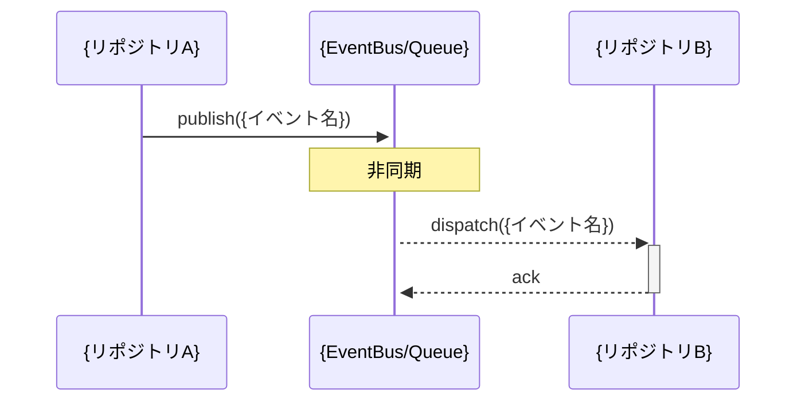
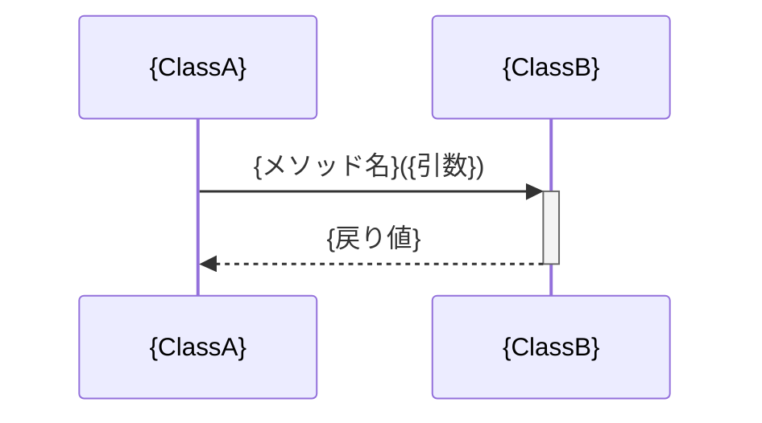

# スペックアウト資料（クロスリポジトリ）

**文書番号：** SPO-{CR番号}-cross  
**対象CR：** {CR番号}  
**対象リポジトリ：** {リポジトリA}, {リポジトリB}, ...  
**作成日：** {YYYY-MM-DD}  
**作成者：** AI（xddp-specout-agent）  
**版数：** 1.0

---

## 1. 概要

このドキュメントは {CR番号} に関わる複数リポジトリ間の相互作用・依存関係を記録する。
リポジトリ固有の詳細は `{リポジトリ名}/SPO-{CR番号}.md` を参照。

| 対象リポジトリ | 参照先 |
|-------------|------|
| {リポジトリA} | [{リポジトリA}/SPO-{CR番号}.md](../{リポジトリA}/SPO-{CR番号}.md) |
| {リポジトリB} | [{リポジトリB}/SPO-{CR番号}.md](../{リポジトリB}/SPO-{CR番号}.md) |

---

## 2. 構造図

> システム／リポジトリ全体の階層・構成要素の関係（パッケージ図・コンポーネント図相当）。
> 複数リポジトリ間のサービス境界・レイヤー・依存方向を俯瞰する。

```
{構造図をテキスト・Mermaid・ASCII等で記述}
```

---

## 3. シーケンス図

> 主要ユースケース・処理フローのリポジトリ間メッセージ交換を時系列で示す。
> SPECOUT_SEQUENCE_LEVELS に従い、指定されたレベルごとに独立したシーケンス図を作成する。
> 非同期コールバック・キュー経由の処理はノート（Note）で明示すること。

### 3.1 {レベル名}レベルのシーケンス図（例: repository）



### 3.2 {レベル名}レベルのシーケンス図（例: class）



---

## 4. 共有インタフェース一覧

> リポジトリ間で共有されるインタフェース（関数シグネチャ・プロトコル・イベントスキーマ・バスI/F等）を記録する。
> 検出なしの場合は「なし」と明記する。工程5での後方互換性判断のため「バージョン」「breaking変更有無」を必ず記入する。

| インタフェース名 | 提供リポジトリ | 消費リポジトリ | 型・プロトコル | バージョン | breaking変更有無 |
|---|---|---|---|---|---|
| {インタフェース名} | {提供リポジトリ} | {消費リポジトリ} | {型/プロトコル} | {v1.0 等} | あり / なし |

---

## 5. リポジトリ間共有定数・列挙値

> 複数リポジトリで参照される定数・列挙値を記録する。
> 変更時の波及先を把握するため、検出なしの場合でも「なし」とセクション自体を残すこと。

| 識別子 | 値 | 定義リポジトリ | 参照リポジトリ | 用途 |
|---|---|---|---|---|
| {識別子} | {値} | {定義リポジトリ} | {参照リポジトリ1, ...} | {用途} |

---

## 6. リポジトリ間共有データ型関連図

> 複数リポジトリで参照される構造体・型定義の参照・継承関係を示す。
> 共有データ型が検出された場合のみ作成。検出なしの場合はこのセクションを省略する。
> OOP言語（Java・C++・Python等）: Mermaid classDiagram で記述する。
> 手続き型言語（C・アセンブラ等）: テキスト表形式で記述する（classDiagram は使用しない）。

**OOP言語（例）:**

```mermaid
classDiagram
    class {SharedTypeA} {
        +{field} {type}
    }
    class {SharedTypeB} {
        +{field} {type}
    }
    {RepoA} --> {SharedTypeA} : uses
    {RepoB} --> {SharedTypeA} : uses
    {SharedTypeA} <|-- {SharedTypeB} : extends
```

**手続き型言語（例）:**

| 識別子 | 定義リポジトリ | 参照リポジトリ | 内容（型・サイズ等） |
|---|---|---|---|
| {構造体名/型名} | {定義リポジトリ} | {参照リポジトリ1, ...} | {typedef/struct 概要} |

---

## 7. データアクセスマトリクス（CRUD）

> 機能・処理単位がリソース（エンティティ・バッファ・レジスタ・ファイル等）に対して行う操作種別をマトリクスで示す。
> `full` レベルのみ、または同一リソースへの並列書き込み・共有バッファアクセスが検出された場合に作成。該当なしの場合は「対象外」と記載。

| 機能／処理名 | {リソースA} | {リソースB} | {リソースC} |
|------------|:----------:|:----------:|:----------:|
| {処理1} | C | R | - |
| {処理2} | - | U | D |

凡例: C=Create/Set, R=Read/Get, U=Update/Write, D=Delete/Clear, -=操作なし

---

## 8. データモデル（ER図・データ構造定義）

> データモデル（エンティティ・属性・リレーション、または構造体・型定義等）。
> `full` レベルまたはデータ構造変更がある場合のみ作成。該当なしの場合は「対象外」と記載。
> RDB がある場合: Mermaid `erDiagram` で記述する。
> OOP 言語・データ構造定義の場合: Mermaid `classDiagram` またはテキスト表形式で記述する。

```mermaid
erDiagram
    {ENTITY_A} {
        {type} {field} PK
        {type} {field}
    }
    {ENTITY_B} {
        {type} {field} PK
        {type} {field} FK
    }
    {ENTITY_A} ||--o{ {ENTITY_B} : "{関係}"
```

---

## 9. データフロー図（DFD）

> リポジトリ間のデータの流れ。
> **リポジトリ間でデータの流れ（共有データストア・イベント・メッセージ・API呼び出し等）が識別された場合に作成する。**
> リポジトリ間のデータフローが識別されなかった場合は「対象外（理由：リポジトリ間データフローなし）」と記載する。

```mermaid
graph LR
    {外部入力}(["{入力源}"]) --> {プロセスA}["{処理A}"]
    {プロセスA} --> {データストアA}[("{DB/ファイル}")]
    {プロセスA} --> {プロセスB}["{処理B}"]
    {プロセスB} --> {外部出力}(["{出力先}"])
```

---

## 10. 追加提案図

> 対象システムの特性に応じて作成を検討する図。

| 図の種類 | 目的 | 作成有無 |
|---------|------|---------|
| ★ タイミング図 | 非同期処理・タイマー・割り込みのタイミング依存分析 | **リアルタイム・組み込み系プロジェクトでは必須**。その他は任意 |
| ★ 依存関係図 | リポジトリ間のimport/use依存の可視化 | 依存関係が複雑または多リポジトリ間で交差する場合に推奨。その他は任意 |

---

## 11. 変更履歴

| 版数 | 日付 | 変更者 | 変更内容 |
|------|------|--------|----------|
| 1.0 | {YYYY-MM-DD} | AI（xddp-specout-agent） | 初版作成 |
