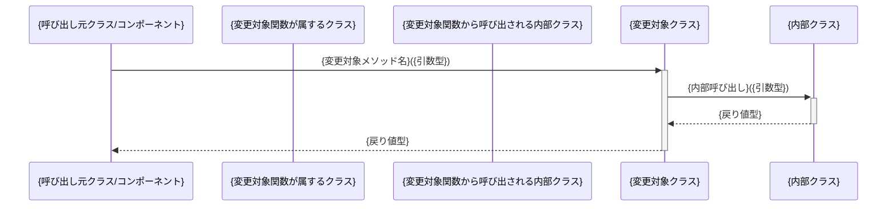

# スペックアウト資料（モジュール個別）

**文書番号：** SPO-{CR番号}-{モジュール名}  
**対象CR：** {CR番号}  
**対象モジュール：** {モジュールパス}  
**作成日：** {YYYY-MM-DD}  
**作成者：** AI（xddp-specout-agent）  
**版数：** 1.0

---

## 1. モジュール概要

| 項目 | 内容 |
|------|------|
| モジュール名 | {モジュール名} |
| ディレクトリ | {src/モジュール名/ 等} |
| 役割・責務 | {このモジュールが担う機能の概要} |
| 既存仕様書 | あり（{ファイルパス}）／なし |

---

## 2. 現状仕様

### 2.1 処理フロー

```
{処理の流れをテキストまたは箇条書きで記述}
1. {ステップ1}
2. {ステップ2}
3. {ステップ3}
```

### 2.2 主要な処理・ロジック

| 識別子 | ファイルパス | 行番号 | 役割 |
|--------|------------|--------|------|
| {関数名／クラス名} | {パス} | {行} | {役割} |

### 2.3 入出力

| 種別 | 名称 | 型 | 説明 |
|------|------|-----|------|
| 入力 | {パラメータ名} | {型} | {説明} |
| 出力 | {戻り値・副作用} | {型} | {説明} |

### 2.4 定数・列挙値一覧

> モジュールが定義・使用する定数・マジックナンバー・列挙値を列挙する。
> 業務ルールや動作閾値がコードに埋め込まれているケースで、変更の影響範囲を正確に把握するために記録する。
> 定数が存在しない場合は「定数なし」と記載。
> スコープ: モジュール内に定義されているもの、またはこのモジュールが直接参照しているものを対象とする。

| 識別子 | 種別 | 値 | スコープ | 定義場所（ファイル:行） | 用途・意味 |
|--------|------|-----|----------|----------------------|-----------|
| {定数名/列挙値名} | #define/const/enum/final/static | {値} | ファイルローカル/モジュール/グローバル/エクスポート | {パス:行} | {この値が意味すること・用途} |

### 2.5 グローバル変数一覧

> モジュール外部から参照・変更可能なグローバル変数・共有変数・静的変数を列挙する。
> モジュール間の暗黙的な結合を可視化し、スレッド安全性・割り込み安全性の評価に活用する。
> グローバル変数が存在しない場合は「グローバル変数なし」と記載。

| 識別子 | 型 | スコープ | 初期値 | 変更される契機 | 主な参照元 | スレッド/割り込み安全性 |
|--------|-----|----------|--------|--------------|-----------|----------------------|
| {変数名} | {型} | ファイルローカル/モジュール公開/グローバル | {初期値または「不定」} | {どのような処理で変更されるか} | {主な参照元モジュール・関数} | 安全/要注意（競合リスク）/未確認 |

### 2.6 制約・前提条件

- {制約1}
- {制約2}

---

## 3. 既存仕様の文書化（仕様書がない場合）

> 仕様書が存在しない場合のみ記述。コードから読み取った仕様をナレッジとして蓄積する。

### 3.1 {機能名}の現状仕様

- **動作条件：** {どのような条件で動作するか}
- **正常系：** {正常時の動作}
- **異常系：** {エラー時・例外時の動作}
- **副作用：** {データ更新・外部連携等}

---

## 4. モジュール内ダイアグラム

> モジュール単体で完結するダイアグラムを記録する。
> SPECOUT_DIAGRAM_LEVEL に応じて不要なセクションは「対象外」と記載して残す。

### 4.1 状態遷移図

> オブジェクト・セッション・タスクの状態と遷移条件（UMLステートマシン相当）。
> 該当する状態管理がない場合は「対象外」と記載。

```mermaid
stateDiagram-v2
    [*] --> {状態A}
    {状態A} --> {状態B} : {イベント／条件}
    {状態B} --> {状態C} : {イベント／条件}
    {状態C} --> [*]
```

### 4.2 データ型関連図

> 構造体・クラス・インタフェースの属性・関係性を記述する（UMLクラス図相当）。
> OOP言語（Java・C++・Python等）: クラス・インタフェースの属性・メソッド・継承・実装関係を記述。
> 手続き型言語（C・Fortran等）: 構造体・共用体・typedef の参照関係（ポインタ参照・埋め込み）を記述。
> 型間に意味ある関係がない場合は「対象外」と記載。
> **§4.2 と §4.3 の役割分担:** §4.2 は型間の**関係性を図**で示す（継承・参照・埋め込み）。§4.3 は型の**フィールド詳細を表**で示す。両者は相補的。

```mermaid
classDiagram
    class {型名/構造体名} {
        +{フィールド名}: {型}
        +{メソッド/関数}(): {戻り値型}
    }
    {型名A} --> {型名B} : {関係（参照/埋め込み/継承等）}
```

### 4.3 データ構造

> キーとなるデータ構造（構造体・型定義・スキーマ等）。

| 識別子 | フィールド名 | 型 | 必須 | 説明 |
|--------|------------|-----|------|------|
| {構造体名／型名} | {フィールド} | {型} | ○／× | {説明} |

### 4.4 PAD（問題分析図）

> アルゴリズム・制御構造の詳細。`full` レベルまたは複雑なロジックがある場合のみ作成。

```
{PADをテキスト・インデント形式で記述}
{処理名}
  ├─ 条件: {条件式}
  │    ├─ True: {処理A}
  │    └─ False: {処理B}
  └─ ループ: {繰返し条件}
         └─ {処理C}
```

### 4.5 モジュール内シーケンス図

> 変更対象関数・メソッドを含むモジュール内部の呼び出しフロー。
> **変更対象シンボル（Wave 0）に関数・メソッドが含まれる場合は必須**（SPECOUT_DIAGRAM_LEVEL の設定に関わらず）。
> 変更対象シンボルに関数・メソッドが含まれないモジュールは「対象外」と記載。
> **スコープ上限:** 呼び出し元は本番コード（EXCLUDE_PATTERNS 除外対象を除く）を優先し、最大 3 つまで記載する。3 件を超える場合は代表的な 3 件を記載し、`note over {変更対象クラス}: 他 N 箇所から呼び出しあり` を図末に付記する。内部呼び出し先は直接呼び出し先（1 段）まで記載し、それより深い呼び出し連鎖は省略してよい。



---

## 5. 変更履歴

| 版数 | 日付 | 変更者 | 変更内容 |
|------|------|--------|----------|
| 1.0 | {YYYY-MM-DD} | AI（xddp-specout-agent） | 初版作成 |
