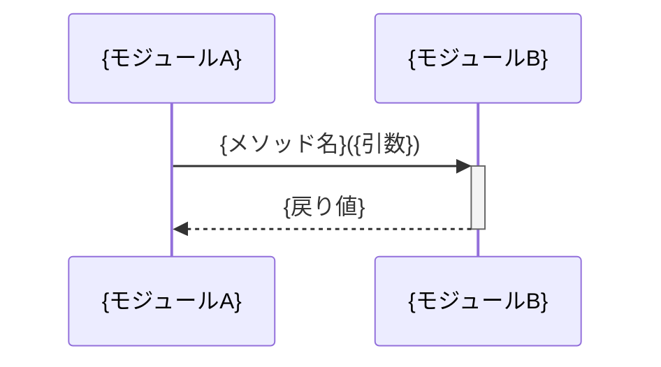

# スペックアウト資料（サマリー）

**文書番号：** SPO-{CR番号}  
**対象CR：** {CR番号}  
**作成日：** {YYYY-MM-DD}  
**作成者：** AI（xddp-specout-agent）  
**版数：** 1.0

---

## 1. 調査概要

| 項目 | 内容 |
|------|------|
| 調査起点 | {変更対象の識別子・ファイル・関数名等} |
| 調査範囲 | {調査したモジュール・レイヤー} |
| 検出モジュール数 | {N} モジュール |
| 既存仕様書 | あり（{ファイルパス}）／なし |

---

## 2. 全体アーキテクチャ図

> 影響モジュール・コンポーネントの構成と依存方向を俯瞰するコンポーネント図。
> モジュールが 1 つの場合は、そのモジュール内の主要コンポーネント（クラス・ファイル）を示す。

```mermaid
graph TB
    {モジュールA}["モジュールA\n({主要ファイル})"]
    {モジュールB}["モジュールB\n({主要ファイル})"]
    {モジュールA} --> {モジュールB}
```

---

## 3. モジュール間シーケンス図

> モジュール間の主要呼び出しフローを記述する。
> **変更対象シンボル（Wave 0）がモジュール間呼び出しに関与する場合は必須**（SPECOUT_SEQUENCE_LEVELS の設定に関わらず）。
> 変更対象シンボルが関与するモジュール間呼び出しが一切ない場合にのみ「対象外」と記載。



---

## 4. データ仕様・副作用・フロー

> 変更対象コードが外部状態（DB・ファイル・外部API・イベントバス・キャッシュ等）に与える副作用、
> データモデル、データアクセスマトリクスを記録する。
> アーキテクトが実装方式を比較する際の基礎情報となる。

### 4.1 外部副作用一覧（必須）

> 影響ファイルが外部状態を変更する箇所を列挙する。副作用がない場合は「副作用なし」と明記する。

| 識別子（関数/メソッド） | ファイルパス | 副作用種別 | 対象（DB表/APIパス/キュー名等） | 備考 |
|---|---|---|---|---|
| {関数名} | {パス} | DB書き込み/外部API呼び出し/イベント発行/ファイルI/O/キャッシュ更新/なし | {対象の識別子} | |

### 4.2 データフロー図（DFD）（必須）

> 変更対象コードを通過するデータフローの全体像。外部副作用の有無に関わらず必ず作成する。
> **外部副作用がある場合:** 「外部エンティティ → 変更対象プロセス → データストア/外部システム」の形式で描く。
> **外部副作用がない場合:** 「入力源 → 変換プロセスの連鎖 → 出力先（戻り値受け取り元/後続プロセス）」の形式で描く。
>   入力源・出力先が特定できない場合は「外部呼び出し元（詳細未調査）」ノードを使用する。
> **変更対象関数が複数ある場合:** 関数ごとに個別プロセスノードとして描く。同一対象へのフローはノードを共有してよい。
>   変更対象全体を 1 つのプロセスノードに集約してはならない（方式比較時に各関数のデータフロー・副作用が判別できなくなるため）。
> （エージェントは Step 10 で `{SIDE_EFFECTS_DFD_PLACEHOLDER}` を Mermaid DFD に Edit 置換する）

{SIDE_EFFECTS_DFD_PLACEHOLDER}

---

### 4.3 データモデル（エンティティ関連図・データ構造定義）

> RDB を持つシステム: ER図（mermaid erDiagram）で主要エンティティ・属性・リレーションを記録する。
> 組み込み・非RDBシステム: 主要データ構造体・共有バッファ・グローバル変数の定義と依存関係を
>   クラス図またはテキスト形式で記録する。PK/FK の代わりに参照関係・所有権を記述する。
> データモデル変更がある場合、または既存のデータ構造が判明した場合に記載する。
> 該当なしの場合は「対象外」と記載。
> **記録条件:** モジュール SPO 調査でデータモデルが実際に判明した場合のみ記録する（`SPECOUT_DIAGRAM_LEVEL = full` が設定されている場合のみモジュール SPO でデータモデルが生成される）。
> 複数モジュール SPO のデータモデルはエージェントがマージして統合記録する（推定リレーションには「（推定）」注記を付与）。

```mermaid
erDiagram
    {ENTITY_A} {
        {type} {field} PK
        {type} {field}
    }
    {ENTITY_B} {
        {type} {field} PK
        {type} {field} FK
    }
    {ENTITY_A} ||--o{ {ENTITY_B} : "{関係}"
```

---

### 4.4 データアクセスマトリクス（CRUDマトリクス・Read/Writeマトリクス）

> 共有リソース（エンティティ・データ構造体・共有変数・レジスタ等）に対するアクセス操作の
> 実施箇所をマトリクスで示す。共有リソースへの同時アクセスリスクがある場合、
> またはアクセス操作が明確に識別できた場合に記載する。
> RDB を持つシステム: Create/Read/Update/Delete（CRUD）で記録する。
> 組み込み・非RDBシステム: Read/Write/Set/Clear 等、実態に合わせた操作名を使用する。
> 該当なしの場合は「対象外」と記載。
> **記録条件:** モジュール SPO 調査でデータアクセスマトリクスが実際に判明した場合のみ記録する（`SPECOUT_DIAGRAM_LEVEL = full` が設定されている場合のみモジュール SPO でデータアクセスマトリクスが生成される）。
> 複数モジュール SPO のマトリクスはエージェントが行単位でマージして統合記録する。

| 機能／処理名 | {リソースA} | {リソースB} |
|------------|:---:|:---:|
| {処理1} | C/W | R |
| {処理2} | - | U/Set |

凡例（RDB）: C=Create, R=Read, U=Update, D=Delete, -=操作なし
凡例（組み込み・非RDB）: W=Write/Set, R=Read, M=Modify/Update, C=Clear, -=操作なし（プロジェクトに合わせて調整）

---

### 4.5 モジュール横断グローバル変数・定数

> 複数モジュールにまたがって参照・変更されるグローバル変数・共有定数を集約する。
> 単一モジュール内のみで使用されるものはモジュール個別 SPO に記録し、ここには含めない。
> アーキテクトが実装方式を選択する際の共有状態の全体像として活用する。
> 検出されなかった場合は「なし」と記載。

#### モジュール横断グローバル変数

| 識別子 | 型 | 定義モジュール | 参照・変更モジュール | 初期値 | 変更契機 | スレッド/割り込み安全性 |
|--------|-----|--------------|------------------|--------|---------|----------------------|
| {変数名} | {型} | {モジュール名} | {モジュール名1}, {モジュール名2} | {初期値} | {変更される処理} | 安全/要注意/未確認 |

#### モジュール横断共有定数・列挙値

| 識別子 | 値 | 定義モジュール | 参照モジュール | 用途 |
|--------|-----|--------------|-------------|------|
| {定数名} | {値} | {モジュール名} | {モジュール名1}, {モジュール名2} | {用途} |

#### 変数データフロー（callgraph）
<!-- 変数・識別子の更新・参照タイミングが複雑な場合のみ記入。シンプルな場合は省略可。 -->
<!-- 記入した内容は xddp.close C3.6 で _flows/{domain}-{varname}-callgraph.md に昇格される。 -->

| 変数/識別子名 | 更新処理（ファイル・タイミング） | 参照処理（ファイル・タイミング） | 注意事項 |
|---|---|---|---|

---

## 5. 影響範囲の分析

### 5.1 直接影響箇所

| ファイルパス | 識別子 | 影響種別 | モジュール | 説明 |
|------------|--------|----------|----------|------|
| {パス} | {関数名等} | 変更必要／参照のみ | {モジュール名} | {影響の内容} |

### 5.2 間接影響箇所（波紋）

| ファイルパス | 識別子 | 影響種別 | モジュール | 説明 |
|------------|--------|----------|----------|------|
| {パス} | {関数名等} | 要確認／影響なし | {モジュール名} | {影響の内容} |

### 5.3 影響なしと判断した範囲

{調査したが影響なしと判断した理由を記述する}

---

### 5.4 エラー・例外パスへの影響

> 変更によって影響を受けるエラー処理・例外ハンドリングを記録する。
> 例外コードの追加・変更、ロールバック挙動の変化、エラー伝搬経路の変化などを対象とする。
> 変更前後で挙動が変わらない場合は「影響なし」と記載する。

| ファイルパス | 識別子 | 変更前のエラー処理 | 変更後の懸念 | 優先度 |
|---|---|---|---|:---:|
| {パス} | {関数名・例外クラス} | {現在のハンドリング内容} | {変更による懸念事項} | 高／中／低 |

---

### 5.5 既存テスト状況

> 影響ファイルの既存テスト有無と、テスト容易性の観察を記録する。
> テストなしのファイルへの変更はリスクが高く、工程9（テスト設計）で重点フォローが必要。
> 「テスト可能性」はアーキテクトが実装方式の Testability を評価するための参考情報。

| ファイルパス | テストファイル | テスト有無 | テスト可能性 | 備考 |
|---|---|:---:|---|---|
| {パス} | {テストファイルパス} | ✅ あり / ❌ なし | {テスト可能性} | {備考} |

---

### 5.6 非機能特性・実装制約の観察

> 調査中に発見した、アーキテクトが実装方式を選択する際に考慮すべき非機能特性・実装制約を記録する。
> 観察できなかった場合は「観察なし」と記載する。
> 詳細な懸念事項・改善案は Section 9（気づき・提案メモ）に記載し、このセクションは構造化データのみを記録する。
>
> 【Section 5.6 と Section 9 の記載基準（対比例）】
> - Section 5.6 記載: ファイル/識別子=`src/db.go:45`、種別=スレッドセーフ、観察内容=「Mutex 使用を確認」、アーキテクトへの示唆=「グローバル状態へのアクセスあり、並行変更に注意」、影響度=中
> - Section 9 記載: 「Mutex の取得順序が不統一な可能性あり、デッドロックリスクを設計工程で確認推奨（Section 5.6 の構造化エントリを参照）」
>
> 記録対象の例:
> - パフォーマンス感度：ホットパス・SLO 要件・N+1 問題の可能性
> - 並行性：スレッドセーフ要件・ロック競合・非同期処理
> - 後方互換性：公開 API の互換性維持要件・バージョニング制約
> - スレッドセーフ：グローバル状態へのアクセス・競合条件の可能性
> - その他：メモリ制約・起動タイミング依存・環境変数依存等

| ファイル/識別子 | 特性種別 | 観察内容 | アーキテクトへの示唆 | 影響度 |
|---|---|---|---|:---:|
| {ファイルパス:関数名} | パフォーマンス/並行性/後方互換/スレッドセーフ/その他 | {コードから読み取った特性} | {方式選択時に考慮すべき点} | 高/中/低 |

---

## 6. 機能ソースコード対応表

→ [SPO-{CR番号}-funcmap.md](SPO-{CR番号}-funcmap.md) を参照。

---

## 7. 変更要求仕様書への反映事項

{スペックアウト結果をもとに、変更要求仕様書の仕様・TMに追記・修正すべき事項を列挙する}

- {反映事項1}
- {反映事項2}

---

## 8. 調査済みモジュール一覧

> モジュール個別資料・クロスリポジトリ資料へのリンク。

| モジュール名 | ディレクトリ | 個別資料 |
|------------|------------|--------|
| {モジュール名} | {src/xxx/} | [modules/{モジュール名}-spo.md](modules/{モジュール名}-spo.md) |

<!-- 統合パス時（影響ファイル総数 ≤ SPECOUT_MAX_FILES_PER_MODULE かつ MODULE-LEVEL なし）は
     エージェントが上記テーブル行を以下の形式で置換する:
     | {モジュール名} | {src/xxx/} | SPO-{CR番号}.md § 2.A, § 5（影響ファイル総数が閾値以下のため modules/ 未生成） | -->

**クロスリポジトリ資料（2リポジトリ以上の場合）:**
[../cross/SPO-{CR番号}-cross.md](../cross/SPO-{CR番号}-cross.md)

---

## 9. 気づき・提案メモ

> 作成・レビュー中に気づいた修正すべき内容・改善案・懸念事項を自由に記録する。
> 現在のCRスコープ外の内容も記載可。次のCR起票・バックログの入力として活用する。

| # | 種別 | 内容 | 対応方針 |
|---|------|------|----------|
| 1 | 修正点／改善案／懸念／質問 | {内容} | 今回対応／次回CR／保留／却下 |

---

## 10. リポジトリ境界

> マルチリポジトリ構成で、このリポジトリから他リポジトリへの呼び出し境界が検出された場合のみ記載する。
> 検出されなかった場合はこのセクションを省略する。

| 呼び出し元ファイル | 行番号 | 呼び出し先リポジトリ | インタフェース名 | 備考 |
|----------------|--------|----------------|--------------|------|
| {ファイルパス} | {行番号} | {リポジトリ名} | {関数名・APIパス} | {備考} |

---

## 11. 変更履歴

| 版数 | 日付 | 変更者 | 変更内容 |
|------|------|--------|----------|
| 1.0 | {YYYY-MM-DD} | AI（xddp-specout-agent） | 初版作成 |
