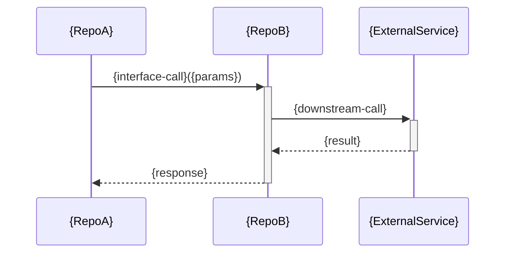

# クロスリポジトリシーケンス図 — {flow}

**フロー:** {flow}  
**最終更新CR:** {CR}  

> 気づきメモはインタフェース `spec.md` に記録してください（このファイルには気づきメモセクションなし）。

---

## 1. 文書概要

| 項目 | 内容 |
|---|---|
| フロー名 | {flow} |
| 参加者スコープ | リポジトリ間サービス間（例: `frontend → api-gateway → worker`、`ECU_A → CAN_Bus → ECU_B`） |

---

## 2. シナリオ説明

{このシーケンスが表すクロスリポジトリフローの説明。}

---

## 3. シーケンス図

> 参加者スコープ: リポジトリ間サービス間。
> Webシステム例: `frontend → api-gateway → worker`
> マルチECU例: `ECU_A → CAN_Bus → ECU_B`
> クロスリポジトリ SPO §3「リポジトリ間シーケンス図」セクションから取得する。

---

## 4. 変更履歴

| バージョン | CR | 日付 | 変更内容 |
|---|---|---|---|
| 1.0.0 | {CR} | {YYYY-MM-DD} | 初版作成（クロスリポジトリ SPO から生成） |
