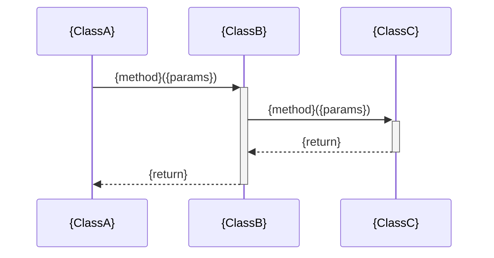

# モジュール内シーケンス図 — {module} / {scenario}

**リポジトリ:** {repo}  
**モジュール:** {module}  
**シナリオ:** {scenario}  
**最終更新CR:** {CR}  

---

## 1. 文書概要

| 項目 | 内容 |
|---|---|
| 対象モジュール | {module} |
| シナリオ名 | {scenario} |
| 参加者スコープ | モジュール内クラス・関数間（例: `AuthService → TokenValidator → UserRepository`） |

---

## 2. シナリオ説明

{このシーケンスが表すシナリオの説明。何のユースケースの一部であるかを記述する。}

---

## 3. シーケンス図

> 参加者スコープ: モジュール内クラス・関数間。
> Webシステム例: `AuthService → TokenValidator → UserRepository`
> 組み込み例: `MotorController → PWMDriver → TimerHW`
> SPO §2「現状仕様 → モジュール内シーケンス図」セクションから取得する。

---

## 4. 変更履歴

| バージョン | CR | 日付 | 変更内容 |
|---|---|---|---|
| 1.0.0 | {CR} | {YYYY-MM-DD} | 初版作成（SPO から生成） |
