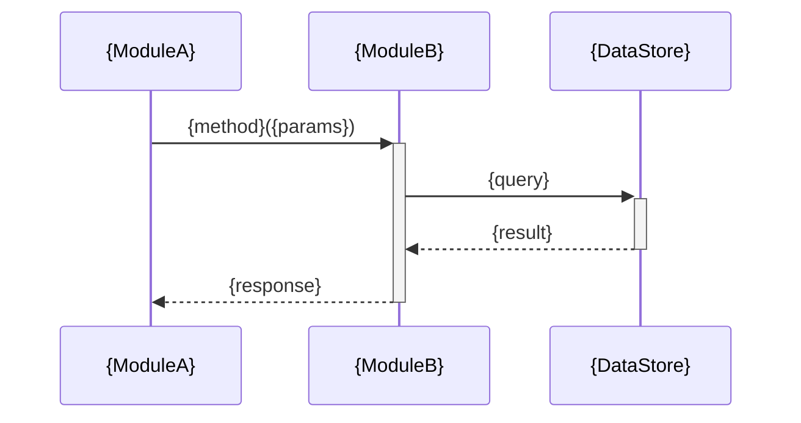

# リポジトリ内クロスモジュールシーケンス図 — {repo} / {feature}

**リポジトリ:** {repo}  
**フィーチャー:** {feature}  
**最終更新CR:** {CR}  

> 気づきメモは `architecture.md` に記録してください（このファイルには気づきメモセクションなし）。
> このファイルは **正典（実装レベルシーケンス）** です。
> `system/use-cases/` のシーケンスはこのファイルへのリンク参照を推奨します（重複記述を避けるため）。

---

## 1. 文書概要

| 項目 | 内容 |
|---|---|
| 対象リポジトリ | {repo} |
| フィーチャー名 | {feature} |
| 参加者スコープ | リポジトリ内モジュール間（例: `AuthModule → SessionModule → DB`） |

---

## 2. シナリオ説明

{このシーケンスが表すシナリオの説明。どの機能・ユースケースの実装フローであるかを記述する。}

---

## 3. シーケンス図

> 参加者スコープ: リポジトリ内モジュール間。起点は API エントリポイント / Service クラス 等。
> Webシステム例: `AuthModule → SessionModule → DB`
> 組み込み例: `CommModule → DataParser → StateManager`
> SPO サマリー「モジュール間シーケンス図」セクションから取得する。

---

## 4. 変更履歴

| バージョン | CR | 日付 | 変更内容 |
|---|---|---|---|
| 1.0.0 | {CR} | {YYYY-MM-DD} | 初版作成（SPO から生成） |
