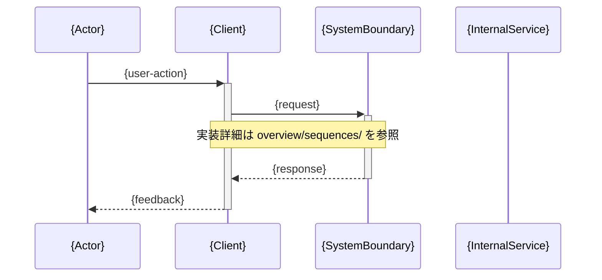

# ユースケースシーケンス図 — {usecase-kebab} / {scenario}

**ユースケース:** {usecase-kebab}  
**シナリオ:** {scenario}  
**最終更新CR:** {CR}  

> 気づきメモは `description.md` に記録してください（このファイルには気づきメモセクションなし）。
> **参加者スコープ:** アクター〜システム境界（ユーザー視点のラッパーシーケンス）。
> モジュール間の実装詳細は `overview/sequences/` へのリンク参照を推奨します（重複記述を避けるため）。

---

## 1. 文書概要

| 項目 | 内容 |
|---|---|
| ユースケース名 | {usecase-kebab} |
| シナリオ名 | {scenario} |
| 参加者スコープ | アクター〜システム境界 |
| 実装詳細参照 | [{repo}/overview/sequences/{feature}-seq.md](../../{repo}/overview/sequences/{feature}-seq.md)（存在する場合） |

---

## 2. シナリオ説明

{このシーケンスが表すシナリオの説明。アクターがどのような目的で何を操作するかを記述する。}

---

## 3. シーケンス図

> 参加者スコープ: アクター〜システム境界。
> Webシステム例: `User → Browser → API → DB`
> 組み込み例: `Operator → HMI → Controller → Actuator`
> 外部連携例: `ExternalSystem → CommDriver → AppCore`
> **アクター補完方針（CRS §2 UR のアクター記述から以下の優先順位で起点を補完）:**
>   1. UR にアクター・クライアント種別の記述がある → その記述を使用
>   2. SPO のエントリポイント種別から推定できる → 推定して使用（「（推定補完）」注記を付与）
>   3. 推定不可 → `{Initiator} → {エントリポイント}` の最小形（「（起動主体不明・最小補完）」注記を付与）

---

## 4. 変更履歴

| バージョン | CR | 日付 | 変更内容 |
|---|---|---|---|
| 1.0.0 | {CR} | {YYYY-MM-DD} | 初版作成（CRS UR + SPO §3 から AI 合成） |
