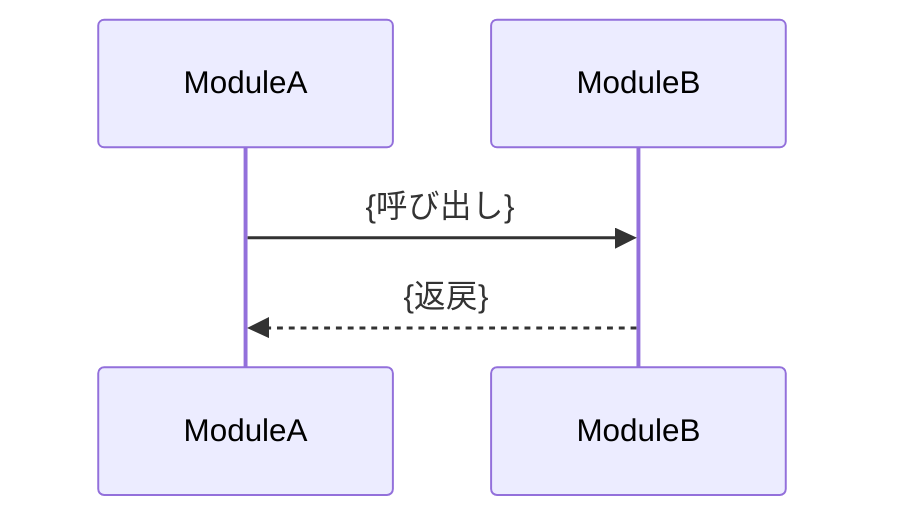

# 機能間フロー（シーケンス） — {domain}-{flow-name}

> 更新ルール: Upsert（同一フロー名を上書き更新）。出典は（CR-NNN）で記録。
> **命名規則:** ファイル名は `{domain}-{flow-name}-sequence.md`。{domain} はプロジェクト側が自由に決める（例: `auth`・`sensor`・`order`）。{flow-name} は SPO 図タイトルから派生（スペース→ハイフン・小文字）。
> **対象:** 複数モジュールのアクターをまたぐシーケンス図（モジュール境界を越えるフロー）。単一モジュール内フローは対象外。

## シーケンス図

**含まれるモジュール:** {モジュール名一覧}
**出典:** CR-NNN / SPO Section 3 / 更新日: YYYY-MM-DD

## 注意事項・制約

- {このフローに紐づく設計上の注意点・タイミング制約・呼び出し順序の前提等}
