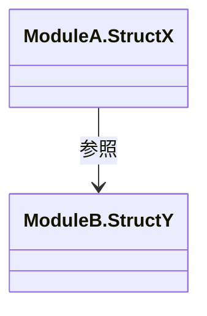

# 構造体関連図 — {domain}

> 更新ルール: Upsert（同一ドメインの図を上書き更新）。出典は（CR-NNN）で記録。
> OOP言語: classDiagram / 手続き型（C言語等）: テキスト表または graph LR

## モジュール間の構造体依存関係

**含まれるモジュール:** {モジュール名一覧}
**出典:** CR-NNN / 更新日: YYYY-MM-DD

## 注意事項・制約

- {この関連図に紐づく設計上の注意点}
