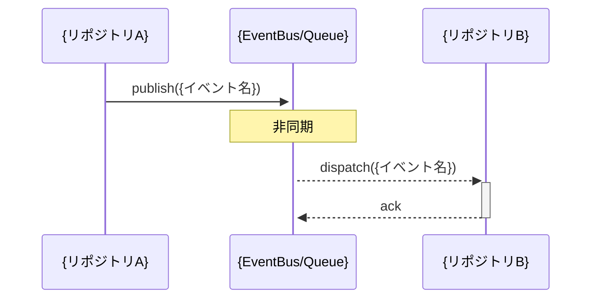
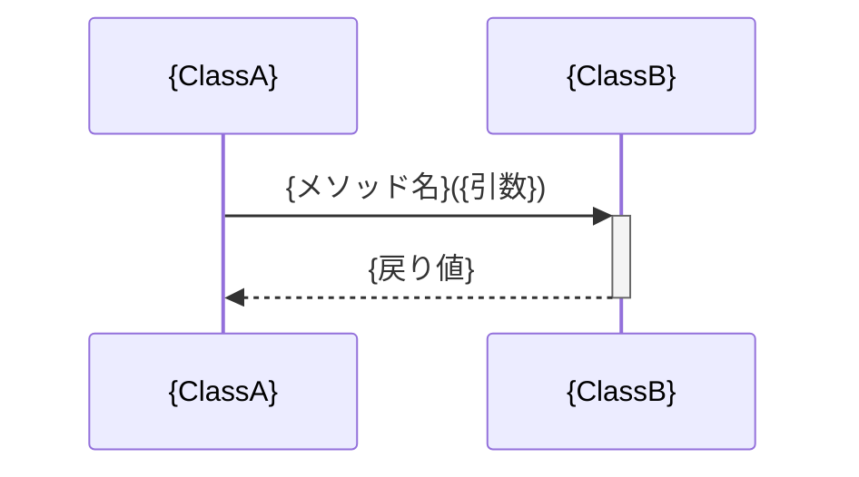

# スペックアウト資料（クロスリポジトリ）

**文書番号：** SPO-{CR番号}-cross  
**対象CR：** {CR番号}  
**対象リポジトリ：** {リポジトリA}, {リポジトリB}, ...  
**作成日：** {YYYY-MM-DD}  
**作成者：** AI（xddp-specout-agent）  
**版数：** 1.0

---

## 1. 概要

このドキュメントは {CR番号} に関わる複数リポジトリ間の相互作用・依存関係を記録する。
リポジトリ固有の詳細は `{リポジトリ名}/SPO-{CR番号}.md` を参照。

| 対象リポジトリ | 参照先 |
|-------------|------|
| {リポジトリA} | [{リポジトリA}/SPO-{CR番号}.md](../{リポジトリA}/SPO-{CR番号}.md) |
| {リポジトリB} | [{リポジトリB}/SPO-{CR番号}.md](../{リポジトリB}/SPO-{CR番号}.md) |

---

## 2. 構造図

> システム／リポジトリ全体の階層・構成要素の関係（パッケージ図・コンポーネント図相当）。
> 複数リポジトリ間のサービス境界・レイヤー・依存方向を俯瞰する。

```
{構造図をテキスト・Mermaid・ASCII等で記述}
```

---

## 3. シーケンス図

> 主要ユースケース・処理フローのリポジトリ間メッセージ交換を時系列で示す。
> SPECOUT_SEQUENCE_LEVELS に従い、指定されたレベルごとに独立したシーケンス図を作成する。
> 非同期コールバック・キュー経由の処理はノート（Note）で明示すること。

### 3.1 {レベル名}レベルのシーケンス図（例: repository）



### 3.2 {レベル名}レベルのシーケンス図（例: class）



---

## 4. CRUD図

> エンティティに対する操作（Create / Read / Update / Delete）の実施箇所をマトリクスで示す。
> `full` レベルまたはデータ競合リスクがある場合のみ作成。該当なしの場合は「対象外」と記載。

| 機能／処理名 | {エンティティA} | {エンティティB} | {エンティティC} |
|------------|:----------:|:----------:|:----------:|
| {処理1} | C | R | - |
| {処理2} | - | U | D |

凡例: C=Create, R=Read, U=Update, D=Delete, -=操作なし

---

## 5. ER図

> データモデル（エンティティ・属性・リレーション）。DBテーブル・ドメインモデル相当。
> `full` レベルまたはスキーマ変更がある場合のみ作成。該当なしの場合は「対象外」と記載。

```mermaid
erDiagram
    {ENTITY_A} {
        {type} {field} PK
        {type} {field}
    }
    {ENTITY_B} {
        {type} {field} PK
        {type} {field} FK
    }
    {ENTITY_A} ||--o{ {ENTITY_B} : "{関係}"
```

---

## 6. データフロー図（DFD）

> リポジトリ間のデータの流れ。
> 調査結果からデータフローが識別できた場合に記述する。識別できなかった場合はこのセクションを省略する。

```mermaid
graph LR
    {外部入力}(["{入力源}"]) --> {プロセスA}["{処理A}"]
    {プロセスA} --> {データストアA}[("{DB/ファイル}")]
    {プロセスA} --> {プロセスB}["{処理B}"]
    {プロセスB} --> {外部出力}(["{出力先}"])
```

---

## 7. 追加提案図（任意）

> 以下は対象システムの特性に応じて作成を検討する図。イベントドリブン非同期・マルチタスク系では ★ を優先選択。

| 図の種類 | 目的 | 作成有無 |
|---------|------|---------|
| ★ タイミング図 | 非同期処理・タイマー・割り込みのタイミング依存分析 | 未作成／作成済み |
| ★ 依存関係図 | リポジトリ間のimport/use依存の可視化 | 未作成／作成済み |

---

## 8. 変更履歴

| 版数 | 日付 | 変更者 | 変更内容 |
|------|------|--------|----------|
| 1.0 | {YYYY-MM-DD} | AI（xddp-specout-agent） | 初版作成 |
