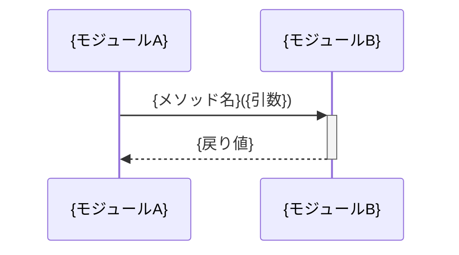

# スペックアウト資料（サマリー）

**文書番号：** SPO-{CR番号}  
**対象CR：** {CR番号}  
**作成日：** {YYYY-MM-DD}  
**作成者：** AI（xddp-specout-agent）  
**版数：** 1.0

---

## 1. 調査概要

| 項目 | 内容 |
|------|------|
| 調査起点 | {変更対象の識別子・ファイル・関数名等} |
| 調査範囲 | {調査したモジュール・レイヤー} |
| 検出モジュール数 | {N} モジュール |
| 既存仕様書 | あり（{ファイルパス}）／なし |

---

## 2. 全体アーキテクチャ図

> 影響モジュール・コンポーネントの構成と依存方向を俯瞰するコンポーネント図。
> モジュールが 1 つの場合は、そのモジュール内の主要コンポーネント（クラス・ファイル）を示す。

```mermaid
graph TB
    {モジュールA}["モジュールA\n({主要ファイル})"]
    {モジュールB}["モジュールB\n({主要ファイル})"]
    {モジュールA} --> {モジュールB}
```

---

## 3. モジュール間シーケンス図

> モジュール間の主要呼び出しフローを記述する。
> モジュールが 1 つまたはモジュール間呼び出しなしの場合は「対象外」と記載。



---

## 4. データフロー図（DFD）

> データの入力源・処理・データストア・出力先の流れ。
> 調査結果からデータフローが識別できた場合に記述する。識別できなかった場合はこのセクションを省略する。

```mermaid
graph LR
    {外部入力}(["{入力源}"]) --> {プロセスA}["{処理A}"]
    {プロセスA} --> {データストアA}[("{DB/ファイル}")]
    {プロセスA} --> {プロセスB}["{処理B}"]
    {プロセスB} --> {外部出力}(["{出力先}"])
```

---

## 5. 影響範囲の分析

### 5.1 直接影響箇所

| ファイルパス | 識別子 | 影響種別 | モジュール | 説明 |
|------------|--------|----------|----------|------|
| {パス} | {関数名等} | 変更必要／参照のみ | {モジュール名} | {影響の内容} |

### 5.2 間接影響箇所（波紋）

| ファイルパス | 識別子 | 影響種別 | モジュール | 説明 |
|------------|--------|----------|----------|------|
| {パス} | {関数名等} | 要確認／影響なし | {モジュール名} | {影響の内容} |

### 5.3 影響なしと判断した範囲

{調査したが影響なしと判断した理由を記述する}

---

### 5.4 エラー・例外パスへの影響

> 変更によって影響を受けるエラー処理・例外ハンドリングを記録する。
> 例外コードの追加・変更、ロールバック挙動の変化、エラー伝搬経路の変化などを対象とする。
> 変更前後で挙動が変わらない場合は「影響なし」と記載する。

| ファイルパス | 識別子 | 変更前のエラー処理 | 変更後の懸念 | 優先度 |
|---|---|---|---|:---:|
| {パス} | {関数名・例外クラス} | {現在のハンドリング内容} | {変更による懸念事項} | 高／中／低 |

---

### 5.5 既存テスト状況

> 影響ファイルの既存テスト有無を記録する。テストなしのファイルへの変更はリスクが高く、工程11（テスト設計）で重点フォローが必要。

| ファイルパス | テストファイル | テスト有無 | 備考 |
|---|---|:---:|---|
| {パス} | {テストファイルパス} | ✅ あり / ❌ なし | {備考} |

---

## 6. 機能ソースコード対応表

> 要求機能・仕様項目とそれを実装するソースコードの対応。影響範囲の地図として機能する。
> 「現行シグネチャ（概略）」列には変更前の関数シグネチャ・戻り値型・主な副作用を記録する。設計フェーズで「何を変えてよいか」の判断基準となる。

| 機能ID／仕様項目 | リポジトリ | ファイルパス | クラス／関数名 | 現行シグネチャ（概略） | 行番号 | 備考 |
|----------------|----------|------------|--------------|-------------------|--------|------|
| {機能ID} | {リポジトリ名} | {パス} | {識別子} | {シグネチャ} | {行} | {備考} |

---

## 7. 変更要求仕様書への反映事項

{スペックアウト結果をもとに、変更要求仕様書の仕様・TMに追記・修正すべき事項を列挙する}

- {反映事項1}
- {反映事項2}

---

## 8. 調査済みモジュール一覧

> モジュール個別資料・クロスリポジトリ資料へのリンク。

| モジュール名 | ディレクトリ | 個別資料 |
|------------|------------|--------|
| {モジュール名} | {src/xxx/} | [modules/{モジュール名}-spo.md](modules/{モジュール名}-spo.md) |

**クロスリポジトリ資料（2リポジトリ以上の場合）:**
[../cross/SPO-{CR番号}-cross.md](../cross/SPO-{CR番号}-cross.md)

---

## 9. 気づき・提案メモ

> 作成・レビュー中に気づいた修正すべき内容・改善案・懸念事項を自由に記録する。
> 現在のCRスコープ外の内容も記載可。次のCR起票・バックログの入力として活用する。

| # | 種別 | 内容 | 対応方針 |
|---|------|------|----------|
| 1 | 修正点／改善案／懸念／質問 | {内容} | 今回対応／次回CR／保留／却下 |

---

## 10. リポジトリ境界

> マルチリポジトリ構成で、このリポジトリから他リポジトリへの呼び出し境界が検出された場合のみ記載する。
> 検出されなかった場合はこのセクションを省略する。

| 呼び出し元ファイル | 行番号 | 呼び出し先リポジトリ | インタフェース名 | 備考 |
|----------------|--------|----------------|--------------|------|
| {ファイルパス} | {行番号} | {リポジトリ名} | {関数名・APIパス} | {備考} |

---

## 11. 変更履歴

| 版数 | 日付 | 変更者 | 変更内容 |
|------|------|--------|----------|
| 1.0 | {YYYY-MM-DD} | AI（xddp-specout-agent） | 初版作成 |
