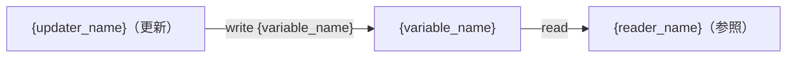

# {ドメイン名} — {フロー名} 変数データフロー（Callgraph）

**対象変数/識別子:** `{variable_name}`
**生成日:** {YYYY-MM-DD}
**出典:** {source}（例: manual/2026-07-04、CR-2026-001）

> 更新ルール: 同一ファイル（{domain}-{name}-callgraph.md）は内容更新＋変更履歴追記。
> 出典が変わる場合は変更履歴セクションに記録する。

---

## 更新処理一覧

| 識別子・処理名 | ファイルパス | 更新タイミング・条件 |
|---|---|---|
| `{updater_name}` | `{file_path}` | {更新条件・タイミング} |

---

## 参照処理一覧

| 識別子・処理名 | ファイルパス | 参照タイミング・条件 |
|---|---|---|
| `{reader_name}` | `{file_path}` | {参照条件・タイミング} |

---

## データフロー図

---

## 注意事項・リスク

{並行更新リスク、タイミング制約、スレッドセーフ、割り込み等}

---

## 変更履歴

| 日付 | 出典 | 変更内容 |
|---|---|---|
| {YYYY-MM-DD} | {source} | 初版 |
