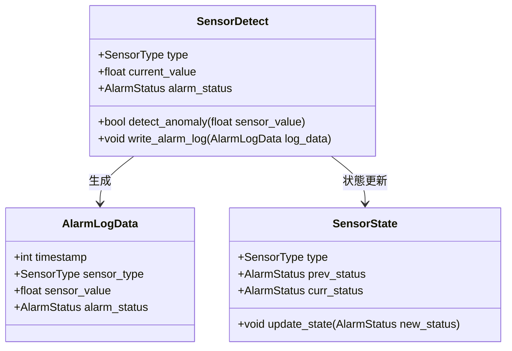
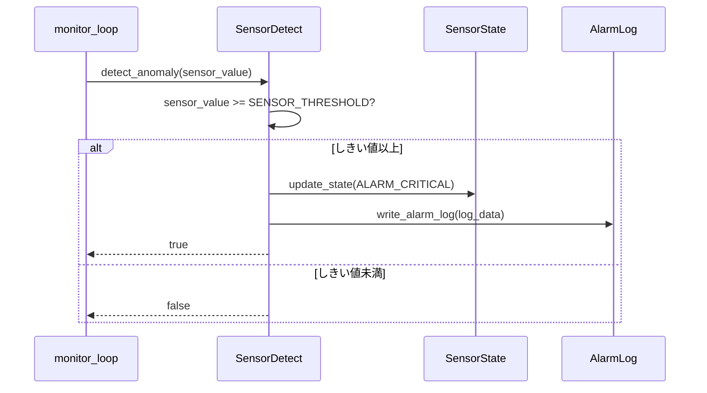
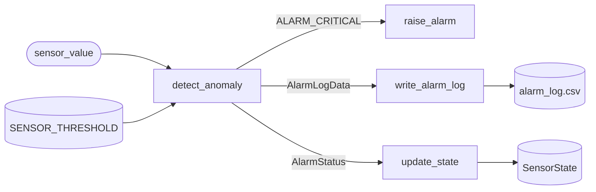
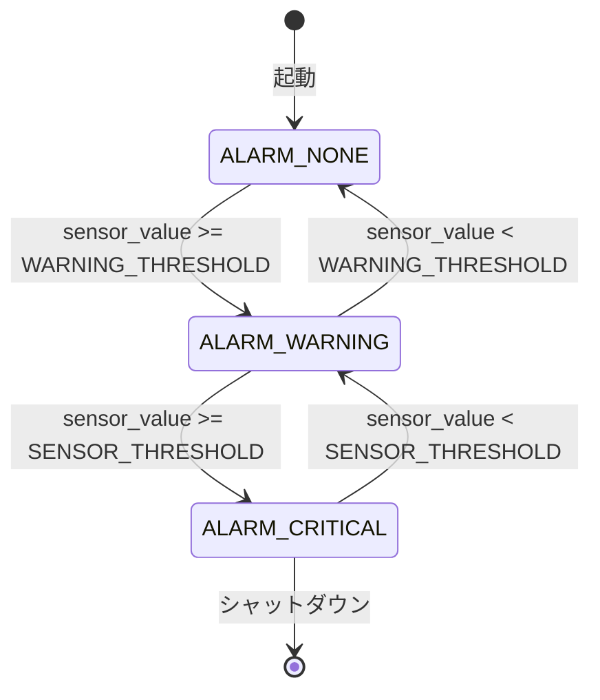

# スペックアウト資料

## ヘッダ情報
| 項目 | 内容 |
|------|------|
| 対応CR番号 | CR-2024-031 |
| タイトル | 温度センサー異常検知のしきい値変更 |

---

## 調査対象

| No | ファイル名 | モジュール／クラス名 | 関数名 | 調査目的 |
|----|-----------|-------------------|--------|---------|
| 1 | sensor_detect.c | SensorDetect | detect_anomaly() | しきい値定数の参照箇所を確認 |
| 2 | sensor_detect.c | SensorDetect | write_alarm_log() | 警報ログのCSV出力フォーマットを確認 |
| 3 | sensor_common.h | - | - | 共通定数・enum定義を確認 |
| 4 | sensor_state.c | SensorState | update_state() | センサー状態遷移への影響を確認 |

---

## 定数・列挙型の定義

### 定数（#define / const）

| No | 名称 | 定義場所 | 現在値 | 説明 | 変更要否 |
|----|------|---------|--------|------|---------|
| 1 | SENSOR_THRESHOLD | sensor_common.h:42 | 80.0f | 全センサー共通の異常検知しきい値 | 要（分離が必要） |
| 2 | TEMP_THRESHOLD | 未定義 | - | 温度センサー専用しきい値（新規追加） | 要（新規追加） |
| 3 | PRESSURE_THRESHOLD | sensor_common.h:43 | 1.5f | 圧力センサーのしきい値 | 不要 |
| 4 | HUMIDITY_THRESHOLD | sensor_common.h:44 | 90.0f | 湿度センサーのしきい値 | 不要 |
| 5 | ALARM_LOG_MAX | sensor_common.h:50 | 1000 | 警報ログの最大保存件数 | 不要 |

### 列挙型（enum）

```c
// SensorType： センサーの種別を表す列挙型
// 定義場所：sensor_common.h:10
typedef enum {
    SENSOR_TEMP     = 0,  // 温度センサー
    SENSOR_PRESSURE = 1,  // 圧力センサー
    SENSOR_HUMIDITY = 2,  // 湿度センサー
} SensorType;

// AlarmStatus： アラームの状態を表す列挙型
// 定義場所：sensor_common.h:18
typedef enum {
    ALARM_NONE    = 0,  // アラームなし
    ALARM_WARNING = 1,  // 警告レベル
    ALARM_CRITICAL = 2, // 異常レベル
} AlarmStatus;
```

| メンバー名 | 値 | 説明 | 変更要否 |
|-----------|-----|------|---------|
| SENSOR_TEMP | 0 | 温度センサー | 不要 |
| SENSOR_PRESSURE | 1 | 圧力センサー | 不要 |
| SENSOR_HUMIDITY | 2 | 湿度センサー | 不要 |
| ALARM_NONE | 0 | アラームなし | 不要 |
| ALARM_WARNING | 1 | 警告レベル | 不要 |
| ALARM_CRITICAL | 2 | 異常レベル | 不要 |

---

## データ構造の調査

### 構造体／クラス図



### 構造体詳細

| No | 構造体名 | メンバー名 | 型 | 定義場所 | 説明 | 変更要否 |
|----|---------|-----------|-----|---------|------|---------|
| 1 | AlarmLogData | timestamp | int | alarm_log.h:10 | アラーム発生時刻 | 不要 |
| 2 | AlarmLogData | sensor_type | SensorType | alarm_log.h:11 | センサー種別 | 不要 |
| 3 | AlarmLogData | sensor_value | float | alarm_log.h:12 | センサー値 | 不要 |
| 4 | AlarmLogData | alarm_status | AlarmStatus | alarm_log.h:13 | アラーム状態 | 不要 |

---

## 処理構造の調査

### detect_anomaly()

**ファイル**：sensor_detect.c:105

**処理概要**：
センサー値を受け取り、SENSOR_THRESHOLDと比較して異常検知アラームを発生させる

**処理フロー**：
1. 引数 `sensor_value`（float）を受け取る
2. `SENSOR_THRESHOLD` と比較
3. `sensor_value >= SENSOR_THRESHOLD` の場合、`raise_alarm()` を呼び出す
4. 戻り値として検知結果（bool）を返す

**変更要否**：要

**変更方針**：
`SENSOR_THRESHOLD` の参照を `TEMP_THRESHOLD` に変更する。関数シグネチャ・戻り値の型は変更しない。

---

### write_alarm_log()

**ファイル**：sensor_detect.c:198

**処理概要**：
アラーム発生時に警報ログをCSVファイルに書き出す

**処理フロー**：
1. `AlarmLogData` 構造体からCSV行を生成
2. タイムスタンプ・センサーID・センサー値・アラーム種別を出力
3. ファイルに追記書き込みする

**変更要否**：不要

**変更方針**：
しきい値変更はCSV出力フォーマットに影響しない。変更不要。

---

## 制御構造の調査

### 呼び出し関係テーブル

| No | 呼び出し元 | 呼び出し先 | 引数 | 戻り値 | 影響有無 |
|----|-----------|-----------|------|--------|---------|
| 1 | monitor_loop() | detect_anomaly() | sensor_value: float | bool | 無（引数・戻り値に変更なし） |
| 2 | detect_anomaly() | raise_alarm() | alarm_type: AlarmStatus | void | 無 |
| 3 | detect_anomaly() | write_alarm_log() | log_data: AlarmLogData | void | 無（フォーマット変更なし） |
| 4 | detect_anomaly() | update_state() | new_status: AlarmStatus | void | 確認中（状態遷移への影響を確認要） |

### シーケンス図



### DFD（データフロー図）



---

## 状態の調査

### 状態遷移図



### 状態遷移テーブル

| 現在状態 | イベント／条件 | 次状態 | アクション | 変更要否 |
|---------|-------------|--------|-----------|---------|
| ALARM_NONE | sensor_value >= WARNING_THRESHOLD | ALARM_WARNING | write_alarm_log() | 不要 |
| ALARM_WARNING | sensor_value >= SENSOR_THRESHOLD | ALARM_CRITICAL | raise_alarm(), write_alarm_log() | 要（SENSOR_THRESHOLD→TEMP_THRESHOLDに変更） |
| ALARM_CRITICAL | sensor_value < SENSOR_THRESHOLD | ALARM_WARNING | write_alarm_log() | 要（同上） |
| ALARM_WARNING | sensor_value < WARNING_THRESHOLD | ALARM_NONE | - | 不要 |

---

## 調査結果サマリ

### 変更が必要な箇所
| No | ファイル名 | 関数名／定数名 | 変更内容 | 対応仕様番号 |
|----|-----------|-------------|---------|------------|
| 1 | sensor_common.h | SENSOR_THRESHOLD | 温度専用定数 TEMP_THRESHOLD を新規追加（85.0f） | CRS-2024-031-01-01〜02 |
| 2 | sensor_detect.c | detect_anomaly() | SENSOR_THRESHOLD → TEMP_THRESHOLD に変更 | CRS-2024-031-02-01 |
| 3 | sensor_state.c | update_state() | ALARM_CRITICAL遷移条件のしきい値参照を変更 | CRS-2024-031-02-01 |

### 調査で新たに判明した事項
| No | 判明した事項 | 対応 | フィードバック先仕様番号 |
|----|-----------|------|----------------------|
| 1 | SENSOR_THRESHOLDは圧力・湿度センサーと共通定数だった。分離が必要。 | 仕様書に追記済み | CRS-2024-031-02-01 |
| 2 | update_state() もSENSOR_THRESHOLDを参照しており変更が必要 | 仕様書に追記済み | CRS-2024-031-02-01 |
| 3 | write_alarm_log() のCSVフォーマットはしきい値に依存しないことを確認 | 対応不要 | 対応不要 |

### 未解決事項
| No | 内容 | 確認先 | 期限 |
|----|------|--------|------|
| 1 | TEMP_THRESHOLD=85.0fの根拠（通常運転温度の実測データ）を確認 | 山田様（品質保証部） | 2024-11-08 |
| 2 | WARNING_THRESHOLDの変更要否を確認（今回の変更で誤警告が出ないか） | 鈴木 一郎（設計担当） | 2024-11-10 |
