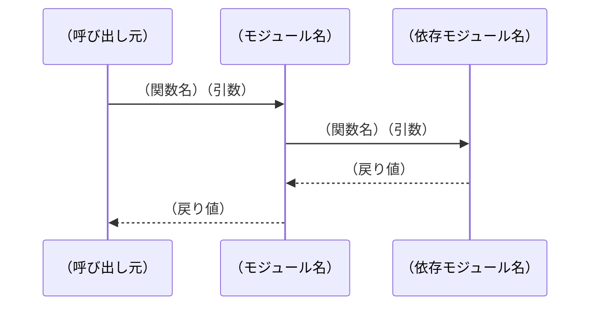
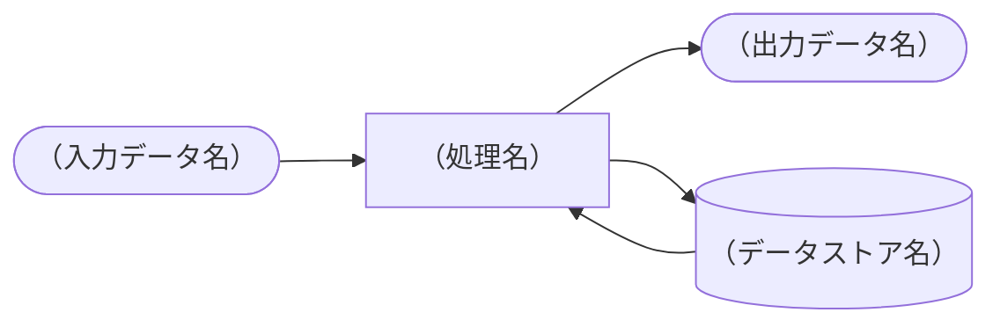
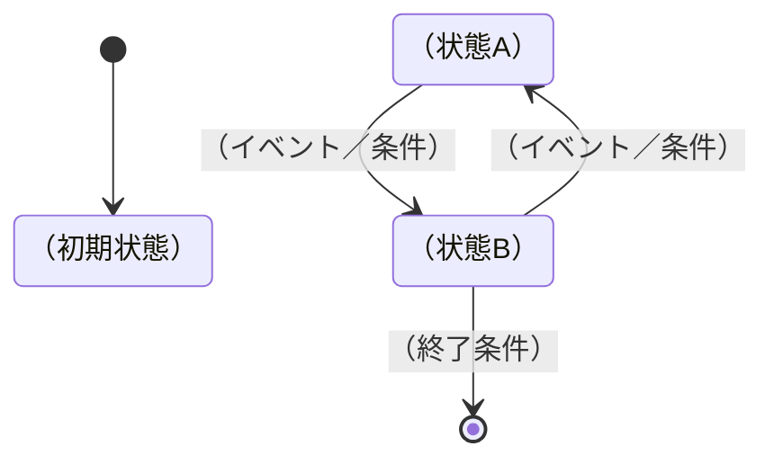

# スペックアウト資料

## ヘッダ情報
| 項目 | 内容 |
|------|------|
| 対応CR番号 | CR-YYYY-NNN |
| タイトル | （変更の概要を一行で） |

---

## 調査対象

<!-- 調査したソースファイル・モジュール・関数の一覧 -->

| No | ファイル名 | モジュール／クラス名 | 関数名 | 調査目的 |
|----|-----------|-------------------|--------|---------|
| 1 | （ファイル名.c） | （モジュール名） | （関数名） | （なぜ調査したか） |

---

## 定数・列挙型の定義

<!-- enum・define・const など定数・列挙型の定義を記録する -->
<!-- 不明な場合は「確認中：〇〇担当者に確認予定」と記載 -->

### 定数（#define / const）

| No | 名称 | 定義場所 | 現在値 | 説明 | 変更要否 |
|----|------|---------|--------|------|---------|
| 1 | （定数名） | （ファイル名:行番号） | （値） | （何を表すか） | 要／不要／確認中 |

### 列挙型（enum）

<!-- enum定義を記録する -->

```c
// （enum名）： （何を表すか）
// 定義場所：（ファイル名:行番号）
typedef enum {
    // （メンバー名） = （値）,  // （説明）
} （enum名）;
```

| メンバー名 | 値 | 説明 | 変更要否 |
|-----------|-----|------|---------|
| （メンバー名） | （値） | （説明） | 要／不要／確認中 |

---

## データ構造の調査

<!-- 構造体・クラスの定義を記録する -->

### 構造体／クラス図

<!-- Mermaidのクラス図で構造体・クラスの関係を表現する -->
<!-- 変更対象の構造体・クラスのみを記載し、関係する構造体も含める -->

```mermaid
classDiagram
    class （クラス名） {
        +（型） （メンバー名）
        +（型） （メンバー名）
        +（戻り値型） （メソッド名）（引数）
    }
    class （関連クラス名） {
        +（型） （メンバー名）
    }
    （クラス名） --> （関連クラス名） : （関係の説明）
```

### 構造体詳細

| No | 構造体名 | メンバー名 | 型 | 定義場所 | 説明 | 変更要否 |
|----|---------|-----------|-----|---------|------|---------|
| 1 | （構造体名） | （メンバー名） | （型） | （ファイル名:行番号） | （何を表すか） | 要／不要／確認中 |

---

## 処理構造の調査

<!-- 変更に関係する処理の流れ・ロジックを記録する -->

### （関数名／処理名）

**ファイル**：（ファイル名:行番号）

**処理概要**：
（この関数・処理が何をするか）

**処理フロー**：
1. （ステップ①）
2. （ステップ②）
3. （ステップ③）

**変更要否**：要／不要／確認中

**変更方針**（変更要の場合）：
（どのように変更するか）

---

## 制御構造の調査

<!-- 呼び出し関係・依存関係を記録する -->

### 呼び出し関係テーブル

<!--
影響有無：有 / 無 / 確認中
打ち切り基準（影響無の場合に記載）：
  基準1: アーキテクチャ境界（引数・戻り値の型が変わらない）
  基準2: パススルー（値を加工せず渡すだけ）
  基準3: 別リポジトリへの影響がIF仕様変更なし
  基準4: テストコードのみの参照
  基準5: 過去CR調査済み（CR番号を記載）
-->

| No | 呼び出し元 | 呼び出し先 | 引数 | 戻り値 | 影響有無 | 打ち切り基準 |
|----|-----------|-----------|------|--------|---------|------------|
| 1 | （関数名） | （関数名） | （引数） | （戻り値） | 有／無／確認中 | （基準1〜5または「-」） |

### シーケンス図

<!-- 処理の時系列的な流れをMermaidのシーケンス図で表現する -->
<!-- 変更対象の処理が絡む主要なシーケンスを記載する -->



### DFD（データフロー図）

<!-- データの流れをMermaidのflowchartで表現する -->
<!-- 変更対象のモジュールへの入出力データの流れを記載する -->



---

## 状態の調査

<!-- 状態を持つモジュール・オブジェクトの状態遷移を記録する -->
<!-- 変更によって状態遷移が影響を受ける場合に記載する -->

### 状態遷移図



### 状態遷移テーブル

| 現在状態 | イベント／条件 | 次状態 | アクション | 変更要否 |
|---------|-------------|--------|-----------|---------|
| （状態名） | （イベント名） | （状態名） | （実行する処理） | 要／不要／確認中 |

---

## 調査結果サマリ

### 変更が必要な箇所
| No | ファイル名 | 関数名／定数名 | 変更内容 | 対応仕様番号 |
|----|-----------|-------------|---------|------------|
| 1 | （ファイル名） | （名称） | （変更内容の概要） | （CRS-NNN-XX-XX） |

### 調査で新たに判明した事項
<!-- ソース調査で初めてわかったこと。変更要求仕様書に追記が必要なものを記録する -->
<!-- フィードバック先：追記・更新した仕様番号を記載。未反映の場合は「未反映」と記載 -->
| No | 判明した事項 | 対応 | フィードバック先仕様番号 |
|----|-----------|------|----------------------|
| 1 | （判明した内容） | 仕様書に追記／確認中／対応不要 | CRS-NNN-XX-XX／未反映／対応不要 |

### 未解決事項
| No | 内容 | 確認先 | 期限 |
|----|------|--------|------|
| 1 | （不明点） | （担当者） | YYYY-MM-DD |
