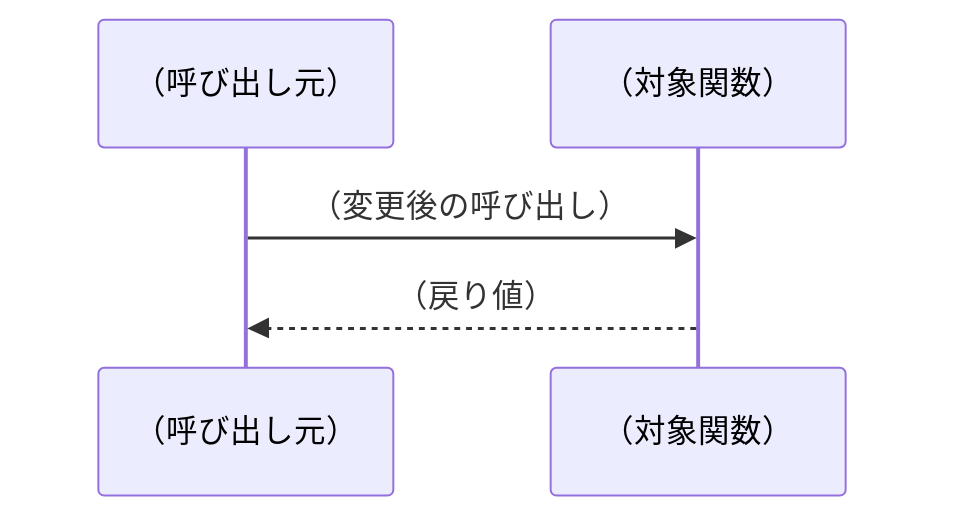

# 変更設計書

## ヘッダ情報
| 項目 | 内容 |
|------|------|
| 対応CR番号 | CR-YYYY-NNN |
| タイトル | （変更の概要を一行で） |

---

<!--
記述ルール：
- TM の交点（仕様番号 × ソースファイル）ごとに1つの変更設計書エントリを作成する
- 変更方法はソースコードをそのまま書かず、文章で記述する（How の視点）
- 変更の「差分」だけを記述する。変わらない部分は書かない
- 不明な場合は「確認中：〇〇担当者に確認予定」と記載
- ステータス：作成中 / レビュー待ち / 承認済み / 却下
-->

---

## 変更エントリ：（仕様番号）×（ファイル名）

### ヘッダ
| 項目 | 内容 |
|------|------|
| 仕様番号 | CRS-NNN-XX-XX |
| ソースファイル | （ファイル名） |
| 変更対象 | （関数名／定数名／構造体名） |
| ステータス | 作成中 |
| 記述者 | （氏名） |
| 日付 | YYYY-MM-DD |

### 修正方針
（なぜこの変更方法を採用するか。設計の意図を残す）

### データ構造の変更
<!-- 定数・変数・構造体の変更がある場合に記述。なければ「なし」 -->

| 変更種別 | 名称 | 変更前 | 変更後 | 理由 |
|---------|------|--------|--------|------|
| ADD／MOD／DEL | （名称） | （変更前の定義） | （変更後の定義） | （理由） |

### 関数呼び出し構造の変更
<!-- 呼び出し関係・引数・戻り値に変更がある場合に記述。なければ「なし」 -->

（変更前後の呼び出し関係を文章で記述。必要に応じてMermaidのシーケンス図を使う）

### 関数外の変更
<!-- ファイルスコープの定数・グローバル変数・型定義など関数の外の変更 -->
<!-- なければ「なし」 -->

| No | 変更種別 | 変更内容 | 予想行数 |
|----|---------|---------|---------|
| 1 | ADD／MOD／DEL | （変更内容を文章で記述） | （行数） |

### 関数内の変更
<!-- 関数・メソッドの内部ロジックの変更 -->
<!-- なければ「なし」 -->

**関数名**：（関数名）（引数）　変更種別：■変更 □追加 □削除

| No | 変更内容 | 予想行数 |
|----|---------|---------|
| 1 | （変更内容を文章で記述。ソースコードではなく変更の意図を書く） | （行数） |

### 変更後の確認項目
<!-- 変更後にホワイトボックステストで確認すべき項目 -->

| No | 確認内容 | 期待結果 |
|----|---------|---------|
| 1 | （どのような条件でテストするか） | （期待する結果） |

---
<!-- 上記の「変更エントリ」セクションをTM交点の数だけ繰り返す -->
