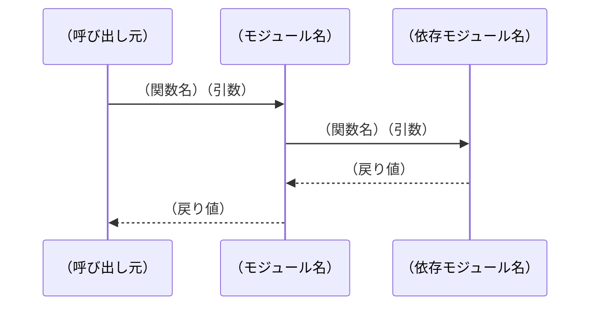
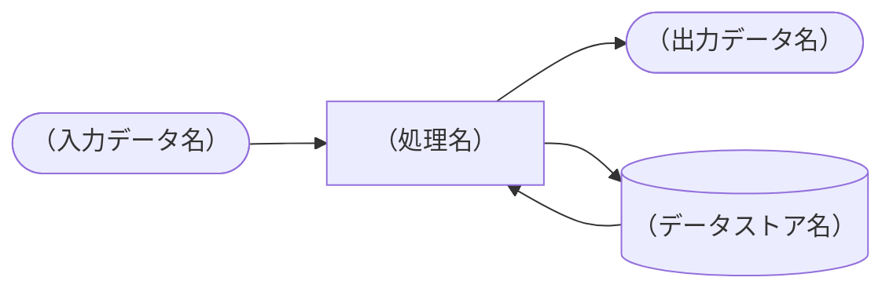

# スペックアウト資料 制御構造

## ヘッダ情報
| 項目 | 内容 |
|------|------|
| 対応CR番号 | CR-YYYY-NNN |
| 参照元 | [specout-00-summary.md](./specout-00-summary.md) |

---

## 呼び出し関係テーブル

<!--
影響有無：有 / 無 / 確認中
打ち切り基準（影響無の場合に記載）：
  基準1: アーキテクチャ境界（引数・戻り値の型が変わらない）
  基準2: パススルー（値を加工せず渡すだけ）
  基準3: 別リポジトリへの影響がIF仕様変更なし
  基準4: テストコードのみの参照
  基準5: 過去CR調査済み（CR番号を記載）
-->

| No | 呼び出し元 | 呼び出し先 | 引数 | 戻り値 | 影響有無 | 打ち切り基準 |
|----|-----------|-----------|------|--------|---------|------------|
| 1 | （関数名） | （関数名） | （引数） | （戻り値） | 有／無／確認中 | （基準1〜5または「-」） |

---

## シーケンス図

---

## DFD（データフロー図）

