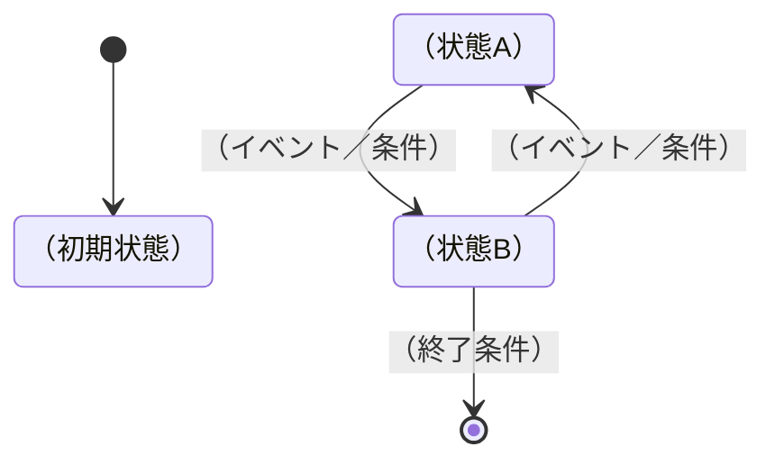

# スペックアウト資料 状態の調査

## ヘッダ情報
| 項目 | 内容 |
|------|------|
| 対応CR番号 | CR-YYYY-NNN |
| 参照元 | [specout-00-summary.md](./specout-00-summary.md) |

---

<!-- 状態を持つモジュール・オブジェクトの状態遷移を記録する -->
<!-- 変更によって状態遷移が影響を受ける場合に記載。該当なしの場合は「該当なし」と記載 -->

## 状態遷移図

---

## 状態遷移テーブル

| 現在状態 | イベント／条件 | 次状態 | アクション | 変更要否 |
|---------|-------------|--------|-----------|---------|
| （状態名） | （イベント名） | （状態名） | （実行する処理） | 要／不要／確認中 |
