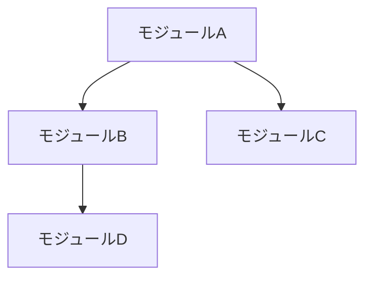
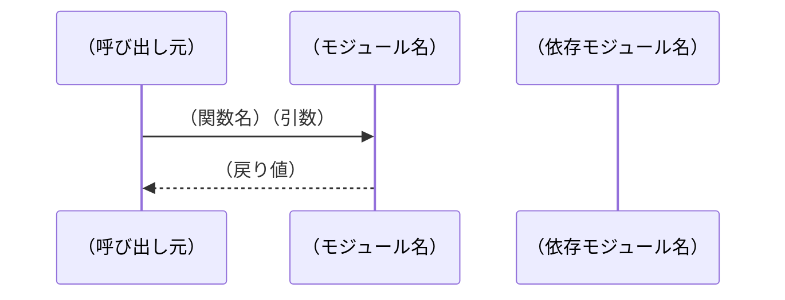
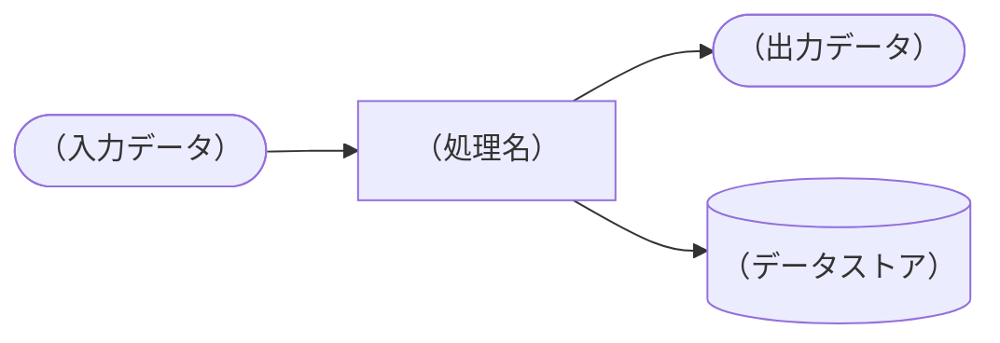
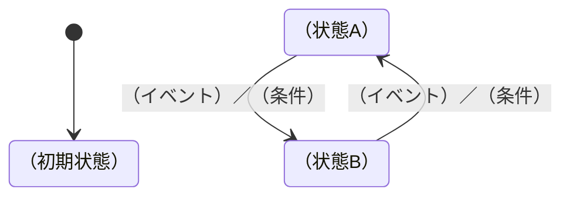

# XDDP システム設計書更新

## 目的
テスト完了・承認済みのCR変更内容を反映し、
変更後のシステム全体の設計書を最新状態に更新する。
7種類の図・仕様を変更後の状態で生成・更新する。

## 前提条件
- xddp.24.spec-updateが完了していること
- 全テストケースがOK（承認済み）であること

## 入力
- スペックアウト資料（構造・制御・状態遷移の根拠）
- 変更設計書（変更内容の詳細）
- 変更要求仕様書（変更の仕様）
- 既存の設計書（ベースライン・存在する場合）

## 出力ファイル構成

```
docs/design/
├── design-01-module.md          # モジュール構成図
├── design-02-class.md           # 構造体関連図（クラス図）
├── design-03-interface.md       # インタフェース仕様（API・関数リスト）
├── design-04-data.md            # データ定義一覧（変数・定数・enum）
├── design-05-sequence.md        # シーケンス図
├── design-06-dfd.md             # DFD（データフロー図）
└── design-07-state.md           # 状態遷移図
```

---

## 各設計書の生成内容

### design-01-module.md：モジュール構成図

変更後のシステム全体のモジュール構成をMermaidで表現する：



- 変更したモジュールを強調表示（色付け）
- 依存関係の方向を明示
- 各モジュールの役割を注記

---

### design-02-class.md：構造体関連図（クラス図）

変更後の全構造体・クラスの関係をMermaidクラス図で表現する：

```mermaid
classDiagram
    class （構造体名） {
        +（型） （メンバー名）
        +（戻り値型） （関数名）（引数）
    }
    （構造体A） --> （構造体B） : （関係）
```

- 変更した構造体・メンバーを明示（コメントで `[変更] CR-NNN` と記載）
- 全構造体の関係を網羅する
- メンバー名・型・アクセス修飾子を記載

---

### design-03-interface.md：インタフェース仕様（API・関数リスト）

変更後の全公開関数・外部IFを一覧化する：

| No | 関数名 | ファイル | 引数 | 戻り値 | 説明 | 変更 |
|----|--------|---------|------|--------|------|------|
| 1 | （関数名） | （ファイル名） | （引数リスト） | （型） | （説明） | 変更あり／なし |

- 変更した関数は「変更あり」と記載し変更内容を注記
- 外部モジュールへのIF（UART・シリアル等）も含める

---

### design-04-data.md：データ定義一覧（変数・定数・enum）

変更後の全データ定義を一覧化する：

**定数（#define / const）**

| No | 名称 | 定義場所 | 値 | 説明 | 変更 |
|----|------|---------|-----|------|------|
| 1 | （定数名） | （ファイル名:行番号） | （値） | （説明） | 変更あり／なし |

**列挙型（enum）**

| No | enum名 | メンバー名 | 値 | 説明 | 変更 |
|----|--------|-----------|-----|------|------|

**グローバル変数**

| No | 変数名 | 型 | 定義場所 | 説明 | 変更 |
|----|--------|-----|---------|------|------|

---

### design-05-sequence.md：シーケンス図

変更後のシステムの主要ユースケースをMermaidシーケンス図で表現する：



- 変更後のフローを反映した図を生成する
- 変更した処理パスを注記（`[変更] CR-NNN`）
- 主要なユースケースを網羅する（正常系・異常系）

---

### design-06-dfd.md：DFD（データフロー図）

変更後のデータの流れをMermaid flowchartで表現する：



- 変更したデータフローを注記（`[変更] CR-NNN`）
- 外部システム・センサー・アクチュエータとのIF含む

---

### design-07-state.md：状態遷移図

変更後の全状態遷移をMermaid stateDiagramで表現する：



**状態遷移テーブル**

| 現在状態 | イベント／条件 | 次状態 | アクション | 変更 |
|---------|-------------|--------|-----------|------|
| （状態名） | （イベント名） | （状態名） | （処理名） | 変更あり／なし |

- 変更した遷移を注記（`[変更] CR-NNN`）
- 全状態・全遷移パスを網羅する

---

## 手順

### Step 1: スペックアウト資料の読み込み
スペックアウト資料（1ファイルまたは分割ファイル）から以下を取得する：
- 構造体・クラス定義 → design-02-class.md に反映
- 処理構造（関数一覧）→ design-03-interface.md に反映
- 定数・enum定義 → design-04-data.md に反映
- 制御構造（シーケンス・DFD）→ design-05, 06 に反映
- 状態遷移 → design-07-state.md に反映

### Step 2: 変更設計書の差分適用
変更設計書から変更箇所を特定し、既存設計書（存在する場合）に差分を適用する。
存在しない場合はスペックアウト資料から全体を新規生成する。

### Step 3: 変更箇所のマーキング
変更したセクション・図の要素に `[変更] CR-YYYY-NNN` の注記を付ける。
これにより「今回のCRで何が変わったか」が一目でわかる状態にする。

### Step 4: 出力サマリ

```markdown
## システム設計書更新サマリ

**対応CR番号**：CR-YYYY-NNN
**更新日**：YYYY-MM-DD

| ファイル | 更新内容 | 変更マーク数 |
|---------|---------|-----------|
| design-01-module.md | （更新内容の概要） | N箇所 |
| design-02-class.md | （更新内容の概要） | N箇所 |
| design-03-interface.md | 関数N件を更新 | N件 |
| design-04-data.md | 定数N件・enum N件を更新 | N件 |
| design-05-sequence.md | （更新内容の概要） | N箇所 |
| design-06-dfd.md | （更新内容の概要） | N箇所 |
| design-07-state.md | 状態遷移N件を更新 | N件 |

### ベースライン情報
- 本設計書のベースライン：CR-YYYY-NNN適用後
- 次回ベースライン更新推奨タイミング：3〜5CR蓄積後または四半期ごと
```

## 注意事項
- 変更箇所以外の既存記述は変更しない（確認した上で維持する）
- 全図は変更後の状態を正として記載する（差分形式にしない）
- スペックアウトで「打ち切り」とした範囲は既存記述があれば維持する
- 既存設計書がない場合は本コマンドが初版となる
- Mermaid記法で生成するため、VSCode・GitHubでレンダリング可能

## テンプレートの参照先
各成果物を生成する際は以下のテンプレートを参照すること：
`~/claude/xddp/templates/`（Claude Codeと共有）
