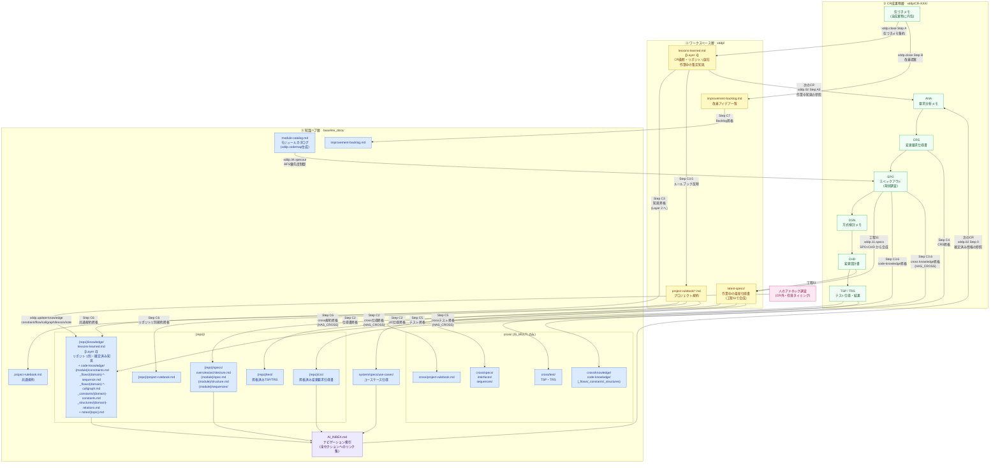

# XDDPドキュメントフロー

> このドキュメントはXDDPツールの**ドキュメント体系**を外部の人向けに説明するリファレンスです。  
> 「どのドキュメントがどの工程で生まれ、どこに蓄積されるか」の全体像を示します。

---

## 1. ドキュメント体系の3層構造

XDDPのドキュメントは3つの層に分かれます。

| 層 | 場所 | 役割 | ライフサイクル |
|---|---|---|---|
| **CR成果物層** | `xddp/CR-XXX/` | 1つのCR（変更要求）に紐付く作業中ドキュメント | CR期間中のみ |
| **ワークスペース層** | `xddp/` | CR横断・作業中の最新状態と暫定知見 | 継続的に蓄積・更新 |
| **知識ハブ層** | `baseline_docs/` | クローズ済みCR由来の確定情報（永続） | xddp.closeで昇格後、恒久保持 |

---

## 2. ドキュメントのライフサイクル図



---

## 3. xddp.close 昇格マッピング

`xddp.close` が実行すると、以下の成果物が `baseline_docs/` へ昇格されます。

| Close Step | 昇格元 | 昇格先 | 備考 |
|---|---|---|---|
| C2 | `xddp/latest-specs/{repo}/` | `baseline_docs/{repo}/specs/` | 全ファイルをコピー |
| C2 | `xddp/latest-specs/system/` | `baseline_docs/system/specs/` | シングルリポジトリでも実行 |
| C2 | `xddp/latest-specs/cross/` | `baseline_docs/cross/specs/` | IS_MULTI かつ HAS_CROSS の場合のみ |
| C3 | `xddp/lessons-learned.md` (Layer 1) | `baseline_docs/{repo}/knowledge/lessons-learned.md` (Layer 2) | repo 別にルーティング；**追記のみ**（上書きなし） |
| C3.5 | lessons-learned の `#コーディング` / `#方式検討` / `#設計` / `#テスト` タグ・NG パターン | `xddp/project-rulebook-{repo}.md` | パターン・禁止事項を upsert（Section 4: テーマ追記、Section 5: ADR追記［`#方式検討`/`#設計`タグ由来、追記のみ］、Section 6: キーワードupsert） |
| C3.6 | SPO §5.6（実装制約）・SPO §3（シーケンス）・SPO §4.2（DFD）・SPO §4.5（変数データフロー）・TRS（不具合 NG-NNN）・LL（`#リスク` `#見落とし` `#仕様定義`） | `baseline_docs/{repo}/knowledge/code-knowledge/{module}/constraints.md`<br>`baseline_docs/{repo}/knowledge/code-knowledge/_flows/{domain}-*-sequence.md`<br>`baseline_docs/{repo}/knowledge/code-knowledge/_flows/{domain}-*-dfd.md`<br>`baseline_docs/{repo}/knowledge/code-knowledge/_flows/{domain}-*-callgraph.md` | 影響度 高・中 のエントリのみ昇格。CK-NNN ID をキーに upsert（既存は置換、新規は追記）。ドメイン名は AI 推定＋人確認 |
| C3.6 | cross SPO §5（共有定数・列挙値） | `baseline_docs/cross/knowledge/code-knowledge/_constants/{domain}-constants.md` | IS_MULTI のみ |
| C3.6 | cross SPO §6（共有データ型関連図） | `baseline_docs/cross/knowledge/code-knowledge/_structures/{domain}-relations.md` | IS_MULTI のみ |
| C3.6 | cross SPO §3（リポジトリ間シーケンス図） | `baseline_docs/cross/knowledge/code-knowledge/_flows/{domain}-*-sequence.md` | IS_MULTI のみ |
| C4 | `xddp/CR-XXX/03_.../CRS-{CR}.md` | `baseline_docs/{repo}/crs/CRS-{CR}.md` | 変更の根拠を永続保存 |
| C5 | `xddp/CR-XXX/09_.../TSP-{CR}.md` + TRS | `baseline_docs/{repo}/test/` | テスト仕様と結果 |
| C5 | `xddp/CR-XXX/09_.../TSP-{CR}-cross.md` + TRS | `baseline_docs/cross/test/` | HAS_CROSS の場合のみ |
| C6 | `xddp/project-rulebook.md` | `baseline_docs/project-rulebook.md` | 共通規約の**上書き**（xddp/ がマスター） |
| C6 | `xddp/project-rulebook-{repo}.md` | `baseline_docs/{repo}/project-rulebook.md` | リポジトリ別規約の**上書き**（xddp/ がマスター） |
| C6 | `xddp/project-rulebook-cross.md` | `baseline_docs/cross/project-rulebook.md` | IS_MULTI かつ HAS_CROSS のみ |
| C7 | `xddp/improvement-backlog.md` | `baseline_docs/improvement-backlog.md` | **上書きコピー**（xddp/ がマスター） |

### 昇格しない成果物

以下は**昇格しません**。git 履歴・lessons-learned・latest-specs で代替できるため、CR フォルダ内に残ります。

| 成果物 | 理由 |
|---|---|
| DSN（方式検討メモ） | 過程成果物。設計判断の要点は lessons-learned に抽出される |
| CHD（変更設計書） | 同上 |
| CODING 記録 | 同上 |
| VERIFY（静的検証レポート） | 同上 |
| ANA（要求分析メモ） | 同上 |
| discovery-log.md / checkpoint.md | specout の中間ファイル。SPO サマリに要点を集約 |

---

## 4. 知識の参照フロー（次のCRが使う情報）

次のCRを開始したとき（`xddp.02.analysis`）、以下の順序で知識を読み込みます。

```
xddp.02 Step 0  ──  baseline_docs/AI_INDEX.md        ← ナビゲーション索引
                    baseline_docs/{repo}/specs/       ← 確定済み仕様書（モジュール spec.md）
                    baseline_docs/system/specs/       ← ユースケース仕様
                    baseline_docs/{repo}/knowledge/   ← Layer 2 知見（xddp.close昇格 + xddp.update-knowledge直接書き込み）
                      ├── lessons-learned.md
                      └── code-knowledge/             ← 制約・フロー・定数・構造体（AI_INDEX の
                            {module}/constraints.md      「code-knowledge インデックス」で絞り込み）
                    baseline_docs/cross/specs/        ← クロスIF仕様（IS_MULTI のみ）

xddp.02 Step A0 ──  xddp/lessons-learned.md          ← Layer 1 知見（作業中・未クローズCR含む）
                    （#要求分析 #仕様定義 #見落とし タグで絞り込み）

xddp.04.specout ──  baseline_docs/{repo}/module-catalog.md  ← BFS優先度制御（xddp.codemap 生成）
```

**Layer 1 と Layer 2 の役割分担:**

| | Layer 1（xddp/lessons-learned.md） | Layer 2（baseline_docs/.../lessons-learned.md） |
|---|---|---|
| **内容** | 全CR横断・全リポジトリ混在の暫定知見 | xddp.close昇格＋xddp.update-knowledge直接書き込みによるリポジトリ別確定知見 |
| **鮮度** | 高い（作業中の気づきも即反映） | 高精度（クローズ後に分類・整理済み） |
| **参照タイミング** | CR中（Step A0） | CR開始時（Step 0）、安定した参照 |

---

## 5. 条件分岐フロー

一部のフローは設定条件によって変わります。

| 条件 | 影響するフロー |
|---|---|
| `IS_MULTI: true`（複数リポジトリ） | `cross/` 成果物（SPO-cross, DSN-cross, CHD-cross）が生成される |
| `HAS_CROSS: true`（cross SPOが存在） | `cross/specs/`・`cross/test/`・`cross/project-rulebook.md` → `baseline_docs/cross/` への昇格が実行される |
| `DEVELOPMENT_MODE: new` | 工程4（4a スペックアウト・4b CRS更新）をスキップ。latest-specs は CHD から直接生成 |
| `{DOCS}` が存在しない | xddp.11.specs の AI_INDEX 先行更新をスキップ（degraded mode） |
| xddp.sync-design 実行時 | DSN リビジョンファイル `{CR_PATH}/05_architecture/{repo}/DSN-{CR}-rev{N}.md` を追加生成（元 DSN は保持） |
| xddp.feedback 実行時（arch/design/test） | CRS-{CR}.md が更新される（design の場合は TM-{CR}.md も更新される） |
| xddp.feedback 実行時（code） | 対象 CHD バッチファイルが直接更新される（DSNと異なりリビジョンファイルは作らない）。加えて CRS-{CR}.md・TM-{CR}.md も更新される |

---

## 6. ディレクトリ構造サマリ

```
workspace/
├── xddp.config.md                        ← XDDP 設定（REPOS, XDDP_DIR, DOCS_DIR 等）
│
├── xddp/                                 ② ワークスペース層
│   ├── lessons-learned.md                  Layer 1 知見（作業中）
│   ├── improvement-backlog.md              改善アイデア一覧
│   ├── project-rulebook.md                 プロジェクト共通規約
│   ├── project-rulebook-{repo}.md          リポジトリ別規約
│   ├── latest-specs/                       工程11が合成した最新仕様書
│   │   ├── {repo}/
│   │   │   ├── overview/
│   │   │   │   ├── architecture.md         （マージ方式で更新）
│   │   │   │   ├── sequences/{feature}-seq.md
│   │   │   │   ├── dfd.md                  （SPO §4.2 が存在する場合のみ）
│   │   │   │   ├── data-model.md           （SPO §4.3 が存在する場合のみ）
│   │   │   │   ├── crud.md                 （SPO §4.4 が存在する場合のみ）
│   │   │   │   └── deployment.md           （ハードウェア・デプロイ構成がある場合のみ）
│   │   │   └── {module}/
│   │   │       ├── spec.md
│   │   │       ├── structure.md
│   │   │       ├── state-machine.md        （状態管理がある場合のみ）
│   │   │       └── sequences/
│   │   ├── system/use-cases/
│   │   │   └── {usecase-kebab}/
│   │   │       ├── description.md
│   │   │       └── sequences/{scenario}-seq.md
│   │   └── cross/                        （IS_MULTI のみ）
│   │       ├── interfaces/{if}/spec.md
│   │       ├── interfaces/{if}/schema.md
│   │       └── sequences/{flow}-seq.md
│   └── CR-XXX/                           ① CR成果物層（1CRにつき1フォルダ）
│       ├── 01_requirements/REQ-XXX.md
│       ├── 02_analysis/
│       │   ├── ANA-XXX.md
│       │   └── review/02_analysis-review.md
│       ├── 03_change-requirements/
│       │   ├── CRS-XXX.md
│       │   └── CRS-XXX.xlsx               （xddp.md2excel で生成した場合）
│       ├── 04_specout/{repo}/
│       │   ├── SPO-XXX.md                 （サマリ）
│       │   ├── modules/{module-name}.md   （モジュール別詳細）
│       │   ├── discovery-log.md           （BFS 探索ログ。中間ファイル）
│       │   ├── checkpoint.md              （BFS 再開用チェックポイント。中間ファイル）
│       │   └── review/04_specout-review.md
│       ├── 04_specout/cross/               （IS_MULTI かつ cross 影響がある場合）
│       │   ├── SPO-XXX-cross.md
│       │   └── review/04_specout-cross-review.md
│       ├── 05_architecture/{repo}/
│       │   ├── DSN-XXX.md                 （インデックスファイル。1案の場合も常に生成）
│       │   ├── DSN-XXX-approach-A.md      （方式内容。1案の場合も必須）
│       │   ├── DSN-XXX-approach-B.md      （2案以上の場合）
│       │   ├── DSN-XXX-approach-C.md      （3案の場合）
│       │   ├── DSN-XXX-comparison.md      （2案以上の場合の比較表。TARGET_FILEはこちら）
│       │   ├── DSN-XXX-rev{N}.md          （xddp.sync-design で追加されるリビジョン）
│       │   └── review/05_architecture-review.md
│       ├── 05_architecture/cross/
│       │   ├── DSN-XXX-cross.md
│       │   └── review/05_architecture-cross-review.md
│       ├── 06_design/{repo}/
│       │   ├── CHD-XXX.md                 （インデックスファイル。BATCH_PLANのSection 2を直接Write）
│       │   ├── CHD-XXX-{UR-ID}.md         （UR単位バッチの内容ファイル）
│       │   ├── CHD-XXX-{UR-ID}-{N}.md     （1バッチのSP数が上限超の場合の分割ファイル、N=1,2,...）
│       │   └── review/06_design-review-{UR-ID}[-{N}].md
│       ├── 06_design/cross/
│       │   ├── CHD-XXX-cross.md
│       │   └── review/06_design-cross-review.md
│       ├── 07_coding/CODING-XXX-{repo}.md  （コーディング記録。{repo}に"cross"が入ることもある）
│       ├── 08_code-review/VERIFY-XXX-{repo}.md  （静的検証レポート。{repo}に"cross"が入ることもある）
│       ├── 09_test-spec/{repo}/
│       │   ├── TSP-XXX.md
│       │   └── review/09_test-spec-review.md
│       ├── 09_test-spec/cross/TSP-XXX-cross.md
│       ├── 10_test-results/{repo}/TRS-XXX-*.md
│       ├── 10_test-results/cross/TRS-XXX-*.md
│       ├── pending-items/                 （エージェント保留事項の受け渡しファイル）
│       │   ├── PENDING-UC-XXX.md
│       │   ├── PENDING-MOD-XXX-{repo}.md
│       │   ├── PENDING-PROMOTE-XXX.md
│       │   └── PENDING-KNOWLEDGE-XXX.md
│       └── progress.md                   （工程進捗管理）
│
└── baseline_docs/                        ③ 知識ハブ層（xddp.close で昇格）
    ├── AI_INDEX.md                         ナビゲーション索引（全ドキュメントへのリンク集）
    ├── improvement-backlog.md
    ├── project-rulebook.md                 共通規約
    ├── {repo}/
    │   ├── module-catalog.md               モジュールカタログ（xddp.codemap で生成・上書き更新）
    │   ├── specs/                          昇格済み最新仕様書（latest-specs/{repo}/ と同構造）
    │   │   ├── overview/architecture.md
    │   │   ├── overview/sequences/
    │   │   ├── overview/dfd.md             （存在する場合のみ）
    │   │   ├── overview/data-model.md      （存在する場合のみ）
    │   │   ├── overview/crud.md            （存在する場合のみ）
    │   │   ├── {module}/spec.md
    │   │   ├── {module}/structure.md
    │   │   └── {module}/sequences/
    │   ├── crs/CRS-XXX.md                  変更要求仕様書（永続・追加のみ）
    │   ├── test/TSP-XXX.md                 テスト仕様・結果（追加のみ）
    │   ├── knowledge/
    │   │   ├── lessons-learned.md          Layer 2 知見（追記のみ）
    │   │   ├── notes/                      アドホックメモ（xddp.update-knowledge で登録）
    │   │   │   └── {topic}.md
    │   │   └── code-knowledge/
    │   │       ├── {module}/
    │   │       │   └── constraints.md      制約・落とし穴（CK-NNN ID で upsert）
    │   │       ├── _flows/
    │   │       │   ├── {domain}-{name}-sequence.md  機能間フロー図
    │   │       │   ├── {domain}-{name}-dfd.md        データフロー図
    │   │       │   └── {domain}-{name}-callgraph.md  変数データフロー（更新・参照タイミング）
    │   │       ├── _constants/             （現在の実装では xddp.close が per-repo 向けには生成しない。
    │   │       │                            AI_INDEX.md の更新ロジックは per-repo 側も対応済みのため
    │   │       │                            将来拡張は可能。現時点では cross 専用として運用する）
    │   │       └── _structures/            （同上）
    │   └── project-rulebook.md
    ├── system/specs/use-cases/             ユースケース仕様
    └── cross/                             （IS_MULTI のみ）
        ├── specs/interfaces/
        ├── specs/sequences/
        ├── crs/
        ├── test/
        ├── knowledge/
        │   └── code-knowledge/
        │       ├── _flows/
        │       ├── _constants/             リポジトリ間共有定数
        │       └── _structures/            リポジトリ間共有データ型
        └── project-rulebook.md
```

---

## 7. ファイル書き込みモードと知識ロストリスク

各ファイルがどのような書き込み方式を採るかを整理します。  
「上書き」は意図したマスター/デリバティブ関係であり、**マスター側を直接編集するのが原則です**。

### 7-1. ワークスペース層（xddp/）

| ファイル | 書き込みモード | 説明 |
|---|---|---|
| `xddp/lessons-learned.md` (Layer 1) | **追記のみ** | 過去エントリは削除されない。エントリ数100超でアーカイブを推奨 |
| `xddp/improvement-backlog.md` | **追記のみ** | IDEA-{NNN} エントリを末尾に追加 |
| `xddp/project-rulebook.md` | **セクション単位 upsert** | Section 4（テーマ追記）・Section 6（キーワードupsert）・Section 3/5（追記）。セクション外は保持 |
| `xddp/project-rulebook-{repo}.md` | 同上 | — |
| `xddp/latest-specs/{repo}/overview/architecture.md` | **マージ**（部分更新） | 今回 specout 対象モジュールのみ更新。非対象モジュールの記述は保持 |
| `xddp/latest-specs/{repo}/overview/data-model.md` | **マージ**（エンティティ名をキーに upsert） | 非対象エンティティは保持 |
| `xddp/latest-specs/{repo}/overview/crud.md` | **マージ**（処理名をキーに upsert） | 非対象行は保持 |
| `xddp/latest-specs/{repo}/{module}/*.md` | **条件付き選択的更新** | ①機械的変化判定（Mermaid ノード数・エッジ数変化、テキスト行数20%超変化）→ 更新あり ②判定なしの場合 AI セマンティック判断：SPO 反映済み かつ SP 差分なし → スキップ（ファイル保持）。更新時は既存ファイルを SPO §2 ベースとし SP 差分 After を部分適用。変更前仕様は `変更履歴` セクションに Before として記録。気づきメモ節は保持 |
| `xddp/latest-specs/cross/interfaces/{if}/*.md` | **バージョニング付き更新** | MAJOR/MINOR/PATCH に応じてバージョン番号を更新 |
| `xddp/latest-specs/system/use-cases/{uc}/*.md` | **上書き再生成** | CRS UR から合成 |

### 7-2. 知識ハブ層（baseline_docs/）

| ファイル | 書き込みモード | マスター | ⚠️ ロストリスク |
|---|---|---|---|
| `baseline_docs/{repo}/knowledge/lessons-learned.md` (Layer 2) | **追記のみ** | xddp.close C3（Layer 1 から昇格） / xddp.update-knowledge（lesson 直接書き込み） | なし |
| `baseline_docs/{repo}/crs/CRS-{CR}.md` | **新規追加**（CR固有ファイル名） | xddp/CR-XXX/ | なし（ファイル名重複なし） |
| `baseline_docs/{repo}/test/` | **新規追加**（CR固有ファイル名） | xddp/CR-XXX/ | なし |
| `baseline_docs/{repo}/knowledge/code-knowledge/{module}/constraints.md` | **upsert**（CK-NNN ID をキー） | SPO + TRS + xddp.update-knowledge（constraint） | なし（既存エントリは ID 一致で置換、新規は追記） |
| `baseline_docs/{repo}/knowledge/code-knowledge/_flows/*.md` | **upsert**（ドメイン-フロー名をキー） | SPO §3 + §4.2 + xddp.update-knowledge（flow） | ⚠️ ドメイン名が変わると古いファイルが残存する可能性。人の確認が必要 |
| `baseline_docs/cross/knowledge/code-knowledge/_constants/*.md` | **upsert** | cross SPO §5 | 同上 |
| `baseline_docs/cross/knowledge/code-knowledge/_structures/*.md` | **upsert** | cross SPO §6 | 同上 |
| `baseline_docs/{repo}/specs/` | **上書きコピー**（latest-specs/ のミラー） | `xddp/latest-specs/` | ⚠️ 直接編集不可。次回 xddp.close で上書きされる |
| `baseline_docs/system/specs/` | 同上 | `xddp/latest-specs/system/` | 同上 |
| `baseline_docs/project-rulebook.md` | **上書きコピー** | `xddp/project-rulebook.md` | ⚠️ baseline_docs/ を直接編集すると次回 xddp.close で消失 |
| `baseline_docs/{repo}/project-rulebook.md` | **上書きコピー** | `xddp/project-rulebook-{repo}.md` | 同上 |
| `baseline_docs/improvement-backlog.md` | **上書きコピー** | `xddp/improvement-backlog.md` | 同上 |
| `baseline_docs/{repo}/module-catalog.md` | **上書き再生成** | xddp.codemap（任意実行） | なし（git で追跡。手動追記した内容は再実行で消失するため注意） |
| `baseline_docs/{repo}/knowledge/notes/{topic}.md` | **新規作成 / 追記** | xddp.update-knowledge（直接書き込みがマスター） | なし（xddp.close の上書き対象外） |
| `baseline_docs/{repo}/knowledge/code-knowledge/_flows/{domain}-*-callgraph.md` | **upsert**（ファイル名キー） | xddp.update-knowledge または xddp.close C3.6（SPO §4.5 から昇格） | ⚠️ ドメイン名・変数名が変わると古いファイルが残存する可能性。人の確認が必要 |
| `baseline_docs/AI_INDEX.md` | **行単位 upsert**（セクション別） | xddp.close + xddp.11.specs | なし（対象外のセクション・行は保持） |

### 7-3. 「マスター」でない側を直接編集してはいけないファイル

以下の baseline_docs/ ファイルは `xddp/` 側から一方向に生成・上書きされます。  
`baseline_docs/` 側を直接編集すると**次回 xddp.close 実行時に変更が消失します**。

| 直接編集 NG ファイル | 代わりに編集すべきファイル |
|---|---|
| `baseline_docs/project-rulebook.md` | `xddp/project-rulebook.md` |
| `baseline_docs/{repo}/project-rulebook.md` | `xddp/project-rulebook-{repo}.md` |
| `baseline_docs/improvement-backlog.md` | `xddp/improvement-backlog.md` |
| `baseline_docs/{repo}/specs/` 以下 | `xddp/latest-specs/{repo}/` 以下 |

**具体的な消失シナリオ（例）：**

```
① ユーザーが baseline_docs/project-rulebook.md に禁止事項を直接追記する
② 別の CR で /xddp.close を実行する
③ xddp.close Step C6 が xddp/project-rulebook.md を baseline_docs/ に上書きコピーする
   → ①で追記した内容が消失する
```

消失を防ぐには、`xddp/project-rulebook.md` に追記し、xddp.close を実行して baseline_docs/ へ反映させること。

### 7-4. 長期的な陳腐化リスク（意図的な設計上の制約）

- **`overview/architecture.md`**: 今回 specout 対象外のモジュールは更新されない。モジュールが実際には削除されていても `CHD` に削除記述がなければ architecture.md から消えない（「サイレント廃止リスク」）。定期的な「棚卸し CR」（全モジュール specout）を推奨。
- **`code-knowledge/_flows/` 等のドメイン名ファイル**: ドメイン名は AI が推定するため、CR 間でドメイン名が変わると古いファイルが残存する。xddp.close Step D で人が確認・修正できる。
- **並行 CR による競合**: `architecture.md` / `data-model.md` / `crud.md` は複数 CR が同一リポジトリを対象とする場合に同時更新リスクがある共有ファイル。同一リポジトリへの並行 CR では `xddp.11.specs` を逐次実行することを推奨。`AI_INDEX.md` も同様に並行更新リスクがある。
