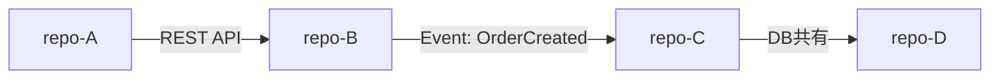

# リポジトリ間依存グラフ

> 手動メンテ。クロスリポジトリのCR設計時（xddp.05.arch）に参照します。

---

## 依存グラフ（Mermaid）

---

## 依存詳細

| 依存元 | 依存先 | 種別 | IFドキュメント | 備考 |
|---|---|---|---|---|
| {repo-A} | {repo-B} | REST API | [api-contracts/{repo-B}.yaml](api-contracts/{repo-B}.yaml) | — |
| {repo-B} | {repo-C} | イベント | [event-schemas/OrderCreated.json](event-schemas/OrderCreated.json) | — |

---

## 更新ルール

- IF変更を伴うCRクローズ時（xddp.close）に更新する
- 実コードと乖離したグラフはAIの誤判断を招くため、陳腐化させない
