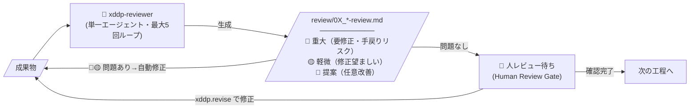
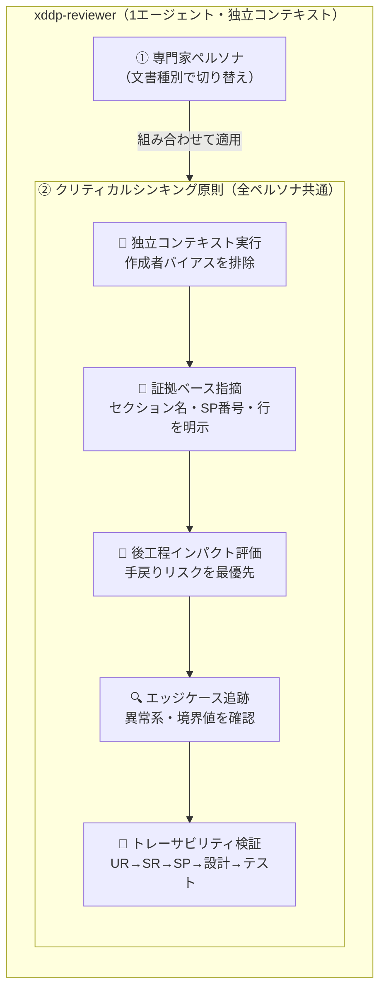
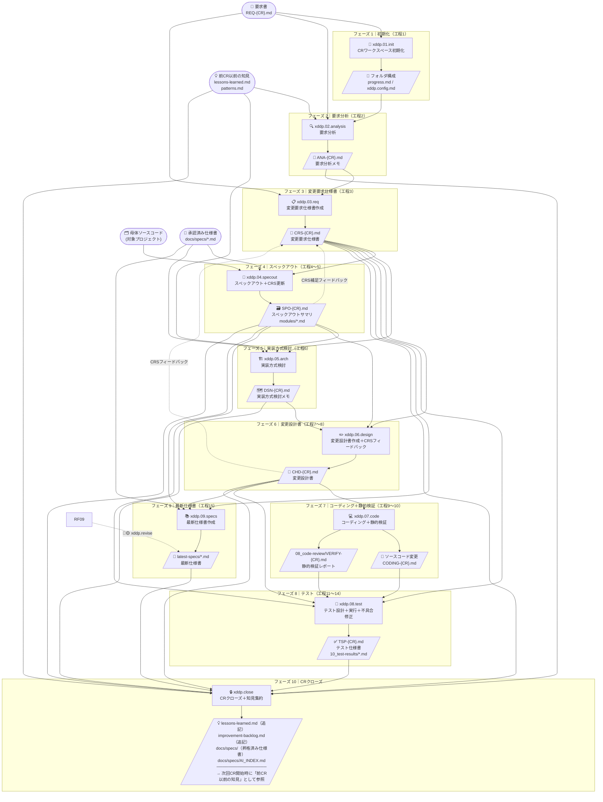
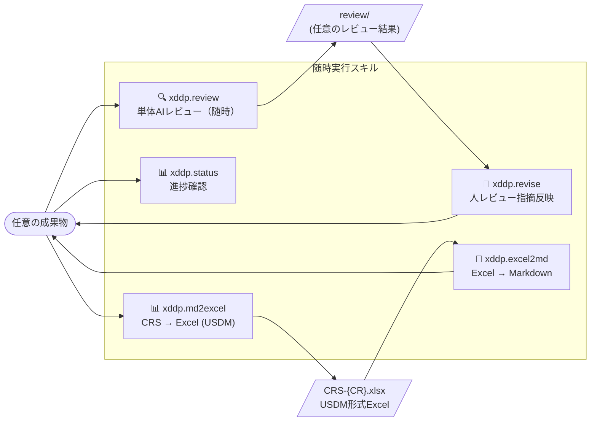

# XDDP プロセス図 — タスク・成果物フロー

> スキル番号（xddp.0X）と工程番号（progress.md の 1〜15）は別体系です。

---

## レビューパターン（各工程共通）

各工程は以下のレビューサイクルを内包します。

> **実装上の注意:** 専門家ペルソナとクリティカルシンキング原則は**1エージェントが同時に担う**（並行実行ではない）。

### xddp-reviewer の内部構造（1回の呼び出し）

### 専門家ペルソナ一覧（文書種別で切り替え）

| 文書 | ペルソナ | 主なレビュー視点 |
|------|----------|----------------|
| **ANA**（要求分析メモ） | 要件アナリスト | ビジネス要件・ユーザーニーズの網羅性、曖昧さ・抜け漏れ・矛盾の検出、後工程への影響評価 |
| **CRS**（変更要求仕様書） | シニア要件エンジニア | UR→SR→SP の階層的整合性、USDM構造・トレーサビリティ、エッジケース網羅、矛盾検出 |
| **SPO**（スペックアウト） | 経験豊富なソフトウェア開発者 | コードベースへの深い理解、影響範囲分析の妥当性、波紋検索の見落としリスク |
| **DSN**（実装方式検討メモ） | ソフトウェアアーキテクト | 複数案の客観的比較・評価、技術的トレードオフ・リスク・拡張性 |
| **CHD**（変更設計書） | シニアソフトウェア開発者 | Before/After コードの論理的正確性、ヌルポインタ・境界値・エラーパスの網羅、設計と仕様の一致 |
| **TSP**（テスト仕様書） | QAエンジニア（テスト設計専門） | テストカバレッジ・再現性・境界値、C0/C1 達成可能性、CHD確認項目とのトレーサビリティ |

---

## プロセス全体フロー

---

## 随時実行スキル（工程外）

---

## 成果物一覧（フォルダ対応表）

> **外部入力（前CRの成果が次CRへ引き継がれるもの）**
>
> | 入力 | パス | 参照スキル |
> |---|---|---|
> | 過去の知見 | `lessons-learned.md`, `docs/projects/.../knowledge/patterns.md` | xddp.02, xddp.05, xddp.close |
> | 承認済み仕様書 | `docs/specs/*.md` | xddp.04, xddp.05, xddp.09 |

| 工程 | フォルダ | ファイル | 生成スキル | レビューファイル |
|---|---|---|---|---|
| 初期化 | `{CR}/01_requirements/` | `REQ-{CR}.md` | xddp.01.init（コピー） | — |
| 要求分析 | `{CR}/02_analysis/` | `ANA-{CR}.md` | xddp.02.analysis | `review/02_analysis-review.md` |
| 変更要求仕様書作成 | `{CR}/03_change-requirements/` | `CRS-{CR}.md` | xddp.03.req | `review/03_change-requirements-review.md` |
| スペックアウト | `{CR}/04_specout/` | `SPO-{CR}.md`, `modules/*.md` | xddp.04.specout | `review/04_specout-review.md` |
| 実装方式検討 | `{CR}/05_architecture/` | `DSN-{CR}.md` | xddp.05.arch | `review/05_architecture-review.md` |
| 変更設計書作成 | `{CR}/06_design/` | `CHD-{CR}.md` | xddp.06.design | `review/06_design-review.md` |
| コーディング | `{CR}/07_coding/` | `CODING-{CR}.md` + ソース変更 | xddp.07.code | — |
| 静的検証 | `{CR}/08_code-review/` | `VERIFY-{CR}.md` | xddp.07.code（静的検証） | — |
| テスト設計・実行 | `{CR}/09_test-spec/` | `TSP-{CR}.md` | xddp.08.test | `review/09_test-spec-review.md` |
| テスト設計・実行 | `{CR}/10_test-results/` | テスト結果 `.md` | xddp.08.test | — |
| 最新仕様書作成 | `latest-specs/` | `{module}-spec.md` | xddp.09.specs | `review/09_specs-review.md` |
| 随時 | `{CR}/review/` | 各レビュー結果 `*.md` | 各スキル内レビューループ / xddp.review | — |
| CRクローズ | `./` | `lessons-learned.md`, `improvement-backlog.md` | xddp.close | — |
| CRクローズ（仕様書昇格） | `docs/specs/` | `{module}-spec.md`, `AI_INDEX.md` | xddp.close（Step C2） | — |
| 初期化 | `./` | `xddp.config.md`, `progress.md` | xddp.01.init | — |
