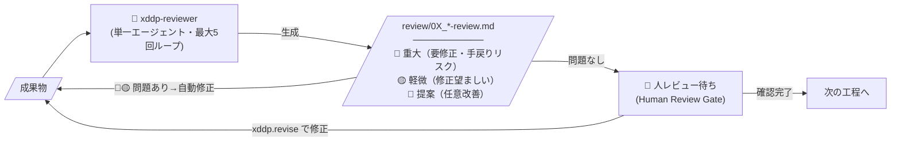
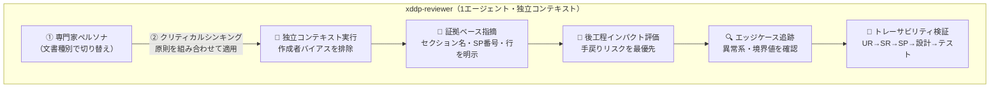
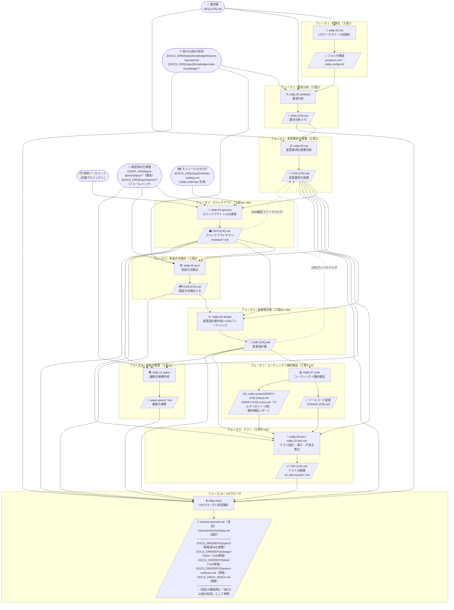
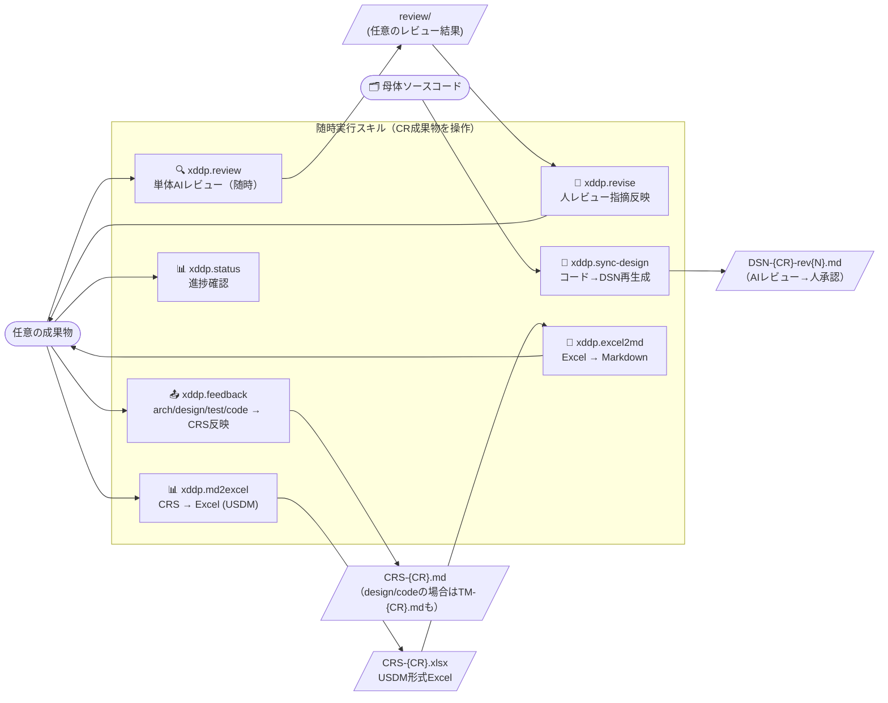
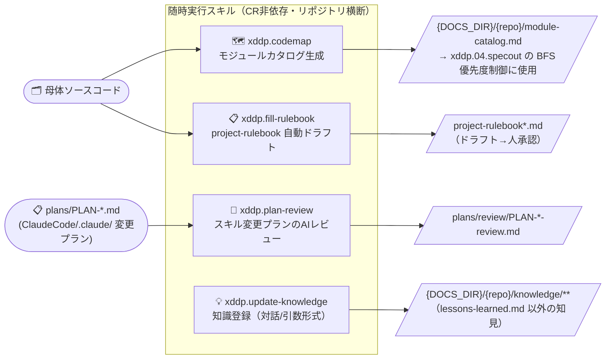

# XDDP プロセス図 — タスク・成果物フロー

> スキル番号（xddp.0X）と工程番号（progress.md の 1〜15）は別体系です。

---

## レビューパターン（各工程共通）

各工程は以下のレビューサイクルを内包します。

> **実装上の注意:** 専門家ペルソナとクリティカルシンキング原則は**1エージェントが同時に担う**（並行実行ではない）。
>
> **適用範囲:** 本サイクル（`xddp-reviewer` 使用）はフェーズ2〜6・フェーズ8のテスト設計（xddp.09.test）・フェーズ9が対象。
> フェーズ1（初期化。レビュー対象成果物なし）、フェーズ7（コーディング＋静的検証。専用の `xddp-verifier-agent` による
> 別方式の検証フローを使用）、フェーズ8のテスト実行（xddp.10.test-run。`xddp-test-runner-agent` を使用）は
> 本サイクルの対象外。随時実行の `xddp.review`／`xddp.feedback`（design/code）／`xddp.sync-design`／`xddp.plan-review` も
> 同じ `xddp-reviewer` を再利用する。

### xddp-reviewer の内部構造（1回の呼び出し）

### 専門家ペルソナ一覧（文書種別で切り替え）

| 文書 | ペルソナ | 主なレビュー視点 |
|------|----------|----------------|
| **ANA**（要求分析メモ） | 要件アナリスト | ビジネス要件・ユーザーニーズの網羅性、曖昧さ・抜け漏れ・矛盾の検出、後工程への影響評価 |
| **CRS**（変更要求仕様書） | シニア要件エンジニア | UR→SR→SP の階層的整合性、USDM構造・トレーサビリティ、エッジケース網羅、矛盾検出 |
| **SPO**（スペックアウト） | 経験豊富なソフトウェア開発者 | コードベースへの深い理解、影響範囲分析の妥当性、波紋検索の見落としリスク |
| **DSN**（実装方式検討メモ） | ソフトウェアアーキテクト | 複数案の客観的比較・評価、技術的トレードオフ・リスク・拡張性 |
| **CHD**（変更設計書） | シニアソフトウェア開発者 | Before/After コードの論理的正確性、ヌルポインタ・境界値・エラーパスの網羅、設計と仕様の一致 |
| **TSP**（テスト仕様書） | QAエンジニア（テスト設計専門） | テストカバレッジ・再現性・境界値、C0/C1 達成可能性、CHD確認項目とのトレーサビリティ |
| **SPEC**（最新仕様書、latest-specs/） | ナレッジベースキュレーター | モジュール仕様・概要図・ユースケース・cross仕様の正確性・網羅性、SPO/CHDとのトレーサビリティ |
| **PLAN**（スキル変更プラン、CR外） | シニアアーキテクト | プロセス設計・エージェント構成・テンプレート設計の妥当性、Before/After・影響範囲の具体性、スキル呼び出し契約の整合性 |

---

## プロセス全体フロー

> **設定による分岐（xddp.config.md）:**
> - `DEVELOPMENT_MODE: new`（新規開発）の場合、フェーズ4（スペックアウト）は母体コードが存在しないためスキップされる。
> - フェーズ8（テスト実行・xddp.10.test-run）はカバレッジが `MIN_COVERAGE`（デフォルト80%）以上で自動合格。未満の場合は
>   人が承認するかテストを追加するかを選択するゲートが入る（100に設定すると旧動作＝100%強制に戻る）。

---

## 随時実行スキル（工程外）

---

## 成果物一覧（フォルダ対応表）

> **外部入力（前CRの成果が次CRへ引き継がれるもの）**
>
> | 入力 | パス | 参照スキル |
> |---|---|---|
> | 過去の知見 | `{DOCS_DIR}/{repo}/knowledge/lessons-learned.md`（cross は `{DOCS_DIR}/cross/knowledge/lessons-learned.md`）、`{DOCS_DIR}/{repo}/knowledge/code-knowledge/**`（xddp.update-knowledge が随時追加） | xddp.02, xddp.05, xddp.06, xddp.09, xddp.close |
> | 承認済み仕様書 | `{XDDP_DIR}/latest-specs/{repo}/**`（優先）, `{DOCS_DIR}/{repo}/specs/**`（フォールバック） | xddp.04, xddp.05, xddp.11 |
> | モジュールカタログ | `{DOCS_DIR}/{repo}/module-catalog.md`（xddp.codemap が生成、specout の BFS 優先度制御に使用） | xddp.04 |

| 工程 | フォルダ | ファイル | 生成スキル | レビューファイル |
|---|---|---|---|---|
| 初期化 | `{CR}/01_requirements/` | `REQ-{CR}.md` | xddp.01.init（テンプレートから生成。要求書ファイル指定時は参照コピーも追加配置） | — |
| 要求分析 | `{CR}/02_analysis/` | `ANA-{CR}.md` | xddp.02.analysis | `review/02_analysis-review.md` |
| 変更要求仕様書作成 | `{CR}/03_change-requirements/` | `CRS-{CR}.md` | xddp.03.req | `review/03_change-requirements-review.md` |
| スペックアウト | `{CR}/04_specout/` | `SPO-{CR}.md`, `modules/*.md` | xddp.04.specout | `review/04_specout-review.md` |
| 実装方式検討 | `{CR}/05_architecture/` | `DSN-{CR}.md` | xddp.05.arch | `review/05_architecture-review.md` |
| 変更設計書作成 | `{CR}/06_design/` | `CHD-{CR}.md` | xddp.06.design | `review/06_design-review.md` |
| コーディング | `{CR}/07_coding/` | `CODING-{CR}.md` + ソース変更 | xddp.07.code | — |
| 静的検証 | `{CR}/08_code-review/` | `VERIFY-{CR}-{repo}.md`, `VERIFY-{CR}-cross.md`（マルチリポジトリ時） | xddp.07.code（静的検証）/ xddp.08.verify | — |
| テスト設計 | `{CR}/09_test-spec/` | `TSP-{CR}.md` | xddp.09.test | `review/09_test-spec-review.md` |
| テスト実行・不具合修正 | `{CR}/10_test-results/{repo}/`（＋マルチリポジトリ時は `cross/`） | `TRS-{CR}-0{N}.md`（実行回ごと） | xddp.10.test-run | — |
| 最新仕様書作成 | `latest-specs/` | `{repo}/{module}/spec.md` 等（モジュール仕様・`overview/*`・`cross/interfaces/*`・`system/use-cases/*`） | xddp.11.specs | `{CR}/review/09_specs-batch{N}-review.md` |
| 随時 | `{CR}/review/` | 各レビュー結果 `*.md` | 各スキル内レビューループ / xddp.review | — |
| CRクローズ | `{XDDP_DIR}/` | `lessons-learned.md`, `improvement-backlog.md` | xddp.close | — |
| CRクローズ（仕様書昇格） | `{DOCS_DIR}/{REPO}/specs/` | `latest-specs/{repo}/**` と同一構造でコピー（`{module}/spec.md` 等） | xddp.close（Step C2） | — |
| CRクローズ（設計書昇格） | `{DOCS_DIR}/{REPO}/design/` | `DSN-{CR}.md`, `CHD-{CR}.md` | xddp.close（Step C4） | — |
| CRクローズ（テスト仕様昇格） | `{DOCS_DIR}/{REPO}/test/` | `TSP-{CR}.md` | xddp.close（Step C5） | — |
| CRクローズ（steering昇格） | `{DOCS_DIR}/{REPO}/` | `project-rulebook.md` | xddp.close（Step C6） | — |
| CRクローズ（インデックス） | `{DOCS_DIR}/` | `AI_INDEX.md` | xddp.close（Step C2〜C6） | — |
| 初期化 | `./` | `xddp.config.md`, `progress.md` | xddp.01.init | — |
