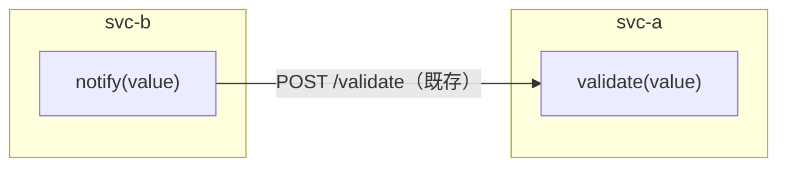
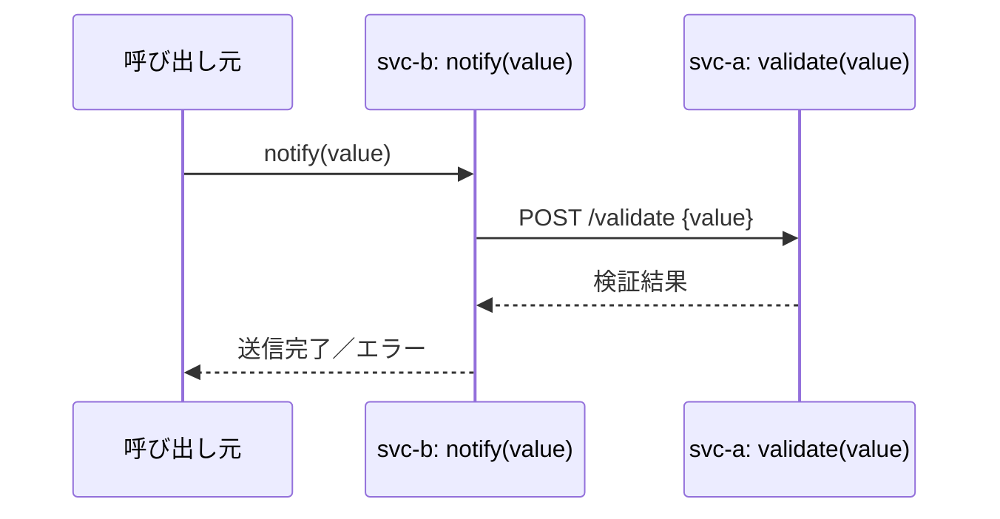
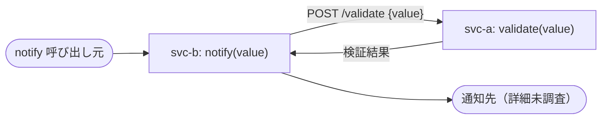

# スペックアウト資料（クロスリポジトリ）

**文書番号：** SPO-CR-2026-991-cross
**対象CR：** CR-2026-991
**対象リポジトリ：** svc-a, svc-b
**作成日：** 2026-08-09
**作成者：** AI（フィクスチャ）
**版数：** 1.0

---

## 1. 概要

このドキュメントは CR-2026-991 に関わる svc-a・svc-b 間の相互作用・依存関係を記録する。
リポジトリ固有の詳細は `{リポジトリ名}/SPO-CR-2026-991.md` を参照。

| 対象リポジトリ | 参照先 |
|-------------|------|
| svc-a | [svc-a/SPO-CR-2026-991.md](../svc-a/SPO-CR-2026-991.md) |
| svc-b | [svc-b/SPO-CR-2026-991.md](../svc-b/SPO-CR-2026-991.md) |

---

## 2. 構造図

---

## 3. シーケンス図

### 3.1 module レベルのシーケンス図

---

## 4. 共有インタフェース一覧

| インタフェース名 | 提供リポジトリ | 消費リポジトリ | 型・プロトコル | バージョン | breaking変更有無 |
|---|---|---|---|---|---|
| POST /validate | svc-a | svc-b | HTTP/JSON | v1.0 | なし（今回のCRでは戻り値の型・エラー表現を変更しない） |

---

## 5. リポジトリ間共有定数・列挙値

なし

---

## 9. データフロー図（DFD）

---

## 11. CRSへの反映事項（cross）

- svc-b の `notify()` は送信前に svc-a の `POST /validate`（既存インタフェース）を呼び出しており、
  今回追加する空文字列チェック（CR-2026-991-SP-002-001.001）はこの呼び出しより前段の svc-b 内部で
  完結する。svc-a 側インタフェースの型・エラー表現は変更しない（breaking変更なし）。

---

## 12. 変更履歴

| 版数 | 日付 | 変更者 | 変更内容 |
|------|------|--------|----------|
| 1.0 | 2026-08-09 | AI（フィクスチャ） | 初版作成 |
