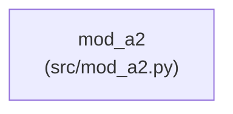

# スペックアウト資料（サマリー）

**文書番号：** SPO-CR-2026-970
**対象CR：** CR-2026-970
**作成日：** 2026-07-26
**作成者：** AI（xddp-specout-agent）
**版数：** 1.0

---

## 1. 調査概要

| 項目 | 内容 |
|------|------|
| 調査起点 | `validate` 関数（`src/mod_a2.py`） |
| 調査範囲 | mod_a2 モジュール |
| 検出モジュール数 | 1 モジュール |
| 既存仕様書 | なし |

---

## 2. 全体アーキテクチャ図

---

## 3. モジュール間シーケンス図

対象外（変更対象 `validate` はモジュール内に閉じ、モジュール間呼び出しに関与しない）。

---

## 4. データ仕様・副作用・フロー

### 4.1 外部副作用一覧（必須）

| 識別子（関数/メソッド） | ファイルパス | 副作用種別 | 対象 | 備考 |
|---|---|---|---|---|
| validate | src/mod_a2.py | なし | - | 純粋な検証関数 |

### 4.2 データフロー図（DFD）（必須）

---

## 5. 影響範囲の分析

### 5.1 直接影響箇所

| ファイルパス | 識別子 | 影響種別 | モジュール | 説明 |
|------------|--------|----------|----------|------|
| src/mod_a2.py | validate | 変更必要 | mod_a2 | 先頭に範囲検証を追加する |

### 5.2 間接影響箇所（波紋）

影響なし（呼び出し元の引数・戻り値の型は不変）。

### 5.3 影響なしと判断した範囲

`mod_a.py` は `validate` を参照しないため影響なし。

### 5.5 既存テスト状況

| ファイルパス | テストファイル | テスト有無 | テスト可能性 | 備考 |
|---|---|:---:|---|---|
| src/mod_a2.py | - | ❌ なし | 高（純粋関数） | 工程9で単体テストを新規設計する |

---

## 7. 変更要求仕様書への反映事項

- SP-001-001.001 の変更対象シンボルは `src/mod_a2.py` の `validate` 関数であることを確認。

---

## 8. 調査済みモジュール一覧

| モジュール名 | ディレクトリ | 個別資料 |
|------------|------------|--------|
| mod_a2 | src/ | SPO-CR-2026-970.md § 2, § 5（影響ファイル総数が閾値以下のため modules/ 未生成） |

---

## 9. 気づき・提案メモ

（なし）

---

## 11. 変更履歴

| 版数 | 日付 | 変更者 | 変更内容 |
|------|------|--------|----------|
| 1.0 | 2026-07-26 | AI（xddp-specout-agent） | 初版作成 |
