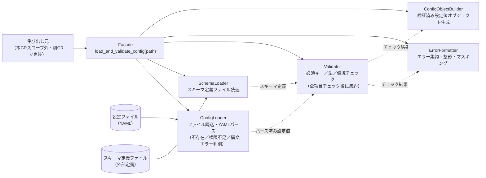

# 実装案A：レイヤードパイプライン方式（読込・スキーマ・検証・整形の内部コンポーネント分離）

**文書番号：** DSN-CR-2026-950-approach-A
**親文書：** [DSN-CR-2026-950.md](./DSN-CR-2026-950.md)
**作成日：** 2026-07-23
**作成者：** AI（xddp-architect-agent）

---

## 概要

設定読み込み・検証モジュールの内部を「ファイル読込」「スキーマ定義読込」「検証（必須キー／型／値域）」「エラー集約・整形（マスキング含む）」「検証済み設定値オブジェクト生成」という5つの責務に分離し、それぞれを独立した内部コンポーネントとして実装する。呼び出し元に公開するのはこれらを合成する単一のファサード関数のみとし、内部コンポーネント間のインタフェース（データの受け渡し形式）を明確に定義する。

## 設計方針

### 概略

本CR（DEVELOPMENT_MODE=new）は母体コードが存在しない完全新規モジュールであり、既存コードとの整合性という制約はない。一方でCRS付記の未決事項（Q2・Q4・Q5・Q6・Q7・Q9・Q10）が示すとおり、パス指定方式・真偽値の表記揺れ・値域指定方式・エラーメッセージ形式・読込失敗時挙動・未知キー扱いなど多数の仕様点がCR起票者確認待ちの暫定方針のまま工程5に持ち込まれている。本方式は、これらの未決事項がCR起票者確認後に変更された場合でも、影響を該当コンポーネント1つに閉じ込められるよう、責務ごとに内部コンポーネントを分離する設計を採る。また、CR-2026-950-UR-001の理由（起動時の設定検証は複数コンポーネントで共通して必要になる見込み）を踏まえ、将来のチェック種別追加（気づきメモ#3：文字列・真偽値項目への妥当性チェック拡張）にも既存コンポーネントへの影響を抑えて対応できることを狙う。

### 影響境界

新規モジュール内部に閉じた変更であり、widget-svc の既存コード（README.md のみの空リポジトリ）への影響はない。呼び出し元モジュールは本CRのスコープ外（CR-2026-950-SR-009-001）であるため、外部から見えるのはファサード関数の公開インタフェースのみである。

## 詳細図（要求時生成）

<!-- /xddp.05.arch {CR} --detail を実行すると、全案で統一された観点・粒度で以下の図が生成されます。
     比較のため全案同時に生成します。個別案のみの生成はサポートしません。 -->

### 構造体関連図

（省略 — `--detail` で生成）

### 主処理シーケンス図

（省略 — `--detail` で生成）

## メリット

- 責務ごとに内部コンポーネントを分離しているため、各コンポーネントを個別にユニットテストできる（必須キーチェック・型チェック・値域チェックをそれぞれ独立に検証可能）。CRS付記の未決事項確定後の再テストコストも該当コンポーネントに限定できる。
- 将来の仕様変更（Q2：パス指定方式、Q4：真偽値表記揺れ、Q5：値域指定方式、Q6：エラーメッセージ形式、Q9：読込失敗時挙動、Q10：未知キー扱い）が、それぞれ対応するコンポーネント（ConfigLoader／Validator／ErrorFormatter）内に閉じ込められ、他コンポーネントへの手戻りを抑制できる。
- CR-2026-950-UR-001の理由（複数コンポーネントでの共通利用見込み）に対し、将来的にConfigLoaderやValidatorなど部分的なコンポーネント単位での再利用・置き換えがしやすい。
- 気づきメモ#3（文字列・真偽値項目への妥当性チェック拡張）のような将来のチェック種別追加に対し、Validatorコンポーネント内に新規チェックを追加するだけで済み、他コンポーネントへの影響がない。

## デメリット

- コンポーネント数・ファイル数が増えるため、単純な設定検証モジュールとしては初期実装工数がやや大きくなる（オーバーエンジニアリングのリスク）。
- コンポーネント間のデータ受け渡し形式（内部インタフェース）を追加で設計する必要があり、実装・レビュー工数が増える。
- CR-2026-950-SP-006-001.001（全項目検証後にエラー集約して一括返却）を実現するには、Validatorの複数チェック結果をErrorFormatterに集約する調整ロジックが必要であり、単一関数実装より設計の見通しをやや要する。

## 影響ファイル数

新規追加のみ・約6ファイル（Facade／ConfigLoader／SchemaLoader／Validator／ErrorFormatter／ConfigObjectBuilder〈型定義含む〉）+ スキーマ定義ファイル1点（非コード成果物、CR-2026-950-SP-003-001.001）。既存ファイルの変更はなし（母体コードが存在しないため）。

---
