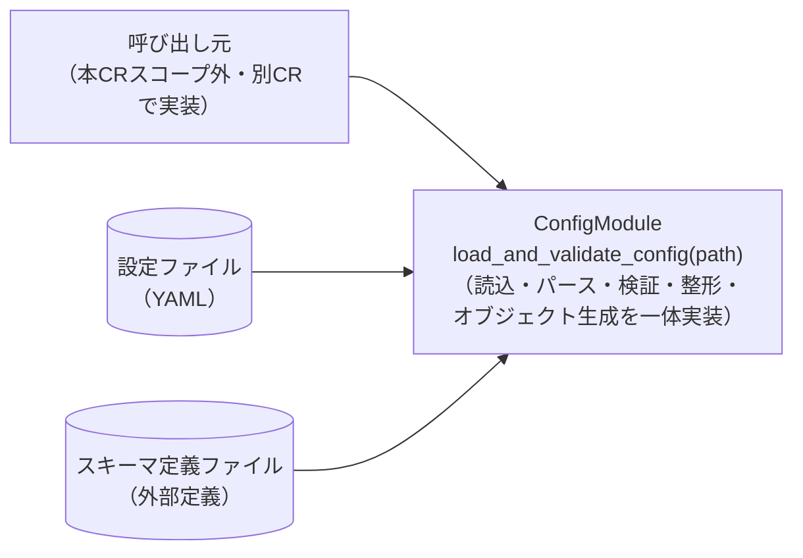

# 実装案B：一体化モジュール方式（読込・検証・整形を単一フローで手続き的に実装）

**文書番号：** DSN-CR-2026-950-approach-B
**親文書：** [DSN-CR-2026-950.md](./DSN-CR-2026-950.md)
**作成日：** 2026-07-23
**作成者：** AI（xddp-architect-agent）

---

## 概要

設定読み込み・検証モジュールを、ファイル読込・YAMLパース・スキーマ照合・3種チェック（必須キー／型／値域）・エラー集約整形・検証済み設定値オブジェクト生成までを単一のファサード関数（内部ヘルパー関数を伴う1つの主処理フロー）として実装する。案Aのような独立したコンポーネント境界（Loader／Validator／ErrorFormatter等の分離インタフェース）は設けない。

## 設計方針

### 概略

本CRの対象は単一の新規モジュールであり、他モジュールとの結合テストはスコープ外（CR-2026-950-SR-009-001）。要求されている処理（読込→検証→整形→返却）は一直線の逐次フローであるため、内部コンポーネントを分離せずとも実装できる。本方式は、コンポーネント間インタフェース設計のコストを省き、初期実装・レビューの工数を最小化することを優先する。CR-2026-950-SP-006-001.001（全項目チェック後の一括エラー集約）も、単一関数内でチェック結果をリストに蓄積するだけで直接的に実現できる。

### 影響境界

新規モジュール内部に閉じた変更であり、widget-svc の既存コード（README.md のみの空リポジトリ）への影響はない。呼び出し元モジュールは本CRのスコープ外（CR-2026-950-SR-009-001）であるため、外部から見えるのはファサード関数の公開インタフェースのみである。

## 詳細図（要求時生成）

<!-- /xddp.05.arch {CR} --detail を実行すると、全案で統一された観点・粒度で以下の図が生成されます。
     比較のため全案同時に生成します。個別案のみの生成はサポートしません。 -->

### 構造体関連図

（省略 — `--detail` で生成）

### 主処理シーケンス図

（省略 — `--detail` で生成）

## メリット

- コンポーネント境界・内部インタフェース設計が不要なため、初期実装工数・レビュー工数が小さく、スケジュール適合性が高い。
- CR-2026-950-SP-006-001.001（全項目検証後の一括エラー集約）を、単一フロー内でチェック結果リストへ逐次追加するだけで素直に実現でき、ステージ間のデータ受け渡し調整が不要。
- ファイル数・モジュール構成がシンプルなため、初めて本モジュールに触れる開発者にとって処理全体の見通しが立てやすい（学習コストが低い）。

## デメリット

- 必須キー／型／値域の各チェックロジックが1つの関数・ファイルに混在しやすく、チェックごとの独立したユニットテストの分離がしにくい（テスト容易性が低下する）。
- CRS付記の未決事項（Q2・Q4・Q5・Q6・Q7・Q9・Q10）がCR起票者確認後に変更された場合、変更箇所が一体化した処理フローの内部に散在するため、影響範囲の特定・修正コストが案Aより大きくなる。
- 気づきメモ#3（文字列・真偽値項目への妥当性チェック拡張）のような将来のチェック種別追加時、既存の一体化フローの中に新規ロジックを差し込む必要があり、既存箇所への影響を局所化しにくい（CR-2026-950-UR-001が想定する将来の再利用性の観点で不利）。

## 影響ファイル数

新規追加のみ・約2ファイル（ConfigModule〈ファサード関数＋検証済み設定値オブジェクトの型定義を同居〉）+ スキーマ定義ファイル1点（非コード成果物、CR-2026-950-SP-003-001.001）。既存ファイルの変更はなし（母体コードが存在しないため）。

---
