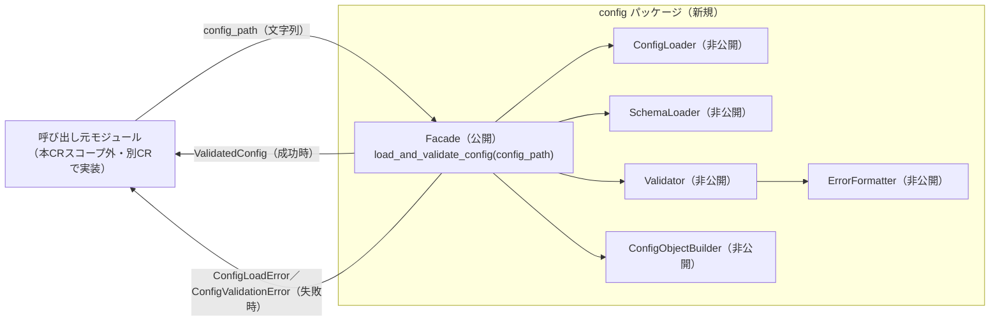

# 変更設計書

**文書番号：** CHD-CR-2026-950
**対象CR：** CR-2026-950
**タイトル：** 独立した設定読み込み・検証モジュールの実装（CR-2026-950-UR-001：パッケージ配置・Facade境界の確定）
**作成日：** 2026-07-23
**作成者：** AI（xddp-designer-agent）
**版数：** 1.0

> このファイルは1つのUR（またはそのバッチ）の内容ファイルである。リポジトリ全体の一覧は
> インデックスファイル（`CHD-CR-2026-950.md`）を参照すること。

---

## 1. 変更概要

| 項目 | 内容 |
|------|------|
| 対象範囲 | CR-2026-950-UR-001（独立した設定読み込み・検証モジュールとして実装したい。CR-2026-950-SP-001-001.001の1件のみ。単一バッチ） |
| 採用方式 | 案A（レイヤードパイプライン方式：ConfigLoader／SchemaLoader／Validator／ErrorFormatter／ConfigObjectBuilderを独立コンポーネントに分離し、Facadeが合成する） |
| 変更ファイル数 | 7 |
| 参照資料 | CRS-CR-2026-950、DSN-CR-2026-950（インデックス＋DSN-CR-2026-950-comparison.md §4・§5）、CHD-CR-2026-950.md（インデックス）。本CRはDEVELOPMENT_MODE=newのためSPOは提供されていない |

> **本CRの開発モードに関する注記：** 本CRは `DEVELOPMENT_MODE=new`（新規開発。母体コードなし・SPO未生成）である。
> そのため全SPについて「Before 設計」は一律「（新規実装のため対象外）」と記載し、After設計のみを記述する。
> 第7章（確認項目）は回帰確認の代わりに「Inter-SP dependency integration（新規コンポーネント間の依存整合性確認）」観点を含める。

---

## 2. 変更対象ファイル一覧

> ファイル単位での変更概要。詳細は第3章（仕様単位）を参照。
> 単一リポジトリ（widget-svc）のため「リポジトリ」列は省略する。
> ファイル拡張子は widget-svc の実装言語に依存するため本CHDでは省略する（工程7でプロジェクトの言語・拡張子規約に従うこと）。

| # | ファイルパス | 変更種別 | 対応SP番号 |
|---|------------|----------|-----------|
| 1 | `config/facade`（パッケージ公開インタフェース。関数 `load_and_validate_config` を提供） | 追加 | CR-2026-950-SP-001-001.001 |
| 2 | `config/errors`（例外クラス階層：`ConfigError`／`ConfigLoadError`／`ConfigValidationError`） | 追加 | CR-2026-950-SP-001-001.001 |
| 3 | `config/loader`（内部・非公開。ConfigLoaderの配置のみ本SPで確定。内部処理詳細はCR-2026-950-UR-002バッチのCHDで設計） | 追加 | CR-2026-950-SP-001-001.001 |
| 4 | `config/schema_loader`（内部・非公開。SchemaLoaderの配置のみ本SPで確定。内部処理詳細はCR-2026-950-UR-003バッチのCHDで設計） | 追加 | CR-2026-950-SP-001-001.001 |
| 5 | `config/validator`（内部・非公開。Validatorの配置のみ本SPで確定。内部処理詳細はCR-2026-950-UR-003〜CR-2026-950-UR-006バッチのCHDで設計） | 追加 | CR-2026-950-SP-001-001.001 |
| 6 | `config/error_formatter`（内部・非公開。ErrorFormatterの配置のみ本SPで確定。内部処理詳細はCR-2026-950-UR-006バッチのCHDで設計） | 追加 | CR-2026-950-SP-001-001.001 |
| 7 | `config/object_builder`（内部・非公開。ConfigObjectBuilderの配置のみ本SPで確定。内部処理詳細はCR-2026-950-UR-007バッチのCHDで設計） | 追加 | CR-2026-950-SP-001-001.001 |

---

## 3. 詳細設計

> **仕様（SP）単位**で変更内容を記述する。
> 実装コードはここに書かない。コーダーが設計仕様から実装する。

### 3.1 CR-2026-950-SP-001-001.001：独立パッケージにコンポーネント群を格納しFacade関数のみを公開する

> widget-svc内に新規パッケージ `config/` を新設し、5つの内部コンポーネント（非公開）とFacade（公開）に分割する。
> 呼び出し元（本CRスコープ外・別CRで実装）が参照できるのは単一のFacade関数のみとする。
> 未決事項語Q13（ファサード関数のシグネチャ・例外クラス設計）を本SPで確定する。

**変更ファイル：** `config/facade`、`config/errors`、`config/loader`、`config/schema_loader`、`config/validator`、`config/error_formatter`、`config/object_builder`（いずれも追加）
**リポジトリ：** widget-svc（単一リポジトリのため省略可）

#### Before 設計

（新規実装のため対象外）

#### After 設計

| 種別 | 名称 | 定義 |
|------|------|------|
| 関数（公開ファサード） | `load_and_validate_config` | `(config_path: 文字列) → ValidatedConfig`（成功時）。失敗時は戻り値を返さず例外を送出する |
| 例外クラス（基底・公開） | `ConfigError` | 本パッケージが送出する全例外の共通基底クラス。呼び出し元はこのクラスを捕捉することで読込・検証いずれの失敗も一括ハンドリング可能 |
| 例外クラス（読込失敗・公開） | `ConfigLoadError` | `ConfigError` のサブクラス。ファイル不存在／権限不足／YAML構文エラーの読込段階の失敗時に送出される（CR-2026-950-SP-002-001.003参照）。保持する属性の詳細（エラー種別の判別方法等）はCR-2026-950-UR-002バッチのCHDで確定する |
| 例外クラス（検証失敗・公開） | `ConfigValidationError` | `ConfigError` のサブクラス。必須キー欠落／型不一致／値域逸脱等の検証段階の失敗時に送出される（CR-2026-950-SR-006-001参照）。保持するキー名・不正理由のペアリストの構造はCR-2026-950-UR-006バッチのCHD（CR-2026-950-SP-006-001.002）で確定する |
| データ型（Facade戻り値・不透明型） | `ValidatedConfig` | 検証成功時にFacadeが返す型変換済み設定値オブジェクトの型名。フィールド定義・型変換規則はCR-2026-950-UR-007バッチのCHD（CR-2026-950-SP-007-001.001）で確定する。本SPでは型名と「Facadeの戻り値型である」という契約のみを確定する |
| 内部コンポーネント（非公開） | `ConfigLoader` | ファイルI/O・YAMLパースを担当。パッケージ外から直接参照不可。内部処理詳細はCR-2026-950-UR-002バッチのCHDで設計 |
| 内部コンポーネント（非公開） | `SchemaLoader` | 外部スキーマ定義ファイルの読込を担当。パッケージ外から直接参照不可。内部処理詳細はCR-2026-950-UR-003バッチのCHDで設計 |
| 内部コンポーネント（非公開） | `Validator` | 必須キーチェック・型チェック・値域チェックを担当。パッケージ外から直接参照不可。内部処理詳細はCR-2026-950-UR-003〜CR-2026-950-UR-006バッチのCHDで設計 |
| 内部コンポーネント（非公開） | `ErrorFormatter` | Validatorの集約結果からエラー詳細生成・マスキングを担当。パッケージ外から直接参照不可。内部処理詳細はCR-2026-950-UR-006バッチのCHDで設計 |
| 内部コンポーネント（非公開） | `ConfigObjectBuilder` | 検証成功時に `ValidatedConfig` を生成する。パッケージ外から直接参照不可。内部処理詳細はCR-2026-950-UR-007バッチのCHDで設計 |

#### 変更仕様

- widget-svc内に新規パッケージ `config/` を新設する。DSN-CR-2026-950-comparison.md §5「CR-2026-950-SP-001-001.001の具体案」に基づき、5つの内部コンポーネント（非公開）とFacade（公開）に分割する（理由：CR-2026-950-UR-001「独立した基盤モジュールとして早期整備」およびCR-2026-950-SR-001-001「既存の内部モジュールに依存しない独立モジュール」を、外部に対して単一の窓口のみを持つ形で実現するため）。
- Facadeモジュールが唯一の公開インタフェースとして `load_and_validate_config(config_path)` 関数を提供する。`ConfigLoader`／`SchemaLoader`／`Validator`／`ErrorFormatter`／`ConfigObjectBuilder` の5内部コンポーネントはパッケージ非公開とし、呼び出し元から直接参照不可とする（理由：CR-2026-950-SR-001-001の独立性を、内部実装変更の影響を呼び出し元に波及させない境界として担保するため）。
- 例外クラス階層として、基底クラス `ConfigError` と、その下に読込失敗用の `ConfigLoadError`、検証失敗用の `ConfigValidationError` を新設する（理由：未決事項Q13「例外クラス設計」の確定要求に対応し、CR-2026-950-SP-002-001.003が定める読込段階の異常系と、CR-2026-950-SR-006-001が定める検証段階の異常系を明確に区別しつつ、呼び出し元が包括的にも個別にも捕捉できるようにするため）。
- Facadeの戻り値型として `ValidatedConfig` という型名を確定する。具体的なフィールド定義はCR-2026-950-UR-007バッチのCHD（CR-2026-950-SP-007-001.001）で確定するが、Facade関数シグネチャの戻り値型としての名称・存在は本SPで確定し、以後の他バッチでは変更しない（理由：DSN-CR-2026-950-comparison.md §5「確定範囲の注記」に基づき、Facadeの外部契約を最初に固定するため）。

**制約・前提条件：**
- Facade以外の5コンポーネントは、widget-svcの実装言語のアクセス制御機構（例：モジュール名前空間＋非公開命名規約、package-privateアクセス修飾子、非exported識別子等、言語依存）を用いて非公開とすること。言語仕様上物理的に非公開にできない場合は、少なくとも命名規約・ドキュメントコメントで非公開である旨を明示し、公開インタフェース文書には一切記載しないこと。
- `load_and_validate_config` の引数 `config_path` の型・パス解決方式（絶対パス／相対パス）の詳細仕様はCR-2026-950-SP-002-001.002（CR-2026-950-UR-002バッチのCHD）に従うこと。本SPでは「文字列型のパスを1つ引数として受け取る」という関数シグネチャの形のみを確定する。
- `ConfigLoadError`・`ConfigValidationError` の具体的な保持属性（エラー種別判別情報・キー名/不正理由ペアリスト等）は、それぞれCR-2026-950-UR-002・CR-2026-950-UR-006バッチのCHDで確定するが、両クラスとも必ず `ConfigError` を継承すること。CR-2026-950-UR-002・CR-2026-950-UR-006バッチの設計時に本制約を遵守すること。
- 本SPの確定範囲（パッケージ配置・「Facadeのみ公開」の境界方針・例外クラス階層の基底構造・`ValidatedConfig` という型名）はCHD以降変更しないこと（DSN-CR-2026-950-comparison.md §5「確定範囲の注記」）。

**実装ガイド（任意）：**
- 「非公開」の実現方法は widget-svc の実装言語慣習に従うこと（例：単一アンダースコアプレフィックスによる非公開命名規約、package-private修飾子、小文字始まりの非exported識別子等）。具体的な言語・規約が確定していない場合は、実装着手時にプロジェクトの命名規約に従い、本CHDへの追記（またはCHDフィードバック）で明示すること。
- `config_path` に空文字列やnull相当の値が渡された場合の挙動は、Facade自体で早期に例外化するか `ConfigLoader` に委譲するかのいずれでもよいが、最終的に `ConfigLoadError`（またはそのサブクラス）として呼び出し元に伝わることを保証すること（第7章確認項目4参照）。

---

## 4. トレーサビリティマトリクス

> 仕様IDと変更箇所（ファイル・モジュール・シンボル）の対応を一覧化する。

| 仕様ID | 仕様名 | 変更ファイル | 変更シンボル（関数・構造体・定数等） |
|--------|--------|------------|--------------------------------------|
| CR-2026-950-SP-001-001.001 | 独立パッケージにコンポーネント群を格納しFacade関数のみを公開する | `config/facade`、`config/errors`、`config/loader`、`config/schema_loader`、`config/validator`、`config/error_formatter`、`config/object_builder` | `load_and_validate_config`、`ConfigError`、`ConfigLoadError`、`ConfigValidationError`、`ValidatedConfig`（型名） |

---

## 5. データ設計（該当する場合）

### 5.1 データ構造の変更

**Before：**

（新規実装のため対象外）

**After：**

| 型名 | 種別 | 親子関係 | 意味 |
|------|------|----------|------|
| `ConfigError` | 例外クラス（基底・公開） | - | 本パッケージが送出する全例外の共通基底 |
| `ConfigLoadError` | 例外クラス（公開） | `ConfigError` のサブクラス | 読込失敗時に送出（保持属性の詳細はCR-2026-950-UR-002バッチのCHD） |
| `ConfigValidationError` | 例外クラス（公開） | `ConfigError` のサブクラス | 検証失敗時に送出（保持属性の詳細はCR-2026-950-UR-006バッチのCHD） |
| `ValidatedConfig` | データ型（不透明型・型名のみ確定） | - | Facade戻り値型。フィールド定義はCR-2026-950-UR-007バッチのCHD（CR-2026-950-SP-007-001.001）で確定 |

### 5.2 移行手順・初期状態定義

対象外（新規実装のため既存データ・既存状態は存在しない）。

---

## 6. インタフェース設計（該当する場合）

> 外部から観測可能なインタフェースの変更を一覧化する。

| 種別 | 名称 | 変更内容 | breaking |
|------|------|----------|---------|
| 関数（公開ファサード） | `load_and_validate_config(config_path)` | 追加（仕様：文字列型のパスを1つ受け取り、成功時は `ValidatedConfig` を返し、失敗時は例外を送出する） | false（新規インタフェースのため既存契約なし） |
| 例外クラス | `ConfigError` | 追加（全例外の共通基底） | false |
| 例外クラス | `ConfigLoadError` | 追加（`ConfigError` のサブクラス） | false |
| 例外クラス | `ConfigValidationError` | 追加（`ConfigError` のサブクラス） | false |
| データ型 | `ValidatedConfig` | 追加（型名のみ確定。フィールド定義はCR-2026-950-UR-007バッチのCHDで確定） | false |

---

## 7. 確認項目（テスト観点）

> テスト設計の入力として使用する。仕様IDと対応させて記述する。
> 本CRはDEVELOPMENT_MODE=newのためSPOが存在せず、回帰確認の代わりに
> Inter-SP dependency integration（新規コンポーネント間の依存整合性）観点を含める。

| # | 確認内容 | 確認種別 | 対応SP番号 |
|---|----------|----------|-----------|
| 1 | 有効な `config_path` と有効な設定ファイルを渡した場合、`load_and_validate_config` が例外を送出せず `ValidatedConfig` 型のインスタンスを返すこと | 正常系 | CR-2026-950-SP-001-001.001 |
| 2 | 存在しないパス／読み取り権限不足のパス／YAML構文が不正なファイルのいずれかを渡した場合、`ConfigLoadError`（`ConfigValidationError` ではない）が送出されること | 異常系 | CR-2026-950-SP-001-001.001 |
| 3 | 読込には成功するが検証（必須キー・型・値域）に失敗する設定ファイルを渡した場合、`ConfigValidationError`（`ConfigLoadError` ではない）が送出されること | 異常系 | CR-2026-950-SP-001-001.001 |
| 4 | `config_path` に空文字列を渡した場合、最終的に `ConfigLoadError`（またはそのサブクラス）として呼び出し元に伝わること | 境界値 | CR-2026-950-SP-001-001.001 |
| 5 | パッケージ外部（呼び出し元想定コード）から `ConfigLoader`／`SchemaLoader`／`Validator`／`ErrorFormatter`／`ConfigObjectBuilder` の各内部コンポーネントに直接アクセスできない（非公開である）こと | 境界値／インタフェース境界確認 | CR-2026-950-SP-001-001.001 |
| 6 | Inter-SP dependency integration：CR-2026-950-UR-002バッチが実装する `ConfigLoader` が送出する読込失敗（ファイル不存在／権限不足／YAML構文エラー）が、Facade経由で呼び出し元に `ConfigLoadError` として正しく変換・伝播されること | 結合（新規コンポーネント間の依存整合性） | CR-2026-950-SP-001-001.001 |
| 7 | Inter-SP dependency integration：CR-2026-950-UR-004〜CR-2026-950-UR-006バッチが実装する `Validator`／`ErrorFormatter` が生成する不正キー・理由のリストが、Facade経由で呼び出し元に `ConfigValidationError` として正しく変換・伝播されること | 結合（新規コンポーネント間の依存整合性） | CR-2026-950-SP-001-001.001 |
| 8 | Inter-SP dependency integration：CR-2026-950-UR-007バッチが実装する `ConfigObjectBuilder` が生成するオブジェクトが、Facadeの戻り値型 `ValidatedConfig` と型として整合し、呼び出し元がそのまま受け取れること | 結合（新規コンポーネント間の依存整合性） | CR-2026-950-SP-001-001.001 |

---

## 8. 気づき・提案メモ

> 作成・レビュー中に気づいた修正すべき内容・改善案・懸念事項を自由に記録する。
> 現在のCRスコープ外の内容も記載可。次のCR起票・バックログの入力として活用する。

| # | 種別 | 内容 | 対応方針 |
|---|------|------|----------|
| 1 | 懸念 | CR-2026-950-SP-001-001.001は未決事項Q13（呼び出し元とのインタフェース仕様：関数シグネチャ・例外クラス設計）を含み、DSN-CR-2026-950-comparison.md §5の指示に従い本CHDで具体的な引数型・戻り値型名・例外クラス階層を確定した。ただし本確定内容はCR起票者への正式確認をまだ経ていない（CRS §5 Q13は「工程6a完了まで」を期限とする）。CR起票者確認の結果、本CHDの内容と齟齬が生じた場合は本CHDおよびCRS（CR-2026-950-SP-001-001.001の備考欄）を更新すること | 今回対応（暫定確定、CR起票者確認待ち。齟齬時は再修正） |
| 2 | 懸念 | 「非公開」の実現方法（アクセス制御機構）はwidget-svcの実装言語に依存するが、本CHD作成時点で言語が明示的に確定した資料がない（README.mdのみの空リポジトリ）。実装着手時にプロジェクトの言語・命名規約を確認し、本CHDの「実装ガイド」記載の非公開実現方法を具体化すること | 今回対応（工程7着手前に確認） |

---

## 9. 変更履歴

| 版数 | 日付 | 変更者 | 変更内容 |
|------|------|--------|----------|
| 1.0 | 2026-07-23 | AI | 初版作成 |
