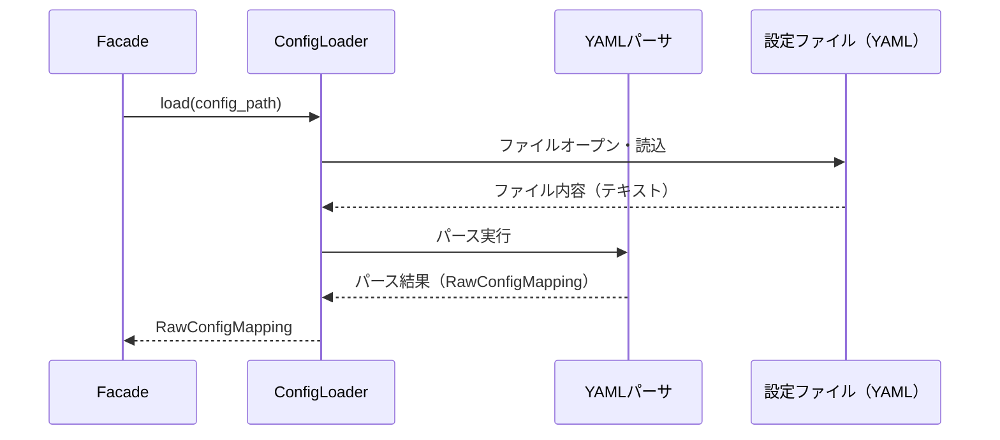
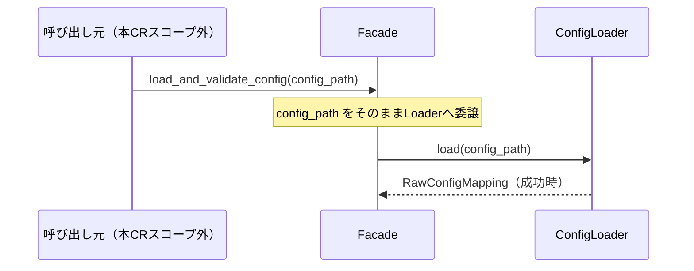
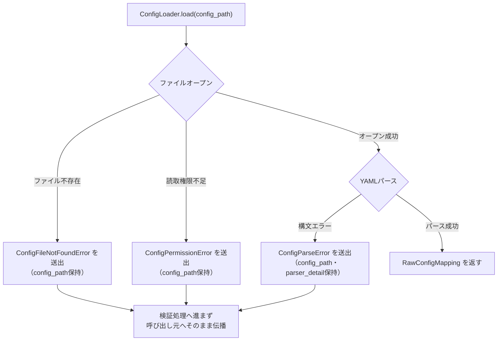

# 変更設計書

**文書番号：** CHD-CR-2026-950
**対象CR：** CR-2026-950
**タイトル：** 起動時に指定パスの設定ファイルを読み込ませたい（CR-2026-950-UR-002）
**作成日：** 2026-07-23
**作成者：** AI（xddp-designer-agent）
**版数：** 1.0

> このファイルは1つのUR（CR-2026-950-UR-002）の内容ファイルである。リポジトリ全体の一覧は
> インデックスファイル（`CHD-CR-2026-950.md`）を参照すること。
> 本CRは `DEVELOPMENT_MODE=new`（新規開発。母体コードが存在せずSPOも存在しない）である。
> 母体コードが存在しないため「Before 設計」は全SPで対象外とし、After設計のみを記述する。

---

## 1. 変更概要

| 項目 | 内容 |
|------|------|
| 対象範囲 | CR-2026-950-UR-002（起動時に指定パスの設定ファイルを読み込ませたい。対応SP：CR-2026-950-SP-002-001.001、CR-2026-950-SP-002-001.002、CR-2026-950-SP-002-001.003） |
| 採用方式 | 案A（レイヤードパイプライン方式）。読込・スキーマ読込・検証・エラー整形・オブジェクト生成を独立コンポーネントに分離する方式のうち、本URはファイル読込を担う ConfigLoader コンポーネントおよび公開ファサード関数の引数（`config_path`）仕様を対象とする（DSN-CR-2026-950-comparison.md §4・DSN-CR-2026-950-approach-A.md） |
| 変更ファイル数 | 3（新規追加のみ。母体コードが存在しないため既存ファイルの変更はなし） |
| 参照資料 | CRS-CR-2026-950、DSN-CR-2026-950（新規開発モードのためSPOなし）、DSN-CR-2026-950-comparison.md、DSN-CR-2026-950-approach-A.md、CHD-CR-2026-950.md（インデックス） |

---

## 2. 変更対象ファイル一覧

> widget-svc は単一リポジトリのため「リポジトリ」列は省略する。

| # | ファイルパス | 変更種別 | 対応SP番号 |
|---|------------|----------|-----------|
| 1 | `config/loader.py` | 追加 | CR-2026-950-SP-002-001.001、CR-2026-950-SP-002-001.003 |
| 2 | `config/facade.py` | 追加 | CR-2026-950-SP-002-001.002 |
| 3 | `config/exceptions.py` | 追加 | CR-2026-950-SP-002-001.003 |

> `config/` パッケージ自体の配置・「Facadeのみ公開」という境界方針はCR-2026-950-SP-001-001.001（CR-2026-950-UR-001対応バッチのCHDを参照）で確定済み。本バッチは既に確定済みのパッケージ構成を前提として、上記3ファイルのうちファイル読込に関わる部分（`ConfigLoader`コンポーネントおよびFacade関数の`config_path`引数仕様）のみを設計する。Facadeの戻り値型（検証済み設定値オブジェクト）の詳細はCR-2026-950-SP-007-001.001対応バッチ（CR-2026-950-UR-007のCHD）で確定する。

---

## 3. 詳細設計

> 母体コードが存在しない新規実装のため、以下すべてのSPで「Before 設計」は
> 「（新規実装のため対象外）」と記載し、After設計のみを記述する。

### 3.1 CR-2026-950-SP-002-001.001：読み込み対象ファイルの形式をYAML形式とする

> 設定ファイルの読み込み形式をYAML形式に確定し、ConfigLoaderコンポーネントがファイルI/O・パースを担当することを定義する。

**変更ファイル：** `config/loader.py`（追加）

#### Before 設計

（新規実装のため対象外）

#### After 設計

| 種別 | 名称 | 定義 |
|------|------|------|
| 関数（パッケージ非公開） | `ConfigLoader.load(config_path: string) -> RawConfigMapping` | 指定パスのYAML形式ファイルを読み込み、YAMLパーサでパースした結果を返す。パース結果はYAMLパーサの実行時型（数値／文字列／真偽値／リスト／マップ等）をそのまま保持した未検証の生データとする |
| データ構造 | `RawConfigMapping` | キー：文字列。値：YAMLパーサが解釈した実行時型そのまま（型変換は行わない）。後続のValidator（CR-2026-950-SP-004-001.001等、別バッチ）・ConfigObjectBuilder（CR-2026-950-SP-007-001.001、別バッチ）が型変換・検証を行う前段階のデータ構造 |

#### 変更仕様

- 読み込み対象ファイルの形式をYAML形式に確定する（CR-2026-950-SP-002-001.001）。標準的にメンテナンスされているYAMLパーサライブラリを用いてファイル内容を構造化データへパースする。
- パース結果はキー・値ともにYAMLパーサの実行時型をそのまま保持した生データ（`RawConfigMapping`）とし、型変換・検証は後続コンポーネント（別バッチで設計するValidator／ConfigObjectBuilder）に委ねる。ConfigLoader自身は型変換・検証ロジックを持たない。

**制約・前提条件：**
- `ConfigLoader`はパッケージ非公開コンポーネントであり、呼び出し元から直接参照させてはならない（CR-2026-950-SP-001-001.001「Facadeのみ公開」方針、CR-2026-950-UR-001対応バッチのCHDを参照）。
- YAMLパーサライブラリの具体的な選定はコーダー裁量とするが、既知の構文エラーを判別可能な例外・エラー情報を返せるライブラリを選定すること（CR-2026-950-SP-002-001.003の実現に必要なため）。

**実装ガイド（任意）：**
- YAMLファイルの内容が空（0バイト）の場合は構文エラーとせず、空の`RawConfigMapping`（要素数0のマップ）を返す設計とする（後続の必須キーチェックで欠落として検出される想定）。

---

### 3.2 CR-2026-950-SP-002-001.002：呼び出し元が明示的に指定したパスから設定ファイルを読み込む

> 呼び出し元とのインタフェース境界のうち、設定ファイルパスの指定方式（引数明示）をファサード関数の引数仕様として確定する。

**変更ファイル：** `config/facade.py`、`config/loader.py`

#### Before 設計

（新規実装のため対象外）

#### After 設計

| 種別 | 名称 | 定義 |
|------|------|------|
| 関数（パッケージ公開・Facade） | `load_and_validate_config(config_path: string) -> ValidatedConfig` | `config/` パッケージが公開する唯一のファサード関数。引数`config_path`は呼び出し元が明示的に指定する設定ファイルのパス（絶対パスまたは相対パス）の文字列。環境変数参照・既定パスへの自動解決は行わない。戻り値`ValidatedConfig`のフィールド定義はCR-2026-950-SP-007-001.001対応バッチ（CR-2026-950-UR-007のCHD）で確定する。本SPでは引数`config_path`の仕様のみを確定する |
| 関数（パッケージ非公開） | `ConfigLoader.load(config_path: string) -> RawConfigMapping` | Facadeから受け取った`config_path`をそのまま渡してファイル読込を実行する。パス解決・正規化の追加処理（`~`展開・シンボリックリンク解決等）は行わない |

#### 変更仕様

- ファサード関数の引数`config_path`の仕様を確定する。呼び出し元が絶対パスまたは相対パスを明示的に指定する方式とし、環境変数参照・既定パスへの自動解決は行わない（未決事項Q2の暫定方針〈ANA §3 曖昧性-7 解釈A〉をCHDで確定）。
- 相対パスが指定された場合、プロセスの現在の作業ディレクトリ（カレントディレクトリ）を基準に解決する。これはファイルシステム標準のパス解決規則に従うのみであり、モジュール側で独自のベースパス補正・探索は行わない。
- `config_path`は必須引数とし、空文字列は有効なパスとして扱わない（3.3節のConfigFileNotFoundError相当として扱う）。

**制約・前提条件：**
- `config_path`の型検証（文字列型であることの確認）はFacade層の入口で行う。文字列型でない値が渡された場合の挙動は本CRのスコープ外とする（呼び出し元契約の前提）。
- Facadeの完全なオーケストレーション構造（5コンポーネントの呼び出し順序全体）はCR-2026-950-SP-001-001.001対応バッチ（CR-2026-950-UR-001のCHD）で確定する。本SPはそのうち`config_path`引数からConfigLoaderへの委譲部分のみを対象とする。

**実装ガイド（任意）：**
- パスの正規化（`~`展開等）は行わない設計とする。OS標準のファイルオープンAPIに`config_path`をそのまま渡す。

---

### 3.3 CR-2026-950-SP-002-001.003：ファイル読み込み失敗時は例外として送出する（暫定）

> ファイル不存在・権限不足・YAML構文エラーの3種を判別可能な専用例外クラスを定義し、検証処理へ進まずそのまま呼び出し元へ伝播させる。

**変更ファイル：** `config/exceptions.py`、`config/loader.py`

#### Before 設計

（新規実装のため対象外）

#### After 設計

| 種別 | 名称 | 定義 |
|------|------|------|
| データ構造（例外基底） | `ConfigLoadError` | ファイル読込段階（`ConfigLoader`内）で発生する異常を表す例外基底クラス。属性：`config_path: string`（読込対象パス。呼び出し元指定値をそのまま保持）、`message: string`（エラーメッセージ本文） |
| データ構造（例外） | `ConfigFileNotFoundError`（`ConfigLoadError`のサブクラス） | 指定パスにファイルが存在しない場合に送出。追加属性なし |
| データ構造（例外） | `ConfigPermissionError`（`ConfigLoadError`のサブクラス） | 指定パスへの読み取り権限がない場合に送出。追加属性なし |
| データ構造（例外） | `ConfigParseError`（`ConfigLoadError`のサブクラス） | YAML構文が不正でパースに失敗した場合に送出。追加属性：`parser_detail: string`（YAMLパーサが返す元エラー情報。行番号・列番号を含む場合はそのまま保持し、パーサが情報を提供しない場合は空文字列とする） |
| 関数（パッケージ非公開） | `ConfigLoader.load(config_path: string) -> RawConfigMapping` | 正常時はRawConfigMappingを返す。異常時は上記3例外のいずれかを送出する（前掲3.1節・3.2節と同一関数） |

#### 変更仕様

- ファイル読込失敗時の3種のエラー（不存在／権限不足／YAML構文エラー）を判別可能な専用例外クラス階層として定義する（CR-2026-950-SP-002-001.003）。いずれも`ConfigLoadError`を基底クラスとし、呼び出し元は基底クラスで一括捕捉するか、サブクラスごとに個別捕捉するかを選択できる。
- 読込失敗時は検証処理（必須キーチェック・型チェック・値域チェック。CR-2026-950-SP-003〜CR-2026-950-SP-005、別バッチで設計）へ進まない。ConfigLoaderが送出する例外はFacade層で捕捉・変換せず、そのまま呼び出し元へ伝播させる。検証失敗時のエラー応答（CR-2026-950-SR-006-001系列、別バッチ）とは異なる異常系として明確に区別する。

**制約・前提条件：**
- 例外クラス名・属性名は本CHDで確定した名称を実装でもそのまま使用すること（未決事項Q13の暫定確定事項の一部）。
- `ConfigParseError.parser_detail`はログ出力用途を想定した情報保持のみを行う。ログ出力機能自体は本CR未定義（未決事項Q11、次回CR検討）のため、本CRの実装スコープにログ出力処理は含めない。

**実装ガイド（任意）：**
- OSのファイルオープン処理が送出する標準的な「ファイル不存在」「権限不足」相当のエラーを捕捉し、上記専用例外に変換（ラップ）して再送出する設計とする。
- YAMLパーサが送出する構文エラーも同様に捕捉し、`ConfigParseError`に変換して再送出する（パーサが提供するエラー詳細情報があれば`parser_detail`にそのまま格納する）。

---

## 4. トレーサビリティマトリクス

| 仕様ID | 仕様名 | 変更ファイル | 変更シンボル（関数・構造体・定数等） |
|--------|--------|------------|--------------------------------------|
| CR-2026-950-SP-002-001.001 | 読み込み対象ファイルの形式をYAML形式とする | `config/loader.py` | `ConfigLoader.load`、`RawConfigMapping` |
| CR-2026-950-SP-002-001.002 | 呼び出し元が明示的に指定したパスから設定ファイルを読み込む | `config/facade.py`、`config/loader.py` | `load_and_validate_config`（`config_path`引数）、`ConfigLoader.load` |
| CR-2026-950-SP-002-001.003 | ファイル読み込み失敗時は例外として送出する（暫定） | `config/exceptions.py`、`config/loader.py` | `ConfigLoadError`、`ConfigFileNotFoundError`、`ConfigPermissionError`、`ConfigParseError` |

---

## 5. データ設計（該当する場合）

### 5.1 データ構造の変更

**Before：**

（新規実装のため対象外）

**After：**

| フィールド/属性 | 型/幅 | 意味・値域 |
|-----------------|-------|----------|
| `ConfigLoadError.config_path` | string | 読込対象のファイルパス（呼び出し元指定値をそのまま保持） |
| `ConfigLoadError.message` | string | エラーメッセージ本文 |
| `ConfigParseError.parser_detail` | string | YAMLパーサが返す元エラー情報（行番号・列番号を含む場合はそのまま保持。パーサが提供しない場合は空文字列） |
| `RawConfigMapping`（キー） | string | 設定ファイル中のキー名（YAMLパーサの解釈結果） |
| `RawConfigMapping`（値） | YAMLパーサの実行時型（数値／文字列／真偽値／リスト／マップ等） | 型変換前の生データ。値域制限なし（後続コンポーネントで検証） |

### 5.2 移行手順・初期状態定義

対象外（新規実装であり移行対象の既存データ・既存状態が存在しないため）。

---

## 6. インタフェース設計（該当する場合）

| 種別 | 名称 | 変更内容 | breaking |
|------|------|----------|---------|
| 関数（公開ファサード、引数部分） | `load_and_validate_config(config_path: string)` | 追加。引数`config_path`の仕様を確定（絶対パスまたは相対パスの明示指定。環境変数参照・既定パス自動解決は不使用） | false（新規インタフェース） |
| 例外階層 | `ConfigLoadError`、`ConfigFileNotFoundError`、`ConfigPermissionError`、`ConfigParseError` | 追加。ファイル読込失敗時に送出する専用例外階層を新設 | false（新規インタフェース。ただし本CRで新設するこの契約は、以後別CRで実装される呼び出し元モジュールの契約となるため、将来の変更時は要注意） |

---

## 7. 確認項目（テスト観点）

| # | 確認内容 | 確認種別 | 対応SP番号 |
|---|----------|----------|-----------|
| 1 | 存在する有効なYAML形式の設定ファイルを絶対パスで指定した場合、`RawConfigMapping`が正しく返却されること | 正常系 | CR-2026-950-SP-002-001.001、CR-2026-950-SP-002-001.002 |
| 2 | 相対パスを指定した場合、プロセスの現在の作業ディレクトリを基準にファイルが解決され読み込めること | 正常系 | CR-2026-950-SP-002-001.002 |
| 3 | 指定パスにファイルが存在しない場合、`ConfigFileNotFoundError`が送出され、`config_path`属性に指定値が保持されること | 異常系 | CR-2026-950-SP-002-001.003 |
| 4 | 読み取り権限のないファイルパスを指定した場合、`ConfigPermissionError`が送出されること | 異常系 | CR-2026-950-SP-002-001.003 |
| 5 | YAML構文が不正なファイルを指定した場合、`ConfigParseError`が送出され、`parser_detail`属性に元のパーサエラー情報（取得できる場合）が保持されること | 異常系 | CR-2026-950-SP-002-001.003 |
| 6 | `config_path`に空文字列を指定した場合、`ConfigFileNotFoundError`相当として扱われること | 境界値 | CR-2026-950-SP-002-001.002、CR-2026-950-SP-002-001.003 |
| 7 | `config_path`にOSのパス長上限に近い極端に長い文字列を指定した場合の挙動（正常にエラー処理されること。クラッシュ・無限ループ等を起こさないこと） | 境界値 | CR-2026-950-SP-002-001.002 |
| 8 | YAMLファイルの内容が空（0バイト）の場合、構文エラーとならず要素数0の`RawConfigMapping`が返却されること | 境界値 | CR-2026-950-SP-002-001.001 |
| 9 | ConfigLoaderが返す`RawConfigMapping`（キー・値ともにYAMLパーサの生の実行時型）を、Validatorコンポーネント（CR-2026-950-SP-003-001.002・CR-2026-950-SP-004-001.001、別バッチCR-2026-950-UR-003／CR-2026-950-UR-004で設計）がそのまま入力として正しく受け取れること（Inter-SP dependency integration） | 統合（新規コンポーネント間） | CR-2026-950-SP-002-001.001 |
| 10 | ConfigLoaderが送出する3種の例外（`ConfigLoadError`系列）を、Facade（CR-2026-950-SP-001-001.001、別バッチCR-2026-950-UR-001で設計）が検証エラー応答（CR-2026-950-SR-006-001系列、別バッチ）と混同せず、読込失敗として区別してそのまま呼び出し元へ伝播できること（Inter-SP dependency integration） | 統合（新規コンポーネント間） | CR-2026-950-SP-002-001.003 |

---

## 8. 気づき・提案メモ

| # | 種別 | 内容 | 対応方針 |
|---|------|------|----------|
| 1 | 懸念 | 未決事項Q2（パス指定方式）・Q9（読込失敗時挙動）はCRS上「工程5開始前」に対応期限が設定されているが、本CHD作成時点でCR起票者による正式な確認記録が本CR資料内で確認できない。DSN・CRSの暫定方針（引数明示方式・例外送出方式）をそのまま採用して設計したため、CR起票者の正式な確認結果を人レビュー時に取得し、内容に乖離があれば本CHDを更新すること | 今回対応（人レビュー時に確認結果の反映有無を確認） |
| 2 | 質問 | `ConfigParseError.parser_detail`の具体的なフォーマット（YAMLパーサ依存のエラー文字列をそのまま保持するか、行番号・列番号を構造化して抽出するか）は本CHDでは「そのまま保持」と暫定した。将来のログ出力機能（未決事項Q11、次回CR候補）実装時に構造化情報が必要になる可能性がある | 次回CR（バックログ化） |

---

## 9. 変更履歴

| 版数 | 日付 | 変更者 | 変更内容 |
|------|------|--------|----------|
| 1.0 | 2026-07-23 | AI | 初版作成 |
