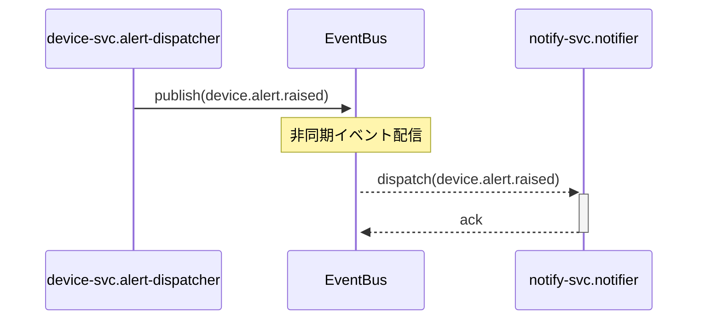

# 機能間フロー（シーケンス） — alert-publish-dispatch

> 更新ルール: Upsert（同一フロー名を上書き更新）。出典は（CR-NNN）で記録。
> **命名規則:** ファイル名は `{domain}-{flow-name}-sequence.md`。{domain} はプロジェクト側が自由に決める（例: `auth`・`sensor`・`order`）。{flow-name} は SPO 図タイトルから派生（スペース→ハイフン・小文字）。
> **対象:** 複数モジュールのアクターをまたぐシーケンス図（モジュール境界を越えるフロー）。単一モジュール内フローは対象外。
>
> **⚠️ 暫定ドメイン名:** `alert` は AI が SPO 内容（device.alert.raised イベント publish/dispatch）から推定した暫定値です。人による確認・命名修正を推奨します（OUTPUT_FILE 参照）。

## シーケンス図

**含まれるモジュール:** device-svc.alert-dispatcher, notify-svc.notifier
**出典:** CR-2026-900 / SPO Section 3 / 更新日: 2026-06-21

## 注意事項・制約

- `device.alert.raised` イベントは CR-2026-900 で `labels` フィールドが必須追加された breaking change（v1.0.0 → v2.0.0）。デプロイ順序・移行手順を `project-rulebook-cross.md` §6 に明記すること（LL-003 参照）。
- 非同期イベント配信のため、device-svc と notify-svc のデプロイタイミングがずれると旧形式イベントが処理される可能性がある。
