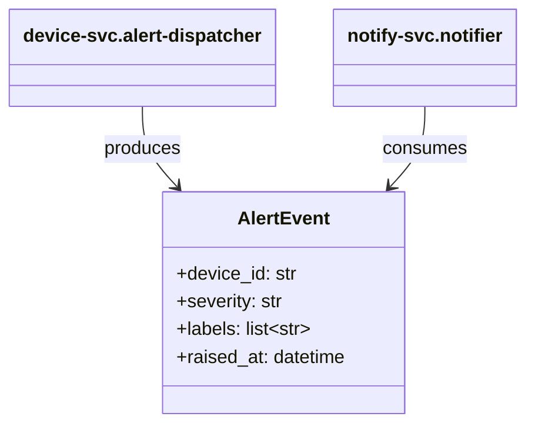

# 構造体関連図 — alert

> 更新ルール: Upsert（同一ドメインの図を上書き更新）。出典は（CR-NNN）で記録。
> OOP言語: classDiagram / 手続き型（C言語等）: テキスト表または graph LR
>
> **⚠️ 暫定ドメイン名:** `alert` は AI が SPO 内容（AlertEvent 共有データ型）から推定した暫定値です。人による確認・命名修正を推奨します（OUTPUT_FILE 参照）。

## モジュール間の構造体依存関係

**含まれるモジュール:** device-svc.alert-dispatcher, notify-svc.notifier
**出典:** CR-2026-900 / 更新日: 2026-06-21

## 注意事項・制約

- `AlertEvent.labels` は CR-2026-900 で必須フィールドとして追加された（breaking change, v1.0.0 → v2.0.0）。旧形式イベント（`labels` なし）を notify-svc が受信した場合に例外を出さないことが確認済み（TC-102 参照）。
- device-svc と notify-svc を同時にデプロイしないと、旧形式イベントの処理に問題が生じる可能性がある（デプロイ順序・移行手順の明記が必要。`project-rulebook-cross.md` §6 参照）。
