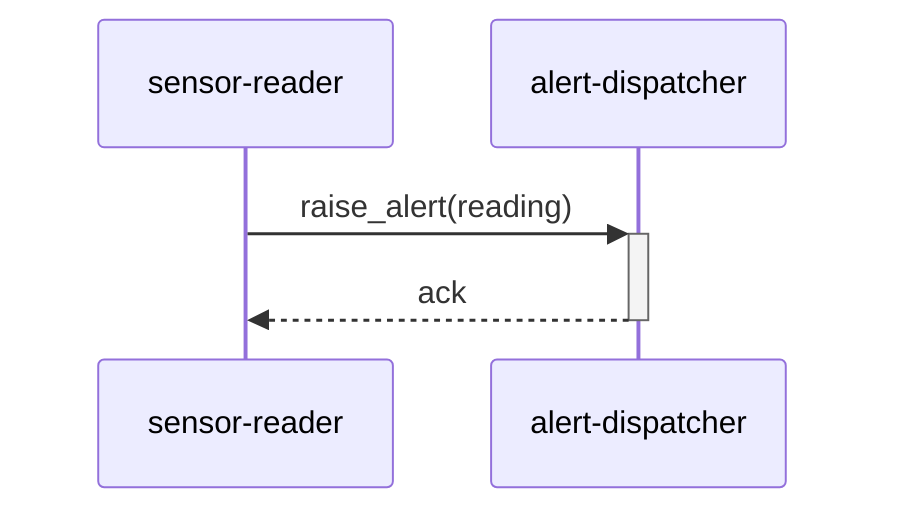

# 機能間フロー（シーケンス） — sensor-alert-dispatch

> 更新ルール: Upsert（同一フロー名を上書き更新）。出典は（CR-NNN）で記録。
> **命名規則:** ファイル名は `{domain}-{flow-name}-sequence.md`。{domain} はプロジェクト側が自由に決める（例: `auth`・`sensor`・`order`）。{flow-name} は SPO 図タイトルから派生（スペース→ハイフン・小文字）。
> **対象:** 複数モジュールのアクターをまたぐシーケンス図（モジュール境界を越えるフロー）。単一モジュール内フローは対象外。
>
> **⚠️ 暫定ドメイン名:** `sensor` は AI が SPO 内容（センサー読み取り→アラート発火）から推定した暫定値です。人による確認・命名修正を推奨します（OUTPUT_FILE 参照）。

## シーケンス図

**含まれるモジュール:** sensor-reader, alert-dispatcher
**出典:** CR-2026-900 / SPO Section 3 / 更新日: 2026-06-21

## 注意事項・制約

- センサー読み取り（sensor-reader）からアラート発火（alert-dispatcher）への呼び出しフロー。ラベル付加を検討する場合、`raise_alert(reading)` のペイロードサイズ増加に注意（参照: `device-svc/knowledge/code-knowledge/sensor-reader/constraints.md` の CK-002）。
