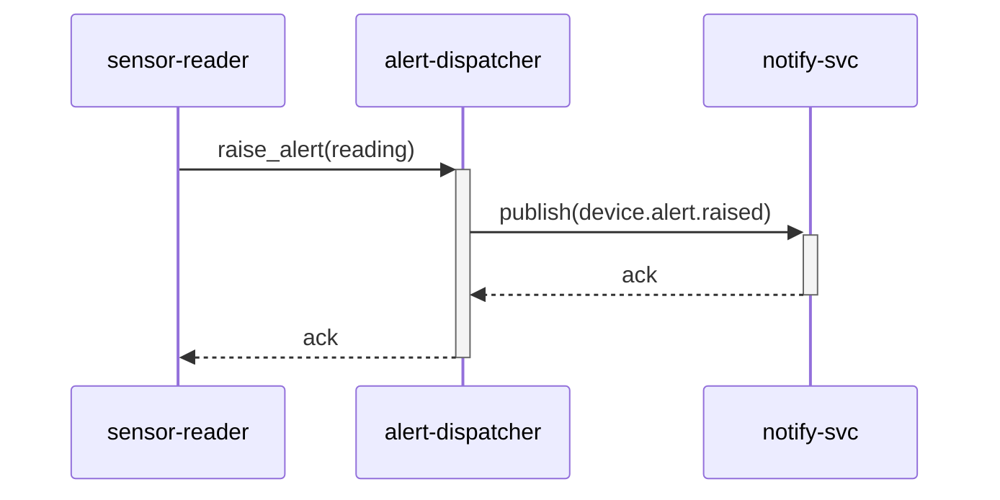

# モジュール内シーケンス図 — alert-dispatcher / main

**リポジトリ:** device-svc
**モジュール:** alert-dispatcher
**シナリオ:** main
**最終更新CR:** CR-2026-900

---

## 1. 文書概要

| 項目 | 内容 |
|---|---|
| 対象モジュール | alert-dispatcher |
| シナリオ名 | main（SPO に単一シーケンスのみ記載のためデフォルト名を使用） |
| 参加者スコープ | sensor-reader → alert-dispatcher → notify-svc |

---

## 2. シナリオ説明

sensor-reader が閾値超過を検知した際に alert-dispatcher へアラート発火を依頼し、alert-dispatcher が `device.alert.raised` イベントを notify-svc へ publish する一連の流れ。

---

## 3. シーケンス図

---

## 4. 変更履歴

| バージョン | CR | 日付 | 変更内容 |
|---|---|---|---|
| 1.0.0 | CR-2026-900 | 2026-06-21 | 初版作成（SPO から生成） |
