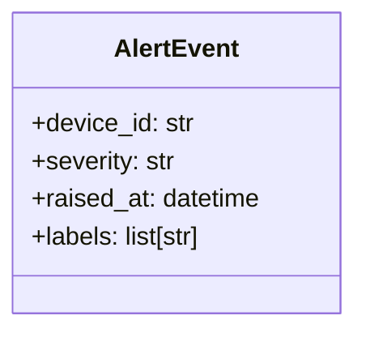

# 構造図（クラス図・データ構造） — alert-dispatcher

**リポジトリ:** device-svc
**モジュール:** alert-dispatcher
**最終更新CR:** CR-2026-900

---

## 1. 文書概要

| 項目 | 内容 |
|---|---|
| 対象モジュール | alert-dispatcher |
| 主要クラス・構造体 | AlertEvent |
| バージョン | 1.0.0 |

---

## 2. クラス図

---

## 3. データ構造定義表

| 名前 | 型 | 説明 | 備考 |
|---|---|---|---|
| AlertEvent | class | アラートイベント | SP-004 で labels を追加 |
| `device_id` | str | アラート対象デバイスID | 必須 |
| `severity` | str | アラート重大度 | 必須 |
| `raised_at` | datetime | アラート発生時刻 | 必須 |
| `labels` | list[str] | 対象デバイスに紐づくラベル一覧 | SP-004で追加。問い合わせ失敗時は空配列 |

---

## 4. PAD（問題分析図）

> アルゴリズムが複雑でないため省略。

---

## 5. 気づき・提案メモ

| # | 種別 | 内容 | 対応方針 |
|---|------|------|----------|
| 1 | 修正点／改善案／懸念／質問 | {内容} | 今回対応／次回CR／保留／却下 |

---

## 6. 変更履歴

| バージョン | CR | 日付 | 変更内容 |
|---|---|---|---|
| 1.0.0 | CR-2026-900 | 2026-06-21 | 初版作成（SPO から生成）。SP-004 反映: AlertEvent に labels フィールドを追加（Before: device_id, severity, raised_at のみ → After: labels を追加） |
