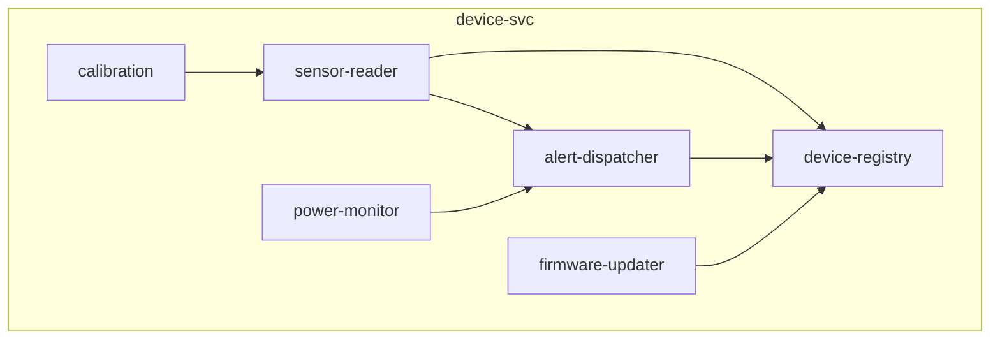

# リポジトリアーキテクチャ図 — device-svc

**リポジトリ:** device-svc
**最終更新CR:** CR-2026-900

> ⚠️ このファイルは複数 CR にわたってマージ更新される共有ファイルです。
> 今回 CR で調査したモジュールのみ更新し、未調査モジュールは既存の記述を保持します。

---

## 1. 文書概要

| 項目 | 内容 |
|---|---|
| 対象リポジトリ | device-svc |
| 登録モジュール数 | 6 モジュール |
| 最終フルスキャン CR | CR-2026-900（定期棚卸し推奨） |

---

## 2. アーキテクチャ図（コンポーネント図）

---

## 3. モジュール一覧

| モジュール名 | 主要ファイル | 責務 | 最終確認CR |
|---|---|---|---|
| sensor-reader | src/sensor_reader.py | センサー値の定期読み取り | CR-2026-900 |
| alert-dispatcher | src/alert_dispatcher.py | 閾値超過時のアラート発火 | CR-2026-900 |
| calibration | src/ | センサー校正 | CR-2026-900 |
| device-registry | src/device_registry.py | デバイス登録・属性管理（ラベル含む） | CR-2026-900 |
| firmware-updater | src/ | ファームウェア更新 | CR-2026-900 |
| power-monitor | src/ | 電源状態監視 | CR-2026-900 |

---

## 4. 依存方向説明

| 依存元 | 依存先 | 依存種別 | 説明 |
|---|---|---|---|
| sensor-reader | device-registry | 関数呼び出し | デバイス属性参照 |
| sensor-reader | alert-dispatcher | 関数呼び出し | 閾値超過の通知 |

---

## 5. 気づき・提案メモ

| # | 種別 | 内容 | 対応方針 |
|---|------|------|----------|
| 1 | 懸念 | sensor_reader.py の閾値比較が境界値を含まない（`>` のみ） | 次回CR |

---

## 6. 変更履歴

| バージョン | CR | 日付 | 変更内容 |
|---|---|---|---|
| 1.0.0 | CR-2026-900 | 2026-06-21 | 初版作成（SPO から生成） |
