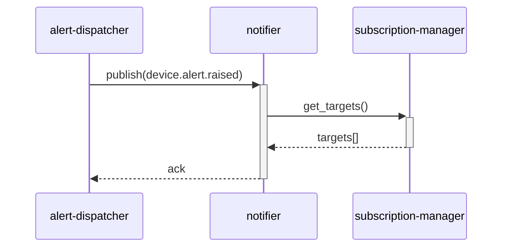

# モジュール内シーケンス図 — notifier / main

**リポジトリ:** notify-svc
**モジュール:** notifier
**シナリオ:** main
**最終更新CR:** CR-2026-900

---

## 1. 文書概要

| 項目 | 内容 |
|---|---|
| 対象モジュール | notifier |
| シナリオ名 | main（アラート受信〜通知振り分け） |
| 参加者スコープ | alert-dispatcher → notifier → subscription-manager |

---

## 2. シナリオ説明

device-svc の alert-dispatcher から `device.alert.raised` イベントを受信し、subscription-manager から通知先一覧を取得して、ラベル照合の上で通知を振り分けるシナリオ。UR-003（ラベル単位の通知振り分け）に対応する。

---

## 3. シーケンス図

---

## 4. 変更履歴

| バージョン | CR | 日付 | 変更内容 |
|---|---|---|---|
| 1.0.0 | CR-2026-900 | 2026-06-21 | 初版作成（SPO から生成） |
