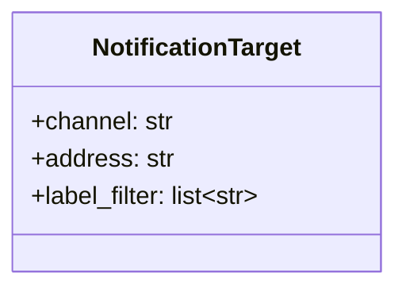

# 構造図（クラス図・データ構造） — notifier

**リポジトリ:** notify-svc
**モジュール:** notifier
**最終更新CR:** CR-2026-900

---

## 1. 文書概要

| 項目 | 内容 |
|---|---|
| 対象モジュール | notifier |
| 主要クラス・構造体 | NotificationTarget |
| バージョン | 1.0.0 |

---

## 2. クラス図



---

## 3. データ構造定義表

| 名前 | 型 | 説明 | 備考 |
|---|---|---|---|
| NotificationTarget | class | 通知先（チャネル・宛先・ラベル条件）を表す | subscription-manager 側で管理・生成される |
| `channel` | str | 通知チャネル種別（例: email, slack） | |
| `address` | str | 送信先アドレス | |
| `label_filter` | list[str] | 対象とするラベル一覧。空配列は「全件対象」を意味する（後方互換） | CR-2026-900 で追加 |

---

## 4. PAD（問題分析図）

> ラベル照合アルゴリズム（dispatch 内の振り分け処理）

```
dispatch(event):
    targets = subscription_manager.get_targets()
    FOR EACH target IN targets:
        IF target.label_filter is empty:
            送信対象に含める
        ELSE IF event.labels と target.label_filter に共通要素が1つ以上ある (OR条件):
            送信対象に含める
        ELSE:
            スキップ
    送信対象一覧に対して送信処理を実行する
    ack を返す
```

---

## 5. 気づき・提案メモ

| # | 種別 | 内容 | 対応方針 |
|---|------|------|----------|
| 1 | 修正点／改善案／懸念／質問 | （なし） | - |

---

## 6. 変更履歴

| バージョン | CR | 日付 | 変更内容 |
|---|---|---|---|
| 1.0.0 | CR-2026-900 | 2026-06-21 | 初版作成（SPO から生成。CHD SP-007 反映で label_filter フィールドを追加） |
