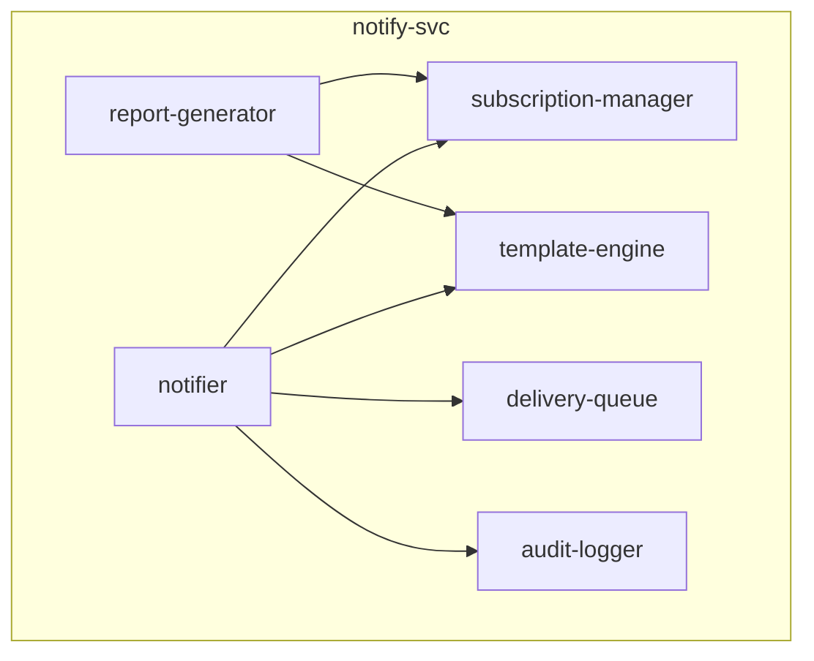

# リポジトリアーキテクチャ図 — notify-svc

**リポジトリ:** notify-svc
**最終更新CR:** CR-2026-900

---

## 1. 文書概要

| 項目 | 内容 |
|---|---|
| 対象リポジトリ | notify-svc |
| 登録モジュール数 | 6 モジュール |
| 最終フルスキャン CR | CR-2026-900（定期棚卸し推奨） |

---

## 2. アーキテクチャ図（コンポーネント図）

---

## 3. モジュール一覧

| モジュール名 | 主要ファイル | 責務 | 最終確認CR |
|---|---|---|---|
| notifier | src/notifier.py | 通知の振り分け・送信 | CR-2026-900 |
| report-generator | src/report_generator.py | レポート生成 | CR-2026-900 |
| template-engine | src/ | 通知文面テンプレート | CR-2026-900 |
| delivery-queue | src/ | 送信キュー管理 | CR-2026-900 |
| subscription-manager | src/ | 通知先・ラベル紐付け管理 | CR-2026-900 |
| audit-logger | src/ | 監査ログ記録 | CR-2026-900 |

---

## 4. 依存方向説明

| 依存元 | 依存先 | 依存種別 | 説明 |
|---|---|---|---|
| notifier | subscription-manager | 関数呼び出し | ラベルに応じた通知先解決 |

---

## 5. 気づき・提案メモ

| # | 種別 | 内容 | 対応方針 |
|---|------|------|----------|
| 1 | 修正点／改善案／懸念／質問 | （なし） | - |

---

## 6. 変更履歴

| バージョン | CR | 日付 | 変更内容 |
|---|---|---|---|
| 1.0.0 | CR-2026-900 | 2026-06-21 | 初版作成（SPO から生成） |
