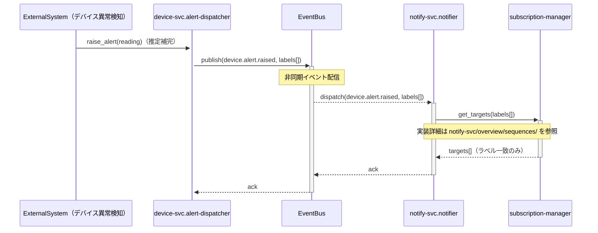

# ユースケースシーケンス図 — label-based-notification-routing / alert-dispatch-flow

**ユースケース:** label-based-notification-routing
**シナリオ:** alert-dispatch-flow
**最終更新CR:** CR-2026-900

> 気づきメモは `description.md` に記録してください（このファイルには気づきメモセクションなし）。
> **参加者スコープ:** アクター〜システム境界（ユーザー視点のラッパーシーケンス）。
> モジュール間の実装詳細は `overview/sequences/` へのリンク参照を推奨します（重複記述を避けるため）。

---

## 1. 文書概要

| 項目 | 内容 |
|---|---|
| ユースケース名 | label-based-notification-routing |
| シナリオ名 | alert-dispatch-flow |
| 参加者スコープ | アクター〜システム境界 |
| 実装詳細参照 | [device-svc/overview/sequences/main-seq.md](../../../device-svc/overview/sequences/main-seq.md)、[notify-svc/overview/sequences/main-seq.md](../../../notify-svc/overview/sequences/main-seq.md)、[cross/sequences/main-seq.md](../../../cross/sequences/main-seq.md)（存在する場合）|

---

## 2. シナリオ説明

デバイス側でアラート条件（閾値超過等）が発生すると、device-svc.alert-dispatcher がラベル一覧を含む `device.alert.raised` イベントを生成し、EventBus を介して notify-svc.notifier に配信する。notifier はイベントのラベルと subscription-manager に登録された通知先ラベルを照合し、合致する通知先にのみ通知を送信する（UR-003：ラベル単位の通知振り分け）。

本シナリオの起動主体は人間の操作ではなく、デバイスの異常検知（アラート発生）である。CRS UR-003 にはこの配信フロー自体の起動主体に関する明示記述がないため、SPO のエントリポイント種別（device-svc.alert-dispatcher が発行元）から ExternalSystem（デバイス側アラート発生）として推定補完した。

---

## 3. シーケンス図

> 参加者スコープ: アクター〜システム境界。
> 本シナリオは UR-003 にアクター・トリガーの明示記述がないため、SPO §3（cross SPO・notifier モジュール SPO）のイベント発行元から起動主体を推定補完した（「（推定補完）」）。

---

## 4. 変更履歴

| バージョン | CR | 日付 | 変更内容 |
|---|---|---|---|
| 1.0.0 | CR-2026-900 | 2026-06-21 | 初版作成（cross SPO §3 + notify-svc/notifier モジュール SPO §3 から AI 合成。起動主体は UR-003 に明示記述なし・SPO エントリポイントから推定補完） |
