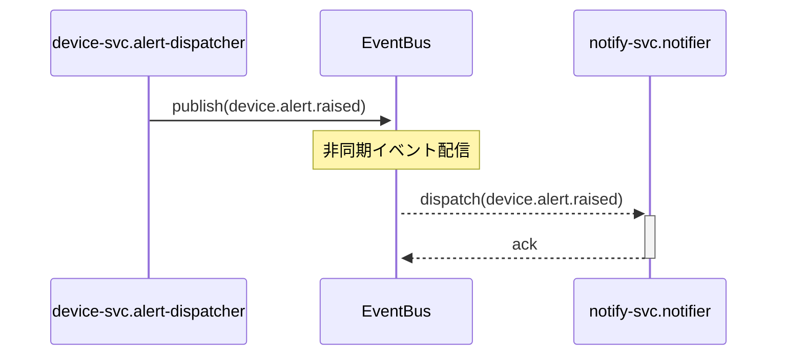
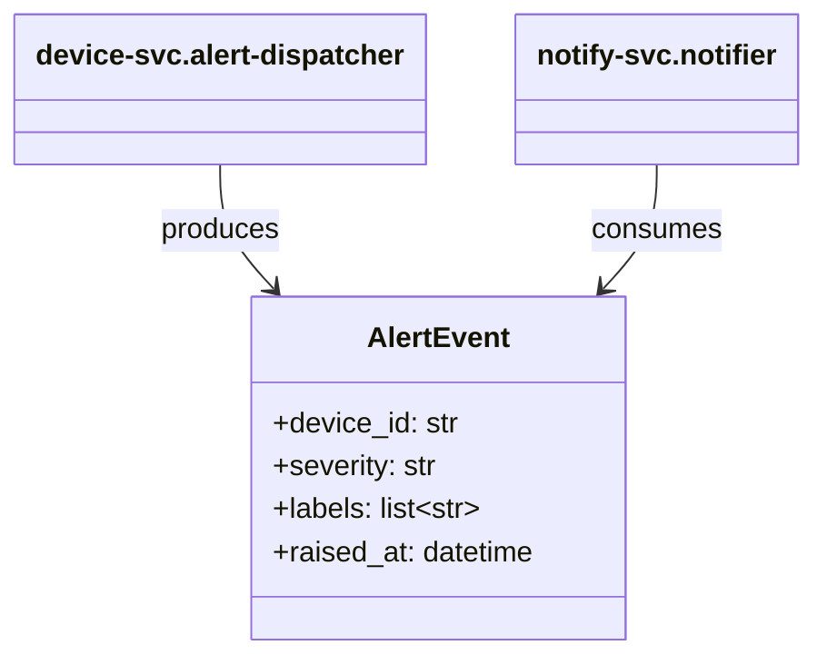

# スペックアウト資料（クロスリポジトリ）

**文書番号：** SPO-CR-2026-900-cross
**対象CR：** CR-2026-900
**対象リポジトリ：** device-svc, notify-svc
**作成日：** 2026-06-21
**作成者：** AI（xddp-specout-agent）
**版数：** 1.0

---

## 1. 概要

このドキュメントは CR-2026-900（デバイス監視システム ラベル機能追加）に関わる device-svc と notify-svc 間の相互作用を記録する。

| 対象リポジトリ | 参照先 |
|-------------|------|
| device-svc | [device-svc/SPO-CR-2026-900.md](../device-svc/SPO-CR-2026-900.md) |
| notify-svc | [notify-svc/SPO-CR-2026-900.md](../notify-svc/SPO-CR-2026-900.md) |

---

## 3. リポジトリ間シーケンス図

---

## 5. リポジトリ間共有定数・列挙値

アラート重大度レベル（device.alert.raised イベントの `severity` フィールドで使用）：

| 識別子 | 値 | 定義リポジトリ | 参照リポジトリ | 用途 |
|---|---|---|---|---|
| SEVERITY_LOW | "LOW" | device-svc | device-svc, notify-svc | 軽微なアラート（通知遅延可） |
| SEVERITY_MEDIUM | "MEDIUM" | device-svc | device-svc, notify-svc | 通常アラート |
| SEVERITY_HIGH | "HIGH" | device-svc | device-svc, notify-svc | 緊急アラート（即時通知） |

---

## 6. リポジトリ間共有データ型関連図

---

## 11. 変更履歴

| 版数 | 日付 | 変更者 | 変更内容 |
|------|------|--------|----------|
| 1.0 | 2026-06-21 | AI（xddp-specout-agent） | 初版作成 |
