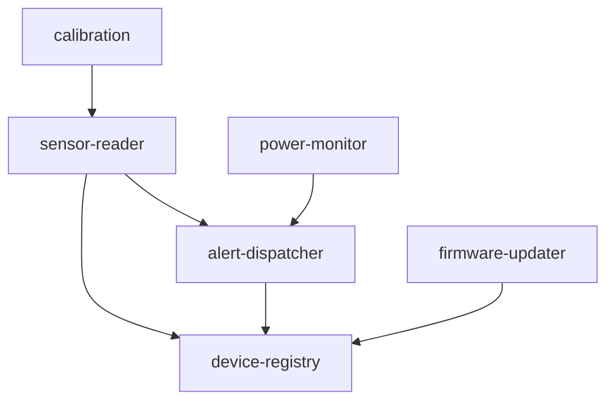
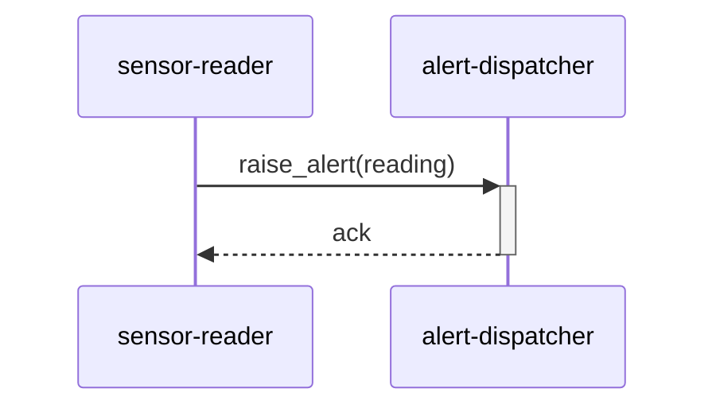

# スペックアウト資料（サマリー） - device-svc

**文書番号：** SPO-CR-2026-900
**対象CR：** CR-2026-900
**作成日：** 2026-06-21
**作成者：** AI（xddp-specout-agent）
**版数：** 1.0

---

## 1. 調査概要

| 項目 | 内容 |
|------|------|
| 調査起点 | デバイスラベル機能（UR-001〜UR-003） |
| 調査範囲 | device-svc 全モジュール |
| 検出モジュール数 | 6 モジュール |
| 既存仕様書 | なし |

---

## 2. 全体アーキテクチャ図

---

## 3. モジュール間シーケンス図

---

## 4. データ仕様・副作用・フロー

### 4.2 データフロー図（DFD）

対象外

### 4.3 データモデル

対象外

### 4.4 データアクセスマトリクス

対象外

---

## 5. 影響範囲の分析

### 5.6 非機能特性・実装制約の観察

| ファイル/識別子 | 特性種別 | 観察内容 | アーキテクトへの示唆 | 影響度 |
|---|---|---|---|:---:|
| src/sensor_reader.py:read_sensor() | パフォーマンス | 読み取りループがポーリング方式で1秒間隔固定 | ラベル付加によりレスポンスサイズが増えるため間隔調整を検討 | 中 |
| src/sensor_reader.py:THRESHOLD_HIGH | 後方互換 | 閾値比較が `>` のみで境界値を含まない | ラベル別閾値を将来追加する場合は境界条件の仕様化が必要 | 高 |

---

## 8. 調査済みモジュール一覧

| モジュール名 | ディレクトリ | 個別資料 |
|------------|------------|--------|
| sensor-reader | src/ | [modules/sensor-reader/SPO-CR-2026-900.md](modules/sensor-reader/SPO-CR-2026-900.md) |
| alert-dispatcher | src/ | [modules/alert-dispatcher/SPO-CR-2026-900.md](modules/alert-dispatcher/SPO-CR-2026-900.md) |
| calibration | src/ | [modules/calibration/SPO-CR-2026-900.md](modules/calibration/SPO-CR-2026-900.md) |
| device-registry | src/ | [modules/device-registry/SPO-CR-2026-900.md](modules/device-registry/SPO-CR-2026-900.md) |
| firmware-updater | src/ | [modules/firmware-updater/SPO-CR-2026-900.md](modules/firmware-updater/SPO-CR-2026-900.md) |
| power-monitor | src/ | [modules/power-monitor/SPO-CR-2026-900.md](modules/power-monitor/SPO-CR-2026-900.md) |

**クロスリポジトリ資料：** [../cross/SPO-CR-2026-900-cross.md](../cross/SPO-CR-2026-900-cross.md)

---

## 11. 変更履歴

| 版数 | 日付 | 変更者 | 変更内容 |
|------|------|--------|----------|
| 1.0 | 2026-06-21 | AI（xddp-specout-agent） | 初版作成 |
