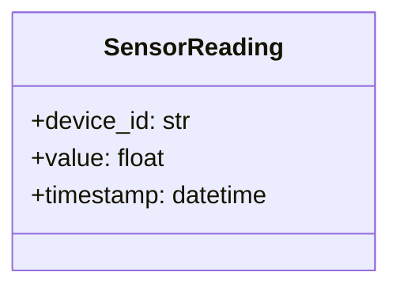

# スペックアウト資料（モジュール個別） - sensor-reader

**文書番号：** SPO-CR-2026-900-sensor-reader
**対象CR：** CR-2026-900
**対象モジュール：** src/sensor_reader.py
**作成日：** 2026-06-21
**作成者：** AI（xddp-specout-agent）
**版数：** 1.0

---

## 1. モジュール概要

| 項目 | 内容 |
|------|------|
| モジュール名 | sensor-reader |
| ディレクトリ | src/ |
| 役割・責務 | センサーから周期的に値を読み取り、閾値判定してアラート判定材料を作る |
| 既存仕様書 | なし |

---

## 2. 現状仕様

センサー値を1秒間隔でポーリングし、閾値（THRESHOLD_HIGH）を超えた場合に alert-dispatcher へ通知する。デバイスIDのみを読み取り結果に含め、ラベル情報は持たない。

### クラス図

### データ構造

| 識別子 | フィールド名 | 型 | 必須 | 説明 |
|--------|------------|-----|------|------|
| SensorReading | device_id | str | ○ | 読み取り元デバイスID |
| SensorReading | value | float | ○ | センサー測定値 |

### 状態遷移図

対象外

### モジュール内シーケンス図

対象外

---

## 5. 変更履歴

| 版数 | 日付 | 変更者 | 変更内容 |
|------|------|--------|----------|
| 1.0 | 2026-06-21 | AI（xddp-specout-agent） | 初版作成 |
