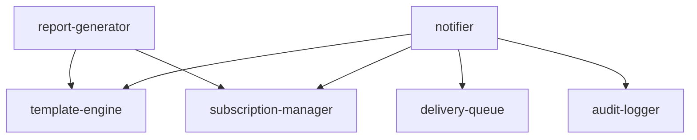
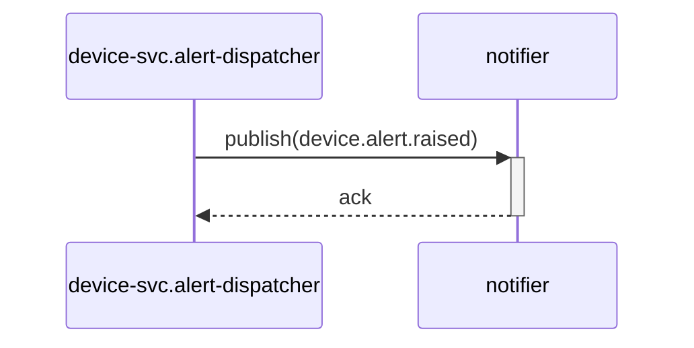

# スペックアウト資料（サマリー） - notify-svc

**文書番号：** SPO-CR-2026-900
**対象CR：** CR-2026-900
**作成日：** 2026-06-21
**作成者：** AI（xddp-specout-agent）
**版数：** 1.0

---

## 1. 調査概要

| 項目 | 内容 |
|------|------|
| 調査起点 | デバイスラベル機能（UR-003：ラベル単位の通知振り分け） |
| 調査範囲 | notify-svc 全モジュール |
| 検出モジュール数 | 6 モジュール |
| 既存仕様書 | なし |

---

## 2. 全体アーキテクチャ図

---

## 3. モジュール間シーケンス図

---

## 4. データ仕様・副作用・フロー

### 4.2 データフロー図（DFD）

対象外

### 4.3 データモデル

対象外

### 4.4 データアクセスマトリクス

対象外

---

## 5. 影響範囲の分析

### 5.6 非機能特性・実装制約の観察

| ファイル/識別子 | 特性種別 | 観察内容 | アーキテクトへの示唆 | 影響度 |
|---|---|---|---|:---:|
| src/notifier.py:dispatch() | 後方互換 | 通知先一覧は固定リストで全件送信する実装 | ラベルフィルタ導入時はAPIの戻り件数が変わるため呼び出し側の互換性確認が必要 | 高 |
| src/report_generator.py:generate() | パフォーマンス | レポート生成が同期処理でデバイス全件をメモリに展開 | ラベル絞り込み追加時はフィルタを先に適用しメモリ使用量を抑える設計が望ましい | 中 |

---

## 8. 調査済みモジュール一覧

| モジュール名 | ディレクトリ | 個別資料 |
|------------|------------|--------|
| notifier | src/ | [modules/notifier/SPO-CR-2026-900.md](modules/notifier/SPO-CR-2026-900.md) |
| report-generator | src/ | [modules/report-generator/SPO-CR-2026-900.md](modules/report-generator/SPO-CR-2026-900.md) |
| template-engine | src/ | [modules/template-engine/SPO-CR-2026-900.md](modules/template-engine/SPO-CR-2026-900.md) |
| delivery-queue | src/ | [modules/delivery-queue/SPO-CR-2026-900.md](modules/delivery-queue/SPO-CR-2026-900.md) |
| subscription-manager | src/ | [modules/subscription-manager/SPO-CR-2026-900.md](modules/subscription-manager/SPO-CR-2026-900.md) |
| audit-logger | src/ | [modules/audit-logger/SPO-CR-2026-900.md](modules/audit-logger/SPO-CR-2026-900.md) |

**クロスリポジトリ資料：** [../cross/SPO-CR-2026-900-cross.md](../cross/SPO-CR-2026-900-cross.md)

---

## 11. 変更履歴

| 版数 | 日付 | 変更者 | 変更内容 |
|------|------|--------|----------|
| 1.0 | 2026-06-21 | AI（xddp-specout-agent） | 初版作成 |
