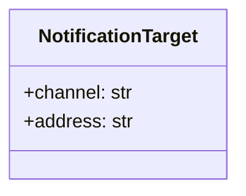
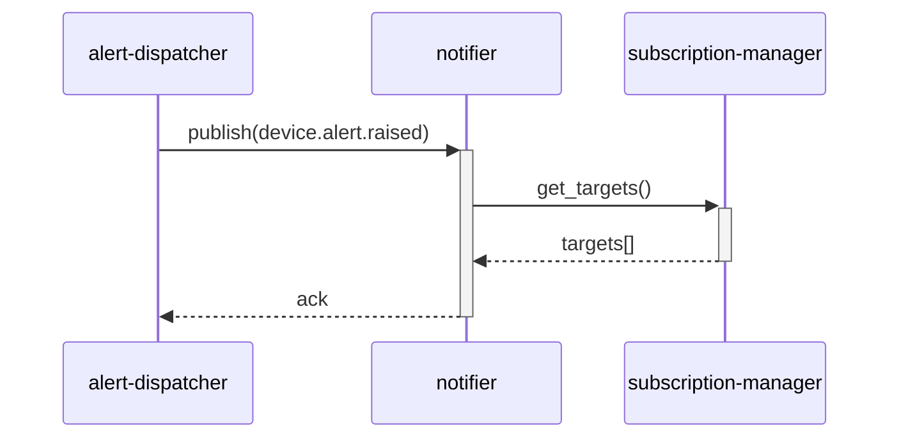

# スペックアウト資料（モジュール個別） - notifier

**文書番号：** SPO-CR-2026-900-notifier
**対象CR：** CR-2026-900
**対象モジュール：** src/notifier.py
**作成日：** 2026-06-21
**作成者：** AI（xddp-specout-agent）
**版数：** 1.0

---

## 1. モジュール概要

| 項目 | 内容 |
|------|------|
| モジュール名 | notifier |
| ディレクトリ | src/ |
| 役割・責務 | device-svc から受信したアラートイベントを通知先へ配信する |
| 既存イベント | なし |

---

## 2. 現状仕様

`device.alert.raised` イベントを受信し、subscription-manager から取得した全通知先に一律送信する。ラベルによる振り分けは未実装。

### クラス図

### データ構造

対象外（クラス図参照）

### 状態遷移図

対象外

### モジュール内シーケンス図

---

## 5. 変更履歴

| 版数 | 日付 | 変更者 | 変更内容 |
|------|------|--------|----------|
| 1.0 | 2026-06-21 | AI（xddp-specout-agent） | 初版作成 |
