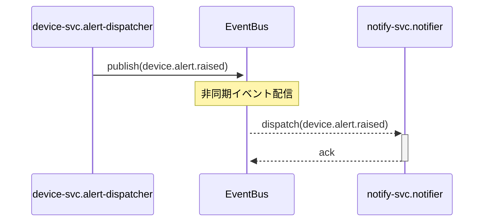

# クロスリポジトリシーケンス図 — main

**フロー:** main
**最終更新CR:** CR-2026-900

---

## 1. 文書概要

| 項目 | 内容 |
|---|---|
| フロー名 | main |
| 参加者スコープ | device-svc.alert-dispatcher → EventBus → notify-svc.notifier |

---

## 2. シナリオ説明

device-svc でアラートが発火した際、EventBus を介して notify-svc に非同期配信されるフロー。

---

## 3. シーケンス図

---

## 4. 変更履歴

| バージョン | CR | 日付 | 変更内容 |
|---|---|---|---|
| 1.0.0 | CR-2026-900 | 2026-06-21 | 初版作成（クロスリポジトリ SPO から生成） |
