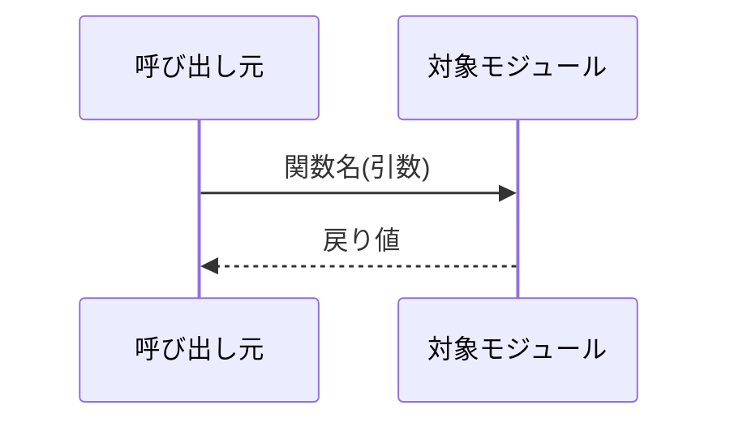
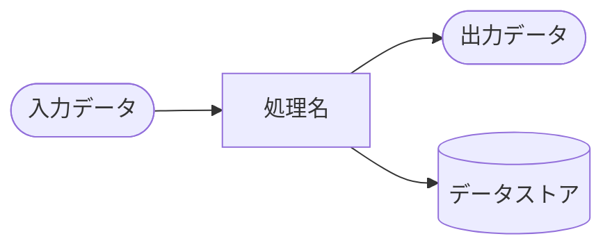
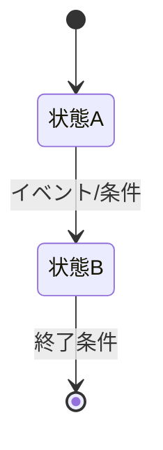

#file:.github/xddp-instructions.md

# XDDP フェーズ2: スペックアウト

## 役割
変更対象の識別子を起点にソースコードを調査し、スペックアウト資料を作成します。
大規模コードベース（複数リポジトリ・400kstep以上）に対応した波紋検索と打ち切り基準を使用します。
**成果物の生成に専念してください。レビューは `#xddp-04-spec-review.prompt.md` が担当します。**

## 実行手順

### ステップ1: 要求分析結果の読み込み
`CR-YYYY-NNN/変更要求仕様書-CRS-YYYY-NNN.md` を読み込み、
スペックアウト対象ファイル候補と変更対象識別子（定数名・関数名・構造体名）を確認してください。
ファイルが存在しない場合は `#xddp-01-req-start.prompt.md` を先に実行するよう案内してください。

---

## 調査戦略：波紋検索

影響範囲の調査はコード全体を読むのではなく、
**変更起点から外側に向かって波紋状に広げる**方法で進めてください。

```
【第1波】変更する識別子そのもの
  定数名・関数名・構造体名を grep で全リポジトリ検索
  ↓
【第2波】第1波の直接参照元
  第1波のファイル・関数を読み、呼び出し元を特定
  ↓
【第3波】第2波の呼び出し元
  引数・戻り値・グローバル状態の変化がある場合のみ調査
  ↓
【打ち切り】以下のいずれかに達したら調査を終了する
```

## 打ち切り基準

| 基準 | 条件 | 例 |
|------|------|-----|
| 基準1 | アーキテクチャ境界を越える場合（引数・戻り値の型が変わらない） | `detect_anomaly(float)→bool` の呼び出し元は打ち切り |
| 基準2 | 値を通過するだけの関数（パススルー） | `wrapper_func(val){ return inner_func(val); }` の呼び出し元は打ち切り |
| 基準3 | 別リポジトリへの影響がIF仕様変更なし | 送信フォーマットが変わらない受信側リポジトリは打ち切り |
| 基準4 | テストコードのみの参照 | `test_detect.c` からのみ参照 → テスト更新要否を記録して打ち切り |
| 基準5 | 過去CRで調査済みの箇所 | CR番号を記録して打ち切り |

**3波を超えても打ち切れない場合は「要設計確認」として記録し、設計担当者にエスカレーションする。**

---

### ステップ2: 第1波 — grep による全参照検索
```bash
# 例（C言語の場合）
grep -r "SENSOR_THRESHOLD" --include="*.c" --include="*.h" -n -l

# 例（複数リポジトリの場合）
for repo in repo1 repo2 repo3; do
  echo "=== $repo ==="
  grep -r "SENSOR_THRESHOLD" $repo --include="*.c" -n
done
```

参照箇所を「直接変更」「影響確認要」「打ち切り」に分類してください。

### ステップ3: 第2波以降 — 影響確認要の箇所を読む
打ち切り基準1〜5に該当するか判定し、該当する場合はスペックアウト資料に記録して打ち切ってください。

### ステップ4: スペックアウト資料の生成

```markdown
# スペックアウト資料

**対応CR番号:** CR-YYYY-NNN
**タイトル:** （変更の概要を一行で）
**生成日時:** YYYY-MM-DD HH:MM
**修正ループ:** 0回

## 調査対象
| No | ファイル名 | モジュール/クラス名 | 関数名 | 調査目的 |
|----|-----------|-------------------|--------|---------|

## 定数・列挙型の定義
| No | 名称 | 定義場所 | 現在値 | 説明 | 変更要否 |
|----|------|---------|--------|------|---------|

## データ構造の調査

### 構造体/クラス図
```mermaid
classDiagram
    class （クラス名） {
        +（型） （メンバー名）
    }
```

| No | 構造体名 | メンバー名 | 型 | 定義場所 | 説明 | 変更要否 |

## 処理構造の調査
### （関数名）
**ファイル:** （ファイル名:行番号）
**処理概要:** （何をするか）
**変更要否:** 要/不要/確認中

## 制御構造の調査

### 呼び出し関係テーブル（波紋検索記録）
| No | 呼び出し元 | 呼び出し先 | 引数 | 戻り値 | 影響有無 | 打ち切り基準 |
|----|-----------|-----------|------|--------|---------|------------|
| 1 | monitor_loop() | detect_anomaly() | float | bool | 無 | 基準1：引数・戻り値の型が変わらない |

### シーケンス図


### DFD


## 状態遷移図


## 調査結果サマリ

### 変更が必要な箇所（● → TM）
| No | ファイル名 | 関数名/定数名 | 変更内容 | 対応仕様番号 |

### 参照確認が必要な箇所（○ → TM）
| No | ファイル名 | 関数名/定数名 | 確認内容 |

### 調査で新たに判明した事項（仕様書フィードバック候補）
| No | 判明した事項 | 対応 | フィードバック先仕様番号 |
|----|-----------|------|----------------------|
| 1 | （判明した内容） | 仕様書に追記/確認中/対応不要 | CRS-NNN-XX-XX/未反映/対応不要 |

### 未解決事項
| No | 内容 | 確認先 | 期限 |
```

### ステップ5: ファイル保存
`CR-YYYY-NNN/スペックアウト-CR-YYYY-NNN.md` に保存してください。

## 完了後の案内
```
✅ スペックアウト 生成完了
→ CR-YYYY-NNN/スペックアウト-CR-YYYY-NNN.md

次のステップ：
  /xddp.04.spec.review   ← AIレビューを実施（推奨）
  /xddp.spec.feedback    ← 判明した事項を変更要求仕様書に反映
  /xddp.05.design.start  ← レビューをスキップして次フェーズへ
```
